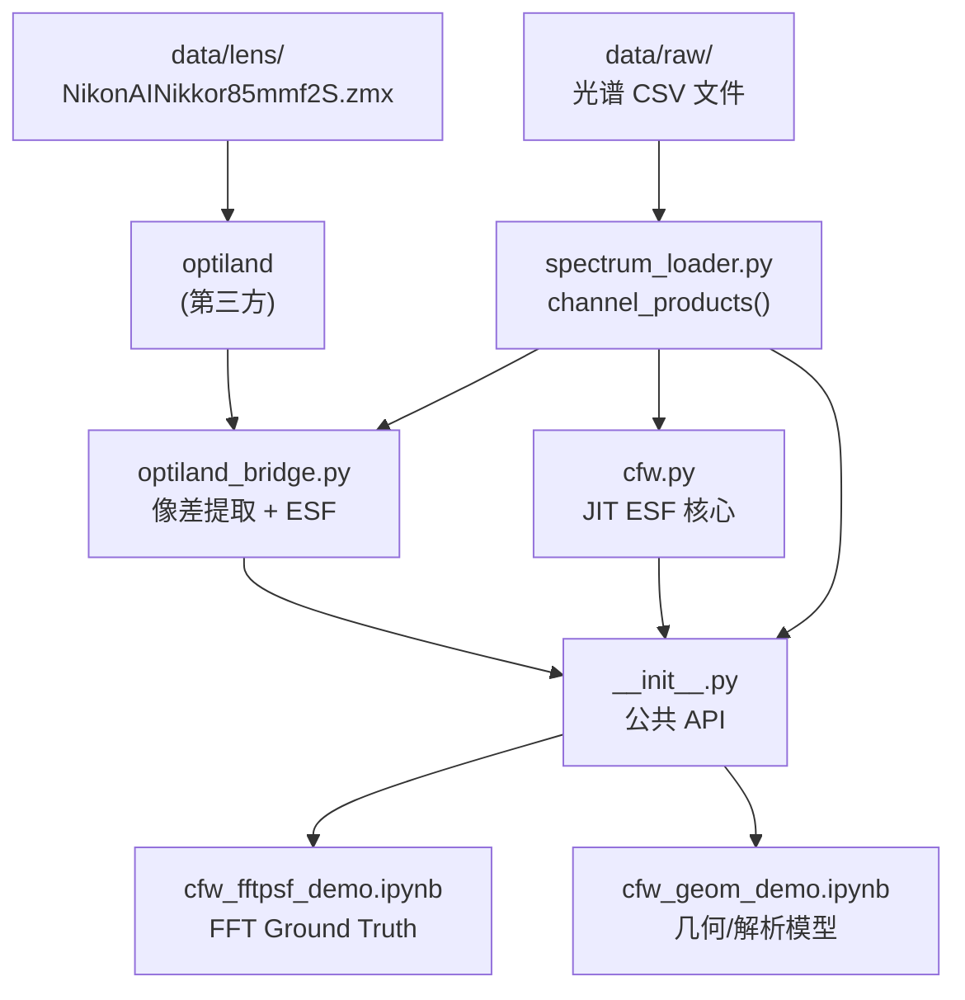
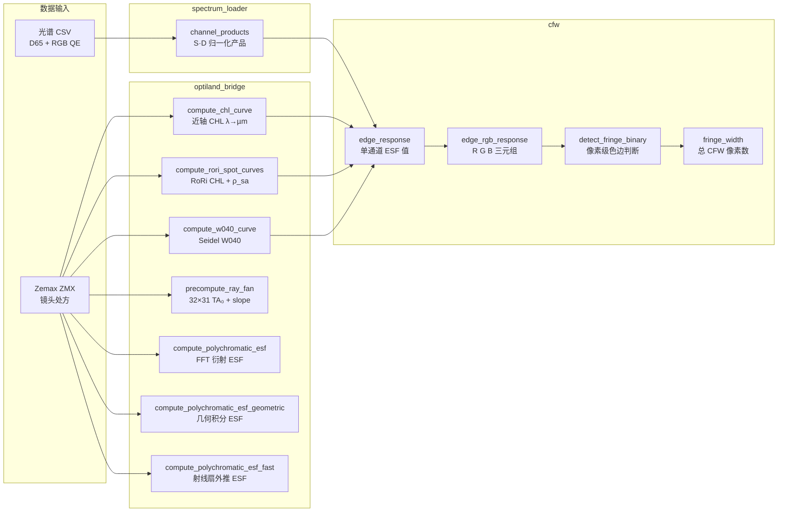

# ChromFringe 技术研究报告

> **研究目标：** 对摄影镜头中残余纵向色差（Longitudinal Chromatic Aberration, CHL）和球差（Spherical Aberration, SA）引起的色彩边缘条纹（Colour Fringe）进行数值建模、预测和量化。
>
> **核心度量：** Colour Fringe Width（CFW）——在给定离焦量下，色边的宽度（µm）。

---

## 目录

- [[#1. 项目概览]]
- [[#2. 仓库结构]]
- [[#3. 模块依赖关系]]
- [[#4. 数据流与信号链]]
- [[#5. 模块接口详解]]
  - [[#5.1 chromf/__init__.py — 公共 API]]
  - [[#5.2 spectrum_loader.py — 光谱数据]]
  - [[#5.3 cfw.py — JIT 核心内核]]
  - [[#5.4 optiland_bridge.py — 像差提取与 PSF]]
- [[#6. 数学与物理模型]]
  - [[#6.1 色差（CHL）几何模型]]
  - [[#6.2 RoRi 孔径加权方法]]
  - [[#6.3 残余球差（SA）弥散]]
  - [[#6.4 Seidel W040 球差系数]]
  - [[#6.5 ESF 模型：Pillbox（几何均匀圆盘）]]
  - [[#6.6 ESF 模型：Gaussian（高斯 PSF）]]
  - [[#6.7 ESF 模型：Double-Gaussian（双区高斯）]]
  - [[#6.8 几何瞳面积分（Gauss-Legendre）]]
  - [[#6.9 射线扇线性外推]]
  - [[#6.10 FFT Fraunhofer 衍射 PSF]]
  - [[#6.11 多色 ESF 光谱积分]]
  - [[#6.12 能量归一化]]
  - [[#6.13 色调映射与 Gamma 校正]]
  - [[#6.14 CFW 定义与像素检测]]
- [[#7. Research Notebooks 详解]]
  - [[#7.1 cfw_fftpsf_demo.ipynb — FFT 衍射基准]]
  - [[#7.2 cfw_geom_demo.ipynb — 几何/解析模型]]
- [[#8. 性能分析]]
- [[#9. 实验数据与结果]]
- [[#10. 数据文件说明]]

---

## 1. 项目概览

### 1.1 物理背景

消色差镜头（Achromatic Lens）在校正主色差（Primary Spectrum）后仍存在**二级光谱**（Secondary Spectrum）：不同波长的光在轴上聚焦于略微不同的位置。当相机对焦在某一焦面时，各波长形成半径各异的弥散圆，RGB 三个通道呈现不同的 ESF（Edge Spread Function）宽度。在高对比度边缘处，这种差异导致可见的彩色条纹。

**信号链：**

$$\text{Scene (knife-edge)} \;\xrightarrow{D_{65}}\; \text{Illuminant} \;\xrightarrow{\mathrm{CHL}(\lambda),\,\mathrm{SA}(\lambda)}\; \text{Lens} \;\xrightarrow{S_c(\lambda)}\; \text{Sensor (RGB)} \;\xrightarrow{\gamma,\,\alpha}\; \text{Display}$$

### 1.2 研究方法层次

| 层级 | 方法 | 速度 | 精度 |
|------|------|------|------|
| 0 | FFT 衍射 PSF（ground truth） | ~1 s/ESF | 含衍射效应 |
| 1 | 几何瞳面积分（Gauss-Legendre） | ~10 ms/ESF | 几何光学精确 |
| 2 | 射线扇线性外推（precomputed fan） | <1 ms/ESF | 线性误差 O((z/f′)²) |
| 3 | 解析 ESF 模型（Pillbox/Gauss/DGauss） | <0.01 ms/ESF | 参数化近似 |

### 1.3 研究镜头

**Nikon AI Nikkor 85mm f/2S**（Zemax ZMX 格式）

- 焦距：85 mm
- 最大孔径：f/2（实验以 f/2 运行，FNO ≈ 2.0）
- 镜片数：13 片（14 个面）
- 关键参数输出：
  - SA 弥散 $\rho_{sa}$：11.8 – 18.4 µm（均值 16.8 µm）
  - W040：1.871 – 3.141 µm OPD

---

## 2. 仓库结构

```
ChromFringe/
├── data/
│   ├── raw/                         ← 光谱 CSV 文件
│   │   ├── daylight_d65.csv         ← CIE D65 标准光源
│   │   ├── sensor_red.csv           ← 传感器 R 通道量子效率
│   │   ├── sensor_green.csv         ← 传感器 G 通道量子效率
│   │   ├── sensor_blue.csv          ← 传感器 B 通道量子效率
│   │   └── defocus_chl_zf85.csv     ← 参考镜头 CHL 曲线
│   └── lens/
│       └── NikonAINikkor85mmf2S.zmx ← Zemax 镜头处方
├── examples/
│   ├── cfw_fftpsf_demo.ipynb        ← FFT 衍射 PSF 基准 notebook
│   └── cfw_geom_demo.ipynb          ← 几何/解析 PSF 模型 notebook
├── src/chromf/
│   ├── __init__.py                  ← 公共 API 导出
│   ├── cfw.py                       ← JIT 编译 CFW 核心内核
│   ├── spectrum_loader.py           ← 光谱数据加载与归一化
│   └── optiland_bridge.py           ← 像差提取 + PSF 计算
├── pyproject.toml
├── environment.yml
├── requirements.txt
└── README.md
```

---

## 3. 模块依赖关系



### 3.1 导入依赖图（精确版）

```
chromf/__init__.py
  ├── from chromf.cfw import fringe_width, edge_response, edge_rgb_response, detect_fringe_binary
  │     └── cfw.py 在模块加载时调用 spectrum_loader.channel_products()
  │           └── spectrum_loader.py → pandas (CSV I/O), scipy (CubicSpline)
  ├── from chromf.spectrum_loader import channel_products
  └── from chromf.optiland_bridge import compute_chl_curve, compute_rori_chl_curve,
        compute_rori_spot_curves, compute_w040_curve, precompute_ray_fan,
        compute_polychromatic_esf, compute_polychromatic_esf_geometric,
        compute_polychromatic_esf_fast
          ├── from chromf.spectrum_loader import channel_products
          └── lazy: from optiland.psf import FFTPSF (仅在调用 FFT 函数时导入)
```

---

## 4. 数据流与信号链

### 4.1 完整计算流程



### 4.2 实验工作流（Notebook 视角）

**`cfw_fftpsf_demo.ipynb`（ground truth 路径）：**

```
加载镜头 → 光谱数据 →
PSF 烘焙（75 ESFs = 25 z × 3 通道，FFT 衍射）→
原始 ESF 缓存 →
色调映射（可变参数）→
CFW 检测 + 通道对差值分析
```

**`cfw_geom_demo.ipynb`（几何/解析路径）：**

```
加载镜头 → 提取像差曲线（CHL/RoRi/SA/W040）→ 预计算射线扇 →
交互式查看器（PSF 模型 × CHL 模型 × 离焦量）→
静态对比实验（5a: PSF 模型 | 5b: 像差精度 | 5c: 全输入对比）
```

---

## 5. 模块接口详解

### 5.1 `chromf/__init__.py` — 公共 API

`src/chromf/__init__.py` 是唯一对外暴露的接口层，统一导出以下函数：

#### CFW 核心函数（来自 `cfw.py`）

```python
from chromf import (
    fringe_width,        # 总 CFW 像素计数
    edge_response,       # 单通道 ESF 值
    edge_rgb_response,   # R, G, B ESF 三元组
    detect_fringe_binary # 单像素色边判断
)
```

#### 光谱数据（来自 `spectrum_loader.py`）

```python
from chromf import channel_products   # 能量归一化 S·D 产品
```

#### 像差提取（来自 `optiland_bridge.py`）

```python
from chromf import (
    compute_chl_curve,              # 近轴 CHL 曲线
    compute_rori_chl_curve,         # 孔径加权 RoRi CHL
    compute_rori_spot_curves,       # RoRi CHL + 残余 SA 弥散
    compute_w040_curve,             # Seidel W040 系数
    precompute_ray_fan,             # 预计算射线扇
    compute_polychromatic_esf,      # FFT 衍射 ESF（ground truth）
    compute_polychromatic_esf_geometric,  # 几何积分 ESF
    compute_polychromatic_esf_fast, # 射线扇外推 ESF
)
```

---

### 5.2 `spectrum_loader.py` — 光谱数据加载与归一化

**文件路径：** `src/chromf/spectrum_loader.py`（164 行）

**数据目录解析：**
```python
DATA_DIR = Path(__file__).resolve().parents[2] / "data" / "raw"
# parents[0]=chromf/, parents[1]=src/, parents[2]=project-root/
```

#### 内部函数

| 函数 | 签名 | 说明 |
|------|------|------|
| `_csv(name)` | `(str) → ndarray` | 加载 CSV，返回 float64 `[λ, value]` 数组 |
| `_load_defocus(channel)` | `(str) → ndarray` | 加载离焦曲线，默认 `"chl_zf85"` |
| `_load_daylight(src)` | `(str) → ndarray` | 加载光源光谱，默认 `"d65"` |
| `_load_sensor(ch)` | `(str) → ndarray` | 加载传感器响应，`ch ∈ {red, green, blue}` |
| `_resample(xs, ys, new_x)` | `(ndarray, ndarray, ndarray) → ndarray` | 三次样条插值 + 归一化到 0–100 |
| `_energy_norm(sensor, daylight)` | `(ndarray, ndarray) → float` | 计算能量归一化系数 k |

#### 公共 API

```python
def channel_products(
    daylight_src: str = "d65",
    channels: Sequence[str] = ("blue", "green", "red"),
    *,
    sensor_peak: float = 1.0,
) -> dict[str, np.ndarray]:
    """
    Returns: {channel_name: ndarray shape (N, 2)}
    每列为 [λ_nm, S·D 归一化值]，满足 ∫ S·D dλ ≈ 1
    """
```

**波长网格：** 由第一个传感器文件（`blue`）决定，31 点，400–700 nm，10 nm 步长。

---

### 5.3 `cfw.py` — JIT 编译核心内核

**文件路径：** `src/chromf/cfw.py`（319 行）

#### 模块级常量

```python
DEFAULT_FNUMBER: float = 1.4        # 默认 f-number
EXPOSURE_SLOPE: float = 8.0         # 色调曲线斜率
DISPLAY_GAMMA: float = 2.2          # sRGB Gamma
COLOR_DIFF_THRESHOLD: float = 0.2   # 色边可见度阈值
EDGE_HALF_WINDOW_PX: int = 400      # 扫描半窗口（像素）
ALLOWED_PSF_MODES = ("geom", "gauss", "dgauss")
```

**模块加载时预计算：**
```python
_prods = _channel_products()        # 调用 spectrum_loader
SENSOR_RESPONSE: dict[str, ndarray] = {
    "R": _prods["red"][:, 1],       # 形状 (31,)
    "G": _prods["green"][:, 1],
    "B": _prods["blue"][:, 1],
}
```

#### JIT 编译内核（Numba `@njit(cache=True)`）

| 函数 | 行号 | 说明 |
|------|------|------|
| `_exposure_curve(x, slope)` | 48–51 | `tanh` 色调曲线，映射到 [0,1] |
| `_geom_esf(x, rho)` | 54–63 | 均匀圆盘（Pillbox）ESF |
| `_gauss_esf(x, rho)` | 66–71 | 高斯 PSF 的 ESF（σ ≈ 0.5ρ） |
| `_dgauss_rms(a, c, fno, rho_lo, rho_hi)` | 74–90 | 双区高斯 RMS 解析计算 |
| `_dgauss_esf(x, σ₁, σ₂, w₁, w₂)` | 93–99 | 双高斯 ESF |
| `_dgauss_edge_response_jit(x, z, ...)` | 102–143 | 双高斯通道积分内核 |
| `_edge_response_jit(x, z, ...)` | 146–172 | Pillbox/Gaussian 通道积分内核 |

#### 公共 API

```python
def edge_response(
    channel: Literal["R", "G", "B"],
    x_px: float,         # 像素坐标（µm，以像素为单位）
    z_um: float,         # 离焦量（µm）
    *,
    exposure_slope: float | None = None,   # 默认 EXPOSURE_SLOPE=8.0
    gamma: float | None = None,            # 默认 DISPLAY_GAMMA=2.2
    chl_curve_um: np.ndarray,             # 形状 (31,)，CHL(λ) µm
    sa_curve_um: np.ndarray | None = None, # 形状 (31,)，ρ_sa(λ) µm
    w040_curve_um: np.ndarray | None = None, # dgauss 模式必须提供
    f_number: float = DEFAULT_FNUMBER,
    psf_mode: Literal["geom", "gauss", "dgauss"] = "gauss",
) -> float  # 返回值 ∈ [0, 1]，色调映射后的 ESF 值
```

```python
def edge_rgb_response(
    x_px: float, z_um: float, *, ...  # 同 edge_response
) -> tuple[float, float, float]       # (R, G, B) ESF 三元组
```

```python
def detect_fringe_binary(
    x_px: float, z_um: float,
    *,
    color_diff_threshold: float | None = None,  # 默认 0.2
    ...  # 同 edge_response
) -> int  # 1 = 有色边，0 = 无色边
```

```python
def fringe_width(
    z_um: float,
    *,
    xrange_val: int | None = None,   # 默认 EDGE_HALF_WINDOW_PX=400
    ...  # 同 edge_response
) -> int  # 总 CFW（像素数）
# 扫描 x ∈ [-400, 400]，对所有满足阈值的像素求和
```

---

### 5.4 `optiland_bridge.py` — 像差提取与 PSF 计算

**文件路径：** `src/chromf/optiland_bridge.py`（734 行）

#### 共享常量

```python
_RORI_PY = (0.0, 0.5, 0.7071067811865476, 0.8660254037844387, 1.0)
# 归一化瞳高: 0, √0.25, √0.5, √0.75, 1

_RORI_WEIGHTS = (1.0, 12.8, 14.4, 12.8, 1.0)
_RORI_SUM = 42.0

_CHANNEL_MAP = {"R": "red", "G": "green", "B": "blue"}
```

#### 内部辅助函数

| 函数 | 行号 | 说明 |
|------|------|------|
| `_resolve_wl_grid(optic, wls, ref_wl)` | 20–36 | 解析波长网格和参考波长 |
| `_paraxial_bfl(paraxial, wl_nm, z_start)` | 39–52 | 近轴边缘光线追迹，计算后焦距 |
| `_sk_real(optic, Py, wl_um)` | 101–114 | 子午实际光线的后焦截距 SK(ρ) |
| `_optic_at_defocus(optic, z_defocus_um)` | 277–285 | 返回图像面偏移后的镜头深拷贝 |
| `_psf_to_esf(psf_2d, dx_um, x_px, n_pixels)` | 656–682 | 2D PSF → 1D ESF（累积和法） |

#### 像差提取函数

```python
def compute_chl_curve(
    optic,
    wavelengths_nm: np.ndarray | None = None,
    ref_wavelength_nm: float | None = None,
) -> np.ndarray  # 形状 (N, 2)：[λ_nm, CHL_µm]
# 近轴边缘光线追迹，返回二级光谱曲线
```

```python
def compute_rori_chl_curve(
    optic, wavelengths_nm=None, ref_wavelength_nm=None,
) -> np.ndarray  # 形状 (N, 2)：[λ_nm, RoRi_CHL_µm]
# 实际光线五瞳高加权平均，包含球差色差（球色差）
# 内部调用 compute_rori_spot_curves 并返回第一个数组
```

```python
def compute_rori_spot_curves(
    optic, wavelengths_nm=None, ref_wavelength_nm=None,
) -> tuple[np.ndarray, np.ndarray]
# 返回: (chl_curve [N,2], spot_curve [N,2])
# spot_curve[:,1] = ρ_sa(λ)，µm，即 RMS 残余弥散斑半径
```

```python
def compute_w040_curve(
    optic, wavelengths_nm=None, ref_wavelength_nm=None,
) -> np.ndarray  # 形状 (N, 2)：[λ_nm, W040_µm OPD]
# Seidel 球差系数：W040 = -TA_marginal_µm / (8·FNO)
```

#### 射线追迹与 ESF 函数

```python
def precompute_ray_fan(optic, num_rho: int = 32) -> dict:
    """
    预追迹 32×31 = 992 条光线（z=0 时）
    返回 dict 包含:
        fno, rho_nodes (32,), W_gl (32,), wl_nm (31,)
        TA0 (32, 31) µm   — 横向像差
        slope (32, 31)    — M/N 方向余弦比
        "R", "G", "B"     — 各通道光谱权重 g_norm (31,)
    """
```

```python
def compute_polychromatic_esf(
    optic, channel: str, z_defocus_um: float,
    x_um: np.ndarray,
    num_rays: int = 256,    # 瞳面采样数
    grid_size: int = 512,   # FFT 网格尺寸
    strategy: str = "chief_ray",  # 必须用 chief_ray 保留离焦相位
    wl_stride: int = 1,     # 波长抽样步长
) -> np.ndarray  # 形状 == x_um.shape，值 ∈ [0, 1]
# FFT 衍射 PSF → ESF（ground truth，慢）
```

```python
def compute_polychromatic_esf_geometric(
    optic, channel: str, z_defocus_um: float,
    x_um: np.ndarray,
    num_rho: int = 32,      # Gauss-Legendre 节点数
    wl_stride: int = 1,
) -> np.ndarray  # 值 ∈ [0, 1]
# 几何瞳面积分 ESF，比 FFT 快约 100×
```

```python
def compute_polychromatic_esf_fast(
    ray_fan: dict,           # 来自 precompute_ray_fan
    channel: str,
    z_defocus_um: float,
    x_um: np.ndarray,
    wl_stride: int = 1,
) -> np.ndarray  # 值 ∈ [0, 1]
# 线性外推射线扇，比 FFT 快约 1000×
```

---

## 6. 数学与物理模型

### 6.1 色差（CHL）几何模型

#### 6.1.1 近轴 CHL 定义

对于薄透镜组，波长 $\lambda$ 的近轴后焦距 $f_2'(\lambda)$ 与参考波长 $\lambda_\text{ref}$ 之差定义为**纵向色差**（CHL）：

$$\mathrm{CHL}_\text{par}(\lambda) = \left[f_2'(\lambda) - f_2'(\lambda_\text{ref})\right] \times 10^3 \quad (\mu\mathrm{m})$$

代码实现（`optiland_bridge.py` 行 84–86）：
```python
f2_values = np.array([_paraxial_bfl(paraxial, wl, z_start) for wl in wls])
f2_ref = _paraxial_bfl(paraxial, ref_wl, z_start)
chl_um = (f2_values - f2_ref) * 1000.0  # mm → µm
```

其中 `_paraxial_bfl` 通过近轴边缘光线追迹计算后焦距：
$$f_2' = -\frac{y_\text{last}}{u_\text{last}}$$

#### 6.1.2 CHL 诱导模糊半径

在几何光学框架下，当图像面位于 $z$ 处（相对于参考焦面），波长 $\lambda$ 的光线形成半径为 $\rho_\text{CHL}$ 的弥散圆：

$$\boxed{\rho_\text{CHL}(z,\lambda) = \frac{|z - \mathrm{CHL}(\lambda)|}{\sqrt{4N^2 - 1}}}$$

**推导：** 对于 f-number 为 $N$ 的透镜，边缘光线半角 $u \approx \arctan(1/(2N))$，在离焦量 $\Delta z = z - \mathrm{CHL}(\lambda)$ 处，弥散圆半径为：

$$\rho = |\Delta z| \cdot \tan u = |\Delta z| \cdot \frac{1/2N}{\sqrt{1 - 1/(4N^2)}} = \frac{|\Delta z|}{\sqrt{4N^2 - 1}}$$

代码实现（`cfw.py` 行 158–161）：
```python
denom = _sqrt(4.0 * f_number**2.0 - 1.0)
rho_chl = _fabs((z - chl_curve[n]) / denom)
```

---

### 6.2 RoRi 孔径加权方法

#### 6.2.1 问题动机

近轴 CHL 忽略了球差引起的**球色差**（Spherochromatism）：球差的大小随波长变化，导致不同孔径区域的有效焦距不同。RoRi 方法通过对多个孔径区域的实际光线求加权平均来估计"等效最佳焦距"。

#### 6.2.2 RoRi 公式

在 5 个归一化瞳高 $\rho_i \in \{0, \sqrt{0.25}, \sqrt{0.5}, \sqrt{0.75}, 1\}$ 处追迹实际子午光线，计算每条光线的后焦截距 $\mathrm{SK}(\rho_i, \lambda)$（光线与光轴的交点位置），然后用面积权重求加权平均：

$$\mathrm{RoRi}(\lambda) = \frac{\mathrm{SK}(0) + 12.8\cdot\mathrm{SK}(\sqrt{0.25}) + 14.4\cdot\mathrm{SK}(\sqrt{0.5}) + 12.8\cdot\mathrm{SK}(\sqrt{0.75}) + \mathrm{SK}(1)}{42}$$

权重来源：环形面积 $\Delta A \propto 2\rho\,\Delta\rho$，将 $[0,1]$ 分成 4 个等面积环后，各环的梯形积分权重为 $\{1, 12.8, 14.4, 12.8, 1\}$，总和为 42。

代码实现（`optiland_bridge.py` 行 94–98）：
```python
_RORI_PY      = (0.0, 0.5, 0.7071067811865476, 0.8660254037844387, 1.0)
_RORI_WEIGHTS = (1.0, 12.8, 14.4, 12.8, 1.0)
_RORI_SUM     = 42.0
```

```python
sks = np.array([_paraxial_bfl(paraxial, wl_nm, z_start)]
               + [_sk_real(optic, py, wl_um) for py in _RORI_PY[1:]])
rori = float(np.dot(_w, sks) / _RORI_SUM)
```

#### 6.2.3 SK(ρ) 的计算

对于归一化瞳高 $\rho$ 处的子午光线，追迹到图像面，利用最后一面的方向余弦 $(M, N)$ 和高度 $y$ 外推到轴上交点：

$$\mathrm{SK}(\rho) = -\frac{y \cdot N}{M}$$

代码实现（`optiland_bridge.py` 行 101–114）：
```python
rays = optic.trace_generic(0.0, 0.0, 0.0, Py, wl_um)
y = float(rays.y.ravel()[-1])
M = float(rays.M.ravel()[-1])   # 子午方向余弦
N = float(rays.N.ravel()[-1])   # 轴向方向余弦
return -y * N / M
```

#### 6.2.4 RoRi CHL 曲线

$$\mathrm{CHL}_\mathrm{RoRi}(\lambda) = \left[\mathrm{RoRi}(\lambda) - \mathrm{RoRi}(\lambda_\mathrm{ref})\right] \times 10^3 \quad (\mu\mathrm{m})$$

---

### 6.3 残余球差（SA）弥散

球差使得不同孔径区域聚焦在不同轴向位置，即使在 RoRi 最佳焦面处，仍存在残余弥散。

#### 6.3.1 横向弥散计算

在 RoRi 焦面处，各瞳高 $\rho_i$ 的光线横向偏离（小角近似）：

$$y_\text{spot}(\rho_i, \lambda) = \frac{[\mathrm{SK}(\rho_i, \lambda) - \mathrm{RoRi}(\lambda)] \cdot \rho_i}{2N}$$

#### 6.3.2 RMS 残余弥散斑

$$\boxed{\rho_\text{sa}(\lambda) = \sqrt{\frac{\sum_i w_i \cdot y_\text{spot}^2(\rho_i, \lambda)}{\sum_i w_i}}}$$

代码实现（`optiland_bridge.py` 行 165–166）：
```python
y_spots = (sks - rori) * _py / (2.0 * fno)        # mm
rho_sa  = float(np.sqrt(np.dot(_w, y_spots**2) / _RORI_SUM))  # mm (RMS)
```

#### 6.3.3 总模糊半径（二次叠加）

将色差模糊与 SA 模糊在弥散圆面积上叠加（二次叠加）：

$$\boxed{\rho(z, \lambda) = \sqrt{\rho_\text{CHL}(z, \lambda)^2 + \rho_\text{SA}(\lambda)^2}}$$

代码实现（`cfw.py` 行 162）：
```python
rho = _sqrt(rho_chl**2 + sa_curve[n]**2)  # 二次叠加
```

---

### 6.4 Seidel W040 球差系数

#### 6.4.1 物理定义

初级球差的波前系数 $W_{040}$ 描述了波前相对于参考球面的最高阶（$\rho^4$ 项）偏离：

$$W(\rho) = W_{040} \cdot \rho^4 + W_{020} \cdot \rho^2 \quad (\mu\mathrm{m\;OPD})$$

其中离焦项 $W_{020}$ 与当前图像面位置相关：
$$W_{020}(z, \lambda) = -\frac{z - \mathrm{CHL}(\lambda)}{8N^2} \quad (\mu\mathrm{m\;OPD})$$

#### 6.4.2 从边缘光线推导 W040

由 Seidel 像差理论，横向像差（TA）与波前导数的关系：

$$\mathrm{TA}(\rho) = -2N \cdot \frac{\partial W}{\partial \rho} = -2N(4W_{040}\rho^3 + 2W_{020}\rho)$$

在归一化边缘光线（$\rho = 1$）处，RoRi 焦面的 $\mathrm{TA}_\text{marginal}$ 为：

$$\mathrm{TA}_\text{marginal} = \frac{\mathrm{SK}(\rho=1) - \mathrm{RoRi}}{2N} \quad (\mathrm{mm})$$

在 RoRi 焦面处 $W_{020}=0$（近似），因此：

$$\mathrm{TA}_\text{marginal} \approx -2N \cdot 4W_{040} \cdot 1 = -8N \cdot W_{040}$$

解出：

$$\boxed{W_{040}(\lambda) = \frac{-\mathrm{TA}_\text{marginal}(\lambda) \times 10^3}{8N} \quad (\mu\mathrm{m\;OPD})}$$

代码实现（`optiland_bridge.py` 行 222–225）：
```python
ta_marginal_mm = (sks[-1] - rori) / (2.0 * fno)     # SK(ρ=1) − RoRi
return -(ta_marginal_mm * 1000.0) / (8.0 * fno)     # µm OPD
```

**实测值（Nikon 85mm f/2）：** W040 ∈ [1.871, 3.141] µm OPD，随波长变化（球色差）。

---

### 6.5 ESF 模型：Pillbox（几何均匀圆盘）

#### 6.5.1 物理假设

PSF 为在半径 $\rho$ 内均匀分布的二维圆盘（几何光学弥散圆），强度分布为：

$$\mathrm{PSF}_\text{geom}(\mathbf{r}) = \frac{1}{\pi\rho^2} \cdot \mathbf{1}[|\mathbf{r}| \leq \rho]$$

#### 6.5.2 ESF 积分

ESF 是 PSF 在 $y$ 方向的投影再做累积积分（相当于半无限大平面与 PSF 的卷积）。对均匀圆盘：

$$\mathrm{ESF}_\text{geom}(x, \rho) = \begin{cases} 0 & x \leq -\rho \\ \dfrac{1}{2}\left(1 + \dfrac{x}{\rho}\right) & -\rho < x < \rho \\ 1 & x \geq \rho \end{cases}$$

**推导：** 在高度 $x$ 处，弦长（圆盘截面）为 $2\sqrt{\rho^2-x^2}$，但均匀圆盘的横向积分为线性：$\int_{-\rho}^{x}\!\frac{1}{\pi\rho^2}\cdot 2\sqrt{\rho^2-t^2}\,dt$，在 $t \in [-\rho, x]$ 积分后归一化得到上式中的线性过渡段。

代码实现（`cfw.py` 行 55–63）：
```python
def _geom_esf(x: float, rho: float) -> float:
    if rho < 1e-6:
        return 1.0 if x >= 0.0 else 0.0
    if x >= rho:  return 1.0
    if x <= -rho: return 0.0
    return 0.5 * (1.0 + x / rho)
```

---

### 6.6 ESF 模型：Gaussian（高斯 PSF）

#### 6.6.1 物理假设

PSF 为二维圆对称高斯分布，标准差 $\sigma \approx 0.5\rho$（与弥散圆半径对应）：

$$\mathrm{PSF}_\text{gauss}(\mathbf{r}) = \frac{1}{2\pi\sigma^2}\exp\!\left(-\frac{|\mathbf{r}|^2}{2\sigma^2}\right)$$

#### 6.6.2 ESF

高斯 PSF 的一维 ESF 是误差函数（CDF of standard normal）：

$$\boxed{\mathrm{ESF}_\text{gauss}(x, \rho) = \frac{1}{2}\left[1 + \mathrm{erf}\!\left(\frac{x}{\sqrt{2}\,\sigma}\right)\right], \quad \sigma = 0.5\rho}$$

代码实现（`cfw.py` 行 66–71）：
```python
def _gauss_esf(x: float, rho: float) -> float:
    if rho < 1e-6:
        return 1.0 if x >= 0.0 else 0.0
    return 0.5 * (1.0 + _erf(x / (_sqrt(2.0) * 0.5 * rho)))
```

**注：** 高斯模型相比 Pillbox 具有软尾巴，更接近真实 PSF（包含衍射边缘振铃的平滑近似）。

---

### 6.7 ESF 模型：Double-Gaussian（双区高斯）

#### 6.7.1 物理动机

球差导致不同孔径区域聚焦于不同轴向位置，波前可写为：

$$W(\rho; z, \lambda) = W_{020} \cdot \rho^2 + W_{040} \cdot \rho^4$$

横向像差：

$$\mathrm{TA}(\rho) = -2N\left(2W_{020}\rho + 4W_{040}\rho^3\right) = -4N\rho(W_{020} + 2W_{040}\rho^2) \equiv 4N\rho|a + c\rho^2|$$

其中 $a = W_{020}$，$c = 2W_{040}$。当 $a/c < 0$ 时，$\mathrm{TA}$ 在：

$$\rho_s = \sqrt{-\frac{W_{020}}{2W_{040}}} = \sqrt{-\frac{a}{c}}$$

处过零点，将瞳面分为两个区域：
- **区域 1（内区）：** $\rho \in [0, \rho_s]$，面积权重 $w_1 = \rho_s^2$
- **区域 2（外区）：** $\rho \in [\rho_s, 1]$，面积权重 $w_2 = 1 - \rho_s^2$

若不存在有效过零点，则取 $\rho_s = 1/\sqrt{2}$（等面积分割）。

代码实现（`cfw.py` 行 126–130）：
```python
rho_s = 0.7071067811865476  # 默认 √½
if _fabs(c) > 1e-10:
    ratio = -W020 / c   # rho_s² = -W020 / (2·W040)
    if 0.0025 < ratio < 0.9025:  # rho_s ∈ (0.05, 0.95)
        rho_s = _sqrt(ratio)
```

#### 6.7.2 各区域 RMS 弥散计算

在区域 $[\rho_\text{lo}, \rho_\text{hi}]$ 内，瞳面面积权重为 $2\rho\,d\rho$，模糊半径为 $R(\rho) = 4N\rho|a + c\rho^2|$，对 $R^2 = 16N^2\rho^2(a+c\rho^2)^2$ 做加权积分：

$$\sigma_i^2 = \frac{\int_{\rho_\text{lo}}^{\rho_\text{hi}} 16N^2\rho^2(a+c\rho^2)^2 \cdot 2\rho\,d\rho}{\int_{\rho_\text{lo}}^{\rho_\text{hi}} 2\rho\,d\rho}$$

展开 $(a + c\rho^2)^2 = a^2 + 2ac\rho^2 + c^2\rho^4$ 并逐项积分，得解析结果：

$$\boxed{\sigma_i^2 = \frac{16N^2\left[a^2\dfrac{\Delta\rho^4}{2} + 2ac\dfrac{\Delta\rho^6}{3} + c^2\dfrac{\Delta\rho^8}{4}\right]}{\rho_\text{hi}^2 - \rho_\text{lo}^2}}$$

其中 $\Delta\rho^n = \rho_\text{hi}^n - \rho_\text{lo}^n$。

代码实现（`cfw.py` 行 74–90）：
```python
num = (a * a * (hi4 - lo4) * 0.5
       + 2.0 * a * c * (hi6 - lo6) / 3.0
       + c * c * (hi8 - lo8) * 0.25)
return _sqrt(_fabs(16.0 * fno * fno * num / area))
```

#### 6.7.3 Double-Gaussian ESF

$$\boxed{\mathrm{ESF}_\text{dgauss}(x) = w_1 \cdot \Phi\!\left(\frac{x}{\sigma_1}\right) + w_2 \cdot \Phi\!\left(\frac{x}{\sigma_2}\right)}$$

其中 $\Phi(t) = \frac{1}{2}\left[1 + \mathrm{erf}\!\left(\dfrac{t}{\sqrt{2}}\right)\right]$ 是标准正态 CDF。

代码实现（`cfw.py` 行 93–99）：
```python
def _dgauss_esf(x, sigma1, sigma2, w1, w2):
    g1 = 0.5 * (1.0 + _erf(x / (s2 * sigma1)))
    g2 = 0.5 * (1.0 + _erf(x / (s2 * sigma2)))
    return w1 * g1 + w2 * g2
```

---

### 6.8 几何瞳面积分（Gauss-Legendre）

#### 6.8.1 物理原理

直接对连续瞳面积分，无需假设 PSF 形状。对于归一化瞳高 $\rho$ 处的光线，在离焦图像面上的横向位移为 $R(\rho) = |y_\text{image}(\rho)|$（µm）。由几何光学，该光线对 ESF 的贡献等于均匀圆盘在 $x$ 位置的 ESF（即 arcsin 函数）：

$$\mathrm{ESF}(x) = \int_0^1 \left[\frac{\arcsin\!\left(\mathrm{clip}\!\left(\dfrac{x}{R(\rho)},\,-1,\,1\right)\right)}{\pi} + \frac{1}{2}\right] 2\rho\,d\rho$$

#### 6.8.2 Gauss-Legendre 数值积分

将 $\int_0^1 f(\rho) \cdot 2\rho\,d\rho$ 变换到标准 $[-1,1]$ 区间：

$$\int_{-1}^{1} f\!\left(\frac{\xi+1}{2}\right) \cdot \left(\frac{\xi+1}{2}\right) \frac{d\xi}{2} \cdot 2 = \sum_k \rho_k \cdot f(\rho_k) \cdot W_k$$

其中 $\xi_k, W_k$ 是 Gauss-Legendre 节点和权重（$[-1,1]$ 上），$\rho_k = (\xi_k+1)/2$。

代码实现（`optiland_bridge.py` 行 434–461）：
```python
xi, W_gl = np.polynomial.legendre.leggauss(num_rho)   # 32 节点
rho_nodes = 0.5 * (xi + 1.0)                          # 映射到 [0,1]
# ...
ratio = np.clip(x_col / R_row, -1.0, 1.0)             # (N, K)
f_contrib = np.arcsin(ratio) / np.pi + 0.5            # (N, K)
esf_j = np.sum(f_contrib * rho_row * W_row, axis=1)   # (N,)
```

**精度：** 32 节点 ESF 误差 < 0.1%（对平滑像差轮廓）。

---

### 6.9 射线扇线性外推

#### 6.9.1 原理

在 $z=0$ 处预追迹所有光线，记录横向像差 $\mathrm{TA}_0(\rho, \lambda)$ 和方向余弦比 $m(\rho, \lambda) = M/N_\text{dir}$。对任意离焦 $z$，利用线性外推：

$$\boxed{R(\rho;\,z,\lambda) = \left|\mathrm{TA}_0(\rho,\lambda) + m(\rho,\lambda) \cdot z\right| \quad (\mu\mathrm{m})}$$

#### 6.9.2 误差分析

线性外推误差来自高阶项（折射面弯曲）：

$$\epsilon = O\!\left(\left(\frac{z}{f'}\right)^2\right) \approx 0.01\%$$

对于 85 mm 镜头，$z \leq 800\,\mu\mathrm{m}$ 时误差 < 0.01%。

代码实现（`optiland_bridge.py` 行 584–585）：
```python
R = np.abs(TA0 + slope * z_defocus_um)   # (K, N_wl_sub)
```

#### 6.9.3 预计算开销

- 追迹 32 × 31 = 992 条光线（一次性）
- 覆盖所有 31 个波长（400–700 nm）
- 覆盖所有三个通道（R/G/B）

---

### 6.10 FFT Fraunhofer 衍射 PSF

#### 6.10.1 物理原理

在 Fraunhofer 衍射近似下，PSF 是出射瞳光瞳函数的傅里叶变换的模平方：

$$\mathrm{PSF}(\mathbf{u}) = \left|\mathcal{F}\left\{P(\boldsymbol{\rho})\cdot e^{i2\pi W(\boldsymbol{\rho})/\lambda}\right\}\right|^2$$

其中 $P(\boldsymbol{\rho})$ 是光瞳透射函数，$W(\boldsymbol{\rho})$ 是波前误差（包含 CHL 引起的离焦和球差）。

由 Optiland 的 `FFTPSF` 类实现：通过实际光线追迹计算 OPD，构建复数光瞳函数，再做 FFT。

#### 6.10.2 波长修正像素尺寸

FFT PSF 的像素间距与波长成正比（夫琅和费衍射的角度分辨率）：

$$\boxed{dx_j = \frac{\lambda_j \cdot N}{Q}, \quad Q = \frac{\text{grid\_size}}{\text{num\_rays} - 1}}$$

其中 $Q$ 是过采样因子。这意味着不同波长的 PSF 在物理空间中有不同的像素尺寸，必须在物理坐标系（µm）中叠加。

代码实现（`optiland_bridge.py` 行 363–374）：
```python
Q    = grid_size / (num_rays - 1)
dx_j = wl_um_j * fno / Q          # 波长修正像素间距（µm）
lsf  = fft_psf.psf.sum(axis=0)    # 2D PSF → 1D LSF
esf_j = np.cumsum(lsf / lsf.sum()) # LSF → ESF（累积和）
x_j   = (np.arange(n) - n // 2) * dx_j  # 物理坐标（µm）
esf_accum += g_norm[j] * np.interp(x_um, x_j, esf_j, ...)
```

#### 6.10.3 关键参数选择

使用 `strategy="chief_ray"` 而非 `"best_fit_sphere"`：

- `chief_ray`：以实际主光线位置为参考球面中心，**保留离焦相位**，不同波长的 CHL 效应正确体现在 OPD 中
- `best_fit_sphere`：拟合并去除离焦，导致所有波长 ESF 形状相同，CFW = 0（不正确）

#### 6.10.4 ESF → LSF → ESF 转换

$$\mathrm{LSF}(x) = \int_{-\infty}^{+\infty} \mathrm{PSF}(x, y)\,dy$$

$$\mathrm{ESF}(x) = \int_{-\infty}^{x} \mathrm{LSF}(t)\,dt \approx \mathrm{cumsum}(\mathrm{LSF})$$

使用 `cumsum` 而非卷积，原因是当 PSF 相对 FFT 网格非常窄时，`fftconvolve` 会在 ~0.5 处截断。

---

### 6.11 多色 ESF 光谱积分

对每个通道 $c$，ESF 是单色 ESF 的光谱加权和：

$$\boxed{\mathrm{ESF}_c(x, z) = \sum_j \hat{w}_c(\lambda_j) \cdot \mathrm{ESF}_\text{mono}(x;\,z,\,\lambda_j)}$$

其中归一化光谱权重：

$$\hat{w}_c(\lambda_j) = \frac{g_c(\lambda_j)}{\sum_{j'} g_c(\lambda_{j'})}, \quad g_c(\lambda) = S_c(\lambda) \cdot D_{65}(\lambda)$$

**波长网格：** 31 个点，400–700 nm，步长 10 nm。实际计算可用 `wl_stride=3` 降采样到 11 个点（误差可忽略）。

代码实现（`cfw.py` 行 159–172，精简版）：
```python
for n in range(chl_curve.size):
    rho_chl = _fabs((z - chl_curve[n]) / denom)
    rho = _sqrt(rho_chl**2 + sa_curve[n]**2)
    weight = _gauss_esf(x, rho)
    acc += sensor[n] * weight     # sensor[n] = S·D 归一化权重
norm = np.sum(sensor)
linear = acc / norm
```

---

### 6.12 能量归一化

**目标：** 确保完全聚焦的平谱光边缘在每个通道产生单位响应（即 ESF 从 0 到 1）。

$$k_c = \left(\int S_c(\lambda) \cdot D_{65}(\lambda)\,d\lambda\right)^{-1}$$

$$\hat{g}_c(\lambda) = k_c \cdot S_c(\lambda) \cdot D_{65}(\lambda)$$

代码实现（`spectrum_loader.py` 行 96–100）：
```python
def _energy_norm(sensor, daylight):
    s, d = sensor[:, 1], daylight[:, 1]
    integral = float(np.trapezoid(s * d, sensor[:, 0]))
    return 1.0 / integral if integral else 0.0
```

---

### 6.13 色调映射与 Gamma 校正

#### 6.13.1 色调映射曲线

模拟相机/显示器的非线性响应，使用对称 $\tanh$ 曲线：

$$\boxed{T(x;\,\alpha) = \frac{\tanh(\alpha \cdot x)}{\tanh(\alpha)}}$$

其中 $\alpha$ 为曝光斜率（`exposure_slope`）。该曲线满足 $T(0)=0$，$T(1)=1$，并在 0 附近斜率为 $\alpha/\tanh(\alpha)$（模拟过曝效果）。

#### 6.13.2 Gamma 校正

模拟 sRGB 显示标准的 Gamma 曲线：

$$I_\text{display}(x) = T(x;\,\alpha)^\gamma$$

#### 6.13.3 完整色调管道

$$\boxed{I_c(x, z) = \left[\frac{\tanh\!\left(\alpha \cdot \mathrm{ESF}_c(x, z)\right)}{\tanh(\alpha)}\right]^\gamma}$$

代码实现（`cfw.py` 行 49–51）：
```python
def _exposure_curve(x, slope):
    return np.tanh(slope * x) / np.tanh(slope)
```

以及（行 142–143）：
```python
linear = acc / norm
return _exposure_curve(linear, slope) ** gamma
```

---

### 6.14 CFW 定义与像素检测

#### 6.14.1 单像素色边检测

像素 $x$ 在离焦 $z$ 时被标记为**色边像素**，当且仅当任意通道对之差超过阈值 $\delta$：

$$\mathrm{Fringe}(x, z) = \mathbf{1}\!\left[\max\!\left(|I_R - I_G|,\;|I_R - I_B|,\;|I_G - I_B|\right) > \delta\right]$$

默认 $\delta = 0.15$–$0.20$（`COLOR_DIFF_THRESHOLD`）。

代码实现（`cfw.py` 行 280–284）：
```python
return int(
    abs(r - g) > threshold
    or abs(r - b) > threshold
    or abs(g - b) > threshold
)
```

#### 6.14.2 CFW 总量

对扫描窗口 $x \in [-400, 400]$（µm，1 µm 步长）求和：

$$\boxed{\mathrm{CFW}(z) = \sum_{x=-400}^{400} \mathrm{Fringe}(x, z) \quad (\mu\mathrm{m})}$$

（像素间距 1 µm，所以像素计数 = µm 宽度）

代码实现（`cfw.py` 行 287–318）：
```python
def fringe_width(z_um, *, ...):
    xs = np.arange(-half, half + 1, dtype=np.int32)   # 默认 half=400
    return int(sum(detect_fringe_binary(float(x), z_um, ...) for x in xs))
```

---

## 7. Research Notebooks 详解

### 7.1 `cfw_fftpsf_demo.ipynb` — FFT 衍射基准

**功能：** 使用 Optiland `FFTPSF` 从第一性原理计算多色 ESF，作为几何模型的 ground truth。

#### 工作流（6 个步骤）

**步骤 1：加载镜头**
```python
lens1 = fileio.load_zemax_file("data/lens/NikonAINikkor85mmf2S.zmx")
# 对每个面施加测量清口径约束（RadialAperture）
```

**步骤 2：光谱数据与色调映射**

定义色调函数：
$$\text{tone}(x, e, \gamma) = \left(\frac{\tanh(e \cdot x)}{\tanh(e)}\right)^\gamma$$

**步骤 3：PSF 烘焙（最耗时步骤）**

参数：`num_rays=400`，`grid_size=512`，`wl_stride=3`，`strategy="chief_ray"`

扫描 $z \in [-800, +400]$，步长 50 µm（25 个 z 值 × 3 通道 = 75 个 ESF）：

```
[ 1/25]  z=  -800 µm  R_tr=301  G_tr=270  B_tr=280
...
[17/25]  z=    +0 µm  R_tr= 48  G_tr= 73  B_tr= 64
[25/25]  z=  +400 µm  R_tr=202  G_tr=234  B_tr=221
```

**关键观察：** 在 $z=0$（标称焦面），G 通道 ESF 过渡宽度（73）最大，说明 G 通道的最佳焦面位于 $z > 0$ 处（正离焦方向）；而 R 通道（48）和 B 通道（64）在 $z < 0$ 处更接近最佳焦面，这反映了 CHL 曲线的符号差异。

**步骤 4：ESF 过渡宽度分析**

ESF 过渡宽度定义为 0.05 < ESF < 0.95 的样本数，是纯光学量（与色调无关）。各通道最小值对应各自的最佳焦面位置，通道间分离直接量化 CHL。

**步骤 5：CFW 与通道对差分析**

在多个曝光值（1, 2, 4, 8, 16）下计算 CFW 和通道对最大色调差：

| 曝光 | max CFW | 峰值 z |
|------|---------|--------|
| 1 | （低） | — |
| 4 | （中等） | 约 −100 µm |
| 16 | （高但可能下降）| — |

**非单调性：** 极高曝光时所有通道饱和为硬台阶，色边区域反而压缩（通道差趋近于 0）。

**步骤 6：逐 z 诊断网格**

每行展示一个 z 值的三列：

1. **原始 ESF**（纯光学）
2. **色调映射后 ESF**（含曝光和 Gamma）+ 色边边界标注
3. **伪彩色密度图**（RGB ESF 渲染为彩色条带）

---

### 7.2 `cfw_geom_demo.ipynb` — 几何/解析模型验证

**功能：** 使用解析 PSF 模型（Pillbox/Gaussian/Double-Gaussian）和几何积分方法，对 RoRi 像差曲线进行 CFW 预测，并与射线扇 ground truth 对比。

#### 工作流

**步骤 1：加载镜头**（同 fftpsf 版本）

**步骤 2：预计算像差数据**

```python
paraxial_curve     = compute_chl_curve(lens1, wavelengths_nm=sensor_wl)
rori_curve, spot_curve = compute_rori_spot_curves(lens1, wavelengths_nm=sensor_wl)
w040_curve         = compute_w040_curve(lens1, wavelengths_nm=sensor_wl)
ray_fan            = precompute_ray_fan(lens1)
# → 32 ρ 节点 × 31 波长
```

实测结果：
```
spot_curve rho_sa range: 11.8 – 18.4 µm (mean 16.8 µm)
w040_curve W040 range:   1.871 – 3.141 µm OPD
```

**步骤 3：诊断图（3 组）**

- **3a.** 光源 & 传感器光谱响应（原始 vs 能量归一化 S·D 产品）
- **3b.** 近轴 CHL vs RoRi CHL 曲线（两曲线差值 = 球色差贡献）
- （SA 残余弥散 ρ_sa(λ) 隐含在 spot_curve 中）

**步骤 4：交互式查看器**

参数控件：
- **离焦量 z**：±700 µm，步长 5 µm
- **Gamma**：1.0–3.0
- **曝光**：1–8
- **PSF 模型**：Pillbox / Gaussian / Double-Gaussian / 几何快速 / 几何积分
- **CHL 曲线**：RoRi / 近轴
- **包含 SA**：开/关

**步骤 5：静态对比实验**（控制变量设计）

**5a — PSF 模型对比（控制变量：PSF 形状）**

固定：近轴 CHL，无 SA

| 模型 | 特点 |
|------|------|
| Pillbox + 近轴 | 硬截断过渡，最保守 |
| Gaussian + 近轴 | 软尾巴，接近衍射效应 |
| DGauss + 近轴 | 双区高斯，包含球差结构 |

**5b — 像差精度对比（控制变量：CHL 输入精度）**

固定：Gaussian PSF

| 行 | CHL | SA | 测试项 |
|----|-----|----|--------|
| 1 | 近轴 | 关 | 基准（仅二级光谱） |
| 2 | RoRi | 关 | +球色差 |
| 3 | RoRi | 开 | +残余 SA 弥散 |

**5c — 全输入对比（含射线扇 ground truth）**

| 行 | PSF | 特点 |
|----|-----|------|
| 1 | Pillbox + RoRi + SA | — |
| 2 | Gaussian + RoRi + SA | — |
| 3 | DGauss + RoRi + SA | — |
| 4 | **几何快速（射线扇）** | **实际光线追迹，无 PSF 假设** |

射线扇模型作为解析模型的参考标准：

$$\mathrm{ESF}(x;\,z,\lambda) = \sum_k \rho_k W_k \left[\frac{1}{\pi}\arcsin\!\left(\mathrm{clip}\!\left(\frac{x}{R(\rho_k;\,z,\lambda)},\,-1,\,1\right)\right) + \frac{1}{2}\right]$$

---

## 8. 性能分析

### 8.1 各方法速度对比

| 方法 | 典型速度 | 相对 FFT | 适用场景 |
|------|----------|----------|----------|
| FFT 衍射 PSF | ~1 s/ESF | 1× | Ground truth |
| 几何积分 ESF | ~10 ms/ESF | ~100× | 精确几何验证 |
| 射线扇外推 | ~0.1–1 ms/ESF | ~1000× | z 扫描、交互 |
| JIT 解析 ESF | <0.01 ms/ESF | ~100000× | 参数空间探索 |

### 8.2 计算资源

**FFT 烘焙（75 ESFs）：**
- 存储：~469 KB（801 × 75 × 8 bytes）
- 时间：约 1–5 分钟（取决于 CPU）

**射线扇预计算：**
- 追迹：32 × 31 = 992 条光线
- 存储：`TA0`(32,31) + `slope`(32,31) ≈ 16 KB

**JIT 编译（首次调用）：**
- Numba 编译延迟：~10–30 s（后续调用为 µs 级，使用 `cache=True`）

### 8.3 内存使用

| 数据结构 | 大小 |
|---------|------|
| FFT ESF 缓存（75 ESFs × 801 points） | ~469 KB |
| 射线扇字典（32×31 double 数组） | ~16 KB |
| 传感器响应预计算（3 × 31） | < 1 KB |

---

## 9. 实验数据与结果

### 9.1 PSF 烘焙输出（`cfw_fftpsf_demo.ipynb`）

| z (µm) | R 过渡宽 | G 过渡宽 | B 过渡宽 |
|--------|----------|----------|----------|
| −800 | 301 | 270 | 280 |
| −400 | 144 | 116 | 123 |
| −100 | 56 | 44 | 44 |
| −50 | 47 | 54 | 48 |
| 0 | 48 | 73 | 64 |
| +50 | 62 | 92 | 83 |
| +100 | 82 | 112 | 102 |
| +400 | 202 | 234 | 221 |

**解读：**
- **R 通道**最佳焦面约在 $z \approx -50$ µm（ESF 过渡最窄 = 47）
- **G 通道**最佳焦面约在 $z \approx -100$ µm（过渡最窄 = 44）
- **B 通道**最佳焦面约在 $z \approx -100$ µm（过渡最窄 = 44）
- 在 $z < 0$ 方向（靠近镜头），R 通道过渡宽 > G/B，说明 R 波长的弥散圆更大（焦距更长）

### 9.2 像差曲线实测值

**Nikon AI Nikkor 85mm f/2S：**

| 量 | 范围 | 说明 |
|----|------|------|
| $\rho_{sa}(\lambda)$ | 11.8 – 18.4 µm（均值 16.8 µm） | RMS 残余 SA 弥散 |
| $W_{040}(\lambda)$ | 1.871 – 3.141 µm OPD | Seidel 球差系数 |
| FNO（实测） | 2.0 | 工作 f-number |
| 焦距 | 85.0 mm | 实测 |

### 9.3 CFW 对比（静态实验预期规律）

- **曝光越高** → CFW 越大（低对比度色边变得可见），但极高曝光时饱和后 CFW 下降
- **RoRi vs 近轴**：球色差显著的大光圈镜头中，RoRi 预测值与实际更接近
- **加入 SA**：$\rho_{sa}$ 增大总弥散，使 CFW vs z 曲线更宽（色边区域更大）
- **DGauss vs Gaussian**：DGauss 在球差明显时能更好捕捉 PSF 不对称性

---

## 10. 数据文件说明

### 10.1 光谱 CSV 格式

所有 CSV 文件位于 `data/raw/`，两列格式：`wavelength_nm, value`。

| 文件 | 内容 | 波长范围 |
|------|------|----------|
| `daylight_d65.csv` | CIE D65 标准光源相对功率 | ~300–830 nm |
| `sensor_red.csv` | R 通道量子效率 | ~400–700 nm |
| `sensor_green.csv` | G 通道量子效率 | ~400–700 nm |
| `sensor_blue.csv` | B 通道量子效率 | ~400–700 nm |
| `defocus_chl_zf85.csv` | 参考镜头 CHL 曲线 | ~400–700 nm |

### 10.2 镜头文件

`data/lens/NikonAINikkor85mmf2S.zmx`：Zemax 格式，包含：
- 13 片透镜（14 个折射面）
- 每面：曲率半径、厚度、材料（玻璃型号）
- 已知清口径：14 个面各自的半直径约束

通过 Optiland `fileio.load_zemax_file()` 加载，返回 `Optic` 对象，支持近轴和实际光线追迹。

---

## 附录：关键参数参考

### A.1 默认计算参数

| 参数 | 默认值 | 说明 |
|------|--------|------|
| `DEFAULT_FNUMBER` | 1.4 | 默认 f-number（可被镜头实测覆盖） |
| `EXPOSURE_SLOPE` | 8.0 | tanh 色调曲线斜率 |
| `DISPLAY_GAMMA` | 2.2 | sRGB Gamma |
| `COLOR_DIFF_THRESHOLD` | 0.2 | 色边检测阈值 |
| `EDGE_HALF_WINDOW_PX` | 400 | 扫描半窗口（像素） |
| `num_rho` | 32 | Gauss-Legendre 瞳面节点数 |
| `wl_stride` | 1 | 波长抽样步长（1 = 31 个波长） |

### A.2 公式速查表

| 公式 | 表达式 |
|------|--------|
| CHL 模糊半径 | $\rho_\text{CHL} = \|z - \text{CHL}(\lambda)\| / \sqrt{4N^2-1}$ |
| 总模糊（二次叠加） | $\rho = \sqrt{\rho_\text{CHL}^2 + \rho_{sa}^2}$ |
| RoRi 加权 | $\text{RoRi} = \sum w_i \cdot \text{SK}(\rho_i) / 42$ |
| W040 系数 | $W_{040} = -\text{TA}_\text{marginal\,µm} / (8N)$ |
| SA 弥散（RMS） | $\rho_{sa} = \sqrt{\sum w_i y_\text{spot}^2 / \sum w_i}$ |
| Pillbox ESF | $\frac{1}{2}(1 + x/\rho)$，在 $[-\rho, \rho]$ 线性 |
| Gaussian ESF | $\frac{1}{2}[1 + \text{erf}(x/(\sqrt{2}\cdot 0.5\rho))]$ |
| Double-Gaussian ESF | $w_1\Phi(x/\sigma_1) + w_2\Phi(x/\sigma_2)$ |
| 几何积分 ESF | $\int_0^1 [\arcsin(x/R(\rho))/\pi + \tfrac{1}{2}]\,2\rho\,d\rho$ |
| 射线扇外推 | $R(\rho;z,\lambda) = \|\text{TA}_0 + m\cdot z\|$ |
| FFT 像素间距 | $dx = \lambda \cdot N / Q$，$Q = \text{grid\_size}/(\text{num\_rays}-1)$ |
| 光谱积分 | $\text{ESF}_c(x,z) = \sum_j \hat{w}_j \cdot \text{ESF}_\text{mono}(x;\rho(z,\lambda_j))$ |
| 色调映射 | $I = (\tanh(\alpha \cdot \text{ESF}) / \tanh(\alpha))^\gamma$ |
| CFW 定义 | $\text{CFW}(z) = \sum_x \mathbf{1}[\max(\|R-G\|,\|R-B\|,\|G-B\|) > \delta]$ |

---

*报告基于 ChromFringe v0.1.0 代码库，生成日期：2026-03-10。*
