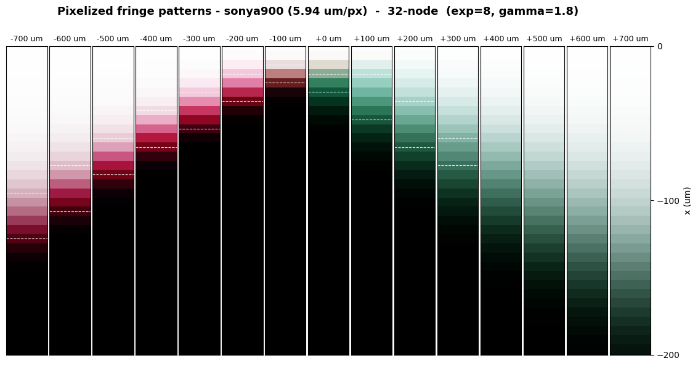
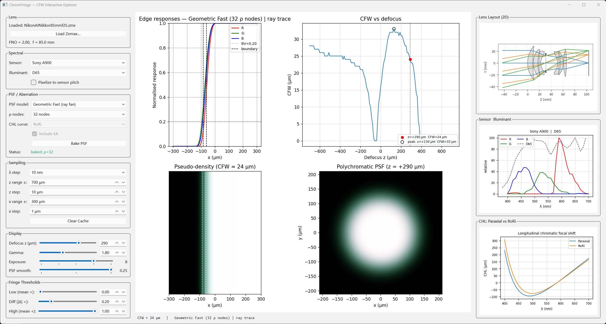

# ChromFringe

A research toolkit for predicting **chromatic colour fringing** in photographic lenses. Given a lens prescription (Zemax ZMX), ChromFringe models how second spectrum and monochromatic aberration produce visible colour fringes at high-contrast edges, and reports a **Colour Fringe Width (CFW)** metric in µm.



**Geom-fast pupil-node convergence against the FFT ground truth**

Achromatic lenses still exhibit residual secondary spectrum, so a design that looks fully corrected on paper can still show visible colour fringes in real images. ChromFringe makes that residual predictable: it provides a hierarchy of ESF (Edge Spread Function) models — from sub-microsecond analytic kernels to full FFT diffraction ground truth — together with tools to extract the required aberration data from an Optiland lens model.



**Interactive CFW Desktop GUI (reference)**

## What It Does

1. Extracts per-wavelength aberration data from an Optiland lens model: paraxial CHL (marginal-ray trace), RoRi CHL (energy-weighted best focus, includes spherochromatism), and residual SA spot radius ρ_SA(λ)
2. Models the polychromatic R/G/B Edge Spread Functions at a knife edge across the full through-focus range
3. Offers a hierarchy of ESF models — analytic (Disc / Gaussian), geometric ray-fan, and full FFT diffraction ground truth
4. Reports the **Colour Fringe Width (CFW)** in µm, with display tone-mapping (exposure slope, gamma) applied after the optics so display parameters can be varied without re-computing
5. Supports multiple camera sensors (Nikon D700, Sony A900) and user-supplied sensor QE
6. Ships an interactive PySide6 desktop GUI plus research notebooks for defocus sweeps, sensor comparison, and node-count convergence studies

## How It Works

ChromFringe models a single signal chain from scene edge to a display-referred colour fringe:

```
Scene (edge) → D65 illuminant → Lens (CHL, SA) → Sensor (RGB QE) → tone map (γ, exposure) → CFW
```

Aberration curves are extracted once per lens; each defocus position then produces per-channel ESFs whose region of disagreement is the colour fringe. The ESF can be evaluated at three fidelity levels that trade speed against physical completeness:

| Level | Method | Speed | Notes |
|-------|--------|-------|-------|
| 0 | FFT diffraction PSF | ~1 s/ESF | Includes diffraction, ground truth |
| 1 | Geometric ray-fan ESF | <1 ms/ESF | Geometrically exact, linear z-extrapolation |
| — | Analytic (Disc / Gaussian) | <0.01 ms/ESF | Diagnostic only — parametric sanity check, not a predictive model |

## Installation

This project uses [uv](https://docs.astral.sh/uv/) for environment and dependency management.

```bash
git clone https://github.com/Leyangf/ChromFringe.git
cd ChromFringe
uv sync                # library only (NumPy, Numba, Optiland …)
uv sync --extra gui    # add the PySide6 desktop GUI
```

`uv sync` creates `.venv/` and installs all locked dependencies (Python ≥ 3.11, NumPy, Numba, [Optiland](https://github.com/HarrisonKramer/optiland)) with `chromf` in editable mode. Activate the environment with `.venv\Scripts\activate` (Windows) or `source .venv/bin/activate` (macOS/Linux), or run commands directly via `uv run`, e.g. `uv run jupyter lab`.

## Quick Start

```python
from optiland import fileio
import chromf

lens = fileio.load_zemax_file("data/lens/NikonAINikkor85mmf2S.zmx")
chl_curve, spot_curve = chromf.compute_rori_spot_curves(lens)

cfw = chromf.fringe_width(
    z_um=200.0,
    chl_curve_um=chl_curve[:, 1],
    rho_sa_um=spot_curve[:, 1],
    f_number=2.0,
    psf_mode="gauss",
)
print(f"CFW = {cfw} µm")
```

### Desktop GUI

```bash
uv run chromf-gui
```

The PySide6 GUI loads any Zemax `.zmx`, sweeps defocus interactively, and shows R/G/B edge responses, a pseudo-density colour-fringe strip, the CFW(z) curve, and side panels for the 2-D lens layout, sensor/illuminant spectra, and Paraxial vs RoRi CHL diagnostics. Geometric Fast PSF mode requires an explicit **Bake PSF** click; the **Pixelize** toggle box-averages the ESF onto the sensor's actual pixel pitch.

## Notebooks

- [`examples/cfw_geom_demo.ipynb`](examples/cfw_geom_demo.ipynb) — interactive geometric/analytic PSF analysis with sliders for defocus, PSF model, and SA toggle. Includes diagnostic plots (CHL curves, SA vs CHL budget) and controlled-variable comparisons.
- [`examples/cfw_fftpsf_demo.ipynb`](examples/cfw_fftpsf_demo.ipynb) — FFT Fraunhofer diffraction ground truth. Uses two-stage baking (monochromatic ESF grid + per-sensor weighting) for efficient multi-camera sweeps.
- [`examples/cfw_convergence_analysis.ipynb`](examples/cfw_convergence_analysis.ipynb) — geom-fast node-count convergence study: sweeps the Gauss–Legendre pupil node count and measures the geometric CFW error against the FFT ground truth to find the smallest node count that has converged.

**Sensor support:** bundled models are Nikon D700 (`nikond700`) and Sony A900 (`sonya900`). Add a camera by placing `sensor_{model}_{red,green,blue}.csv` files in `data/raw/` and passing the model name.

## Acknowledgements

This work was inspired by:

> V. Blahnik, D. Gängler, and J.-M. Kaltenbach, "Evaluation and analysis of
> chromatic aberrations in images," in *Optical Design and Engineering IV*,
> Proc. SPIE **8167**, 81670G (2011). https://doi.org/10.1117/12.901818
