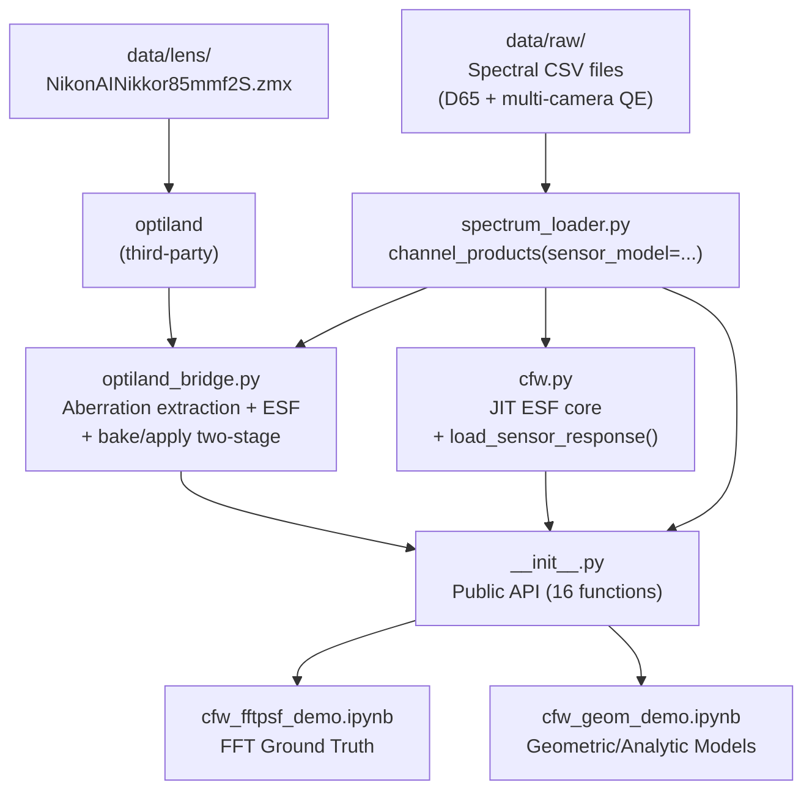

# ChromFringe Technical Research Report

> **Research objective:** Numerical modelling, prediction, and quantification of colour fringes caused by residual longitudinal chromatic aberration (CHL) and spherical aberration (SA) in photographic lenses.
>
> **Core metric:** Colour Fringe Width (CFW) — the width (µm) of the colour fringe at a given defocus.

---

## Table of Contents

- [[#1. Project Overview]]
- [[#2. Repository Structure]]
- [[#3. Module Dependencies]]
- [[#4. Data Flow and Signal Chain]]
- [[#5. Module Interface Reference]]
  - [[#5.1 chromf/__init__.py — Public API]]
  - [[#5.2 spectrum_loader.py — Spectral Data]]
  - [[#5.3 cfw.py — JIT Core Kernels]]
  - [[#5.4 optiland_bridge.py — Aberration Extraction & PSF]]
- [[#6. Mathematical and Physical Models]]
  - [[#6.1 Chromatic Aberration (CHL) Geometric Model]]
  - [[#6.2 RoRi Aperture-Weighted Method]]
  - [[#6.3 Residual Spherical Aberration (SA) Blur]]
  - [[#6.4 Seidel W040 Spherical Aberration Coefficient]]
  - [[#6.5 ESF Model: Pillbox (Geometric Uniform Disc)]]
  - [[#6.6 ESF Model: Gaussian PSF]]
  - [[#6.7 ESF Model: Multi-Zone Defocus (MZD)]]
  - [[#6.8 Geometric Pupil Integral (Gauss-Legendre)]]
  - [[#6.9 Ray-Fan Linear Extrapolation]]
  - [[#6.10 FFT Fraunhofer Diffraction PSF]]
  - [[#6.11 Polychromatic ESF Spectral Integration]]
  - [[#6.12 Energy Normalisation]]
  - [[#6.13 Tone Mapping and Gamma Correction]]
  - [[#6.14 CFW Definition and Pixel Detection]]
- [[#7. Research Notebooks]]
  - [[#7.1 cfw_fftpsf_demo.ipynb — FFT Diffraction Baseline]]
  - [[#7.2 cfw_geom_demo.ipynb — Geometric/Analytic Models]]
- [[#8. Performance Analysis]]
- [[#9. Experimental Data and Results]]
- [[#10. Data File Reference]]

---

## 1. Project Overview

### 1.1 Physical Background

Achromatic lenses, after correcting the primary spectrum, still exhibit **secondary spectrum**: different wavelengths focus at slightly different axial positions. When the camera is focused on a particular image plane, each wavelength forms a blur circle of different radius, causing the R, G, and B channels to exhibit different ESF (Edge Spread Function) widths. At high-contrast edges, this difference produces visible colour fringes.

**Signal chain:**

$$\text{Scene (knife-edge)} \;\xrightarrow{D_{65}}\; \text{Illuminant} \;\xrightarrow{\mathrm{CHL}(\lambda),\,\mathrm{SA}(\lambda)}\; \text{Lens} \;\xrightarrow{S_c(\lambda)}\; \text{Sensor (RGB)} \;\xrightarrow{\gamma,\,\alpha}\; \text{Display}$$

### 1.2 Modelling Hierarchy

| Level | Method | Speed | Accuracy |
|-------|--------|-------|----------|
| 0 | FFT diffraction PSF (ground truth) | ~1 s/ESF | Includes diffraction effects |
| 1 | Geometric pupil integral (Gauss-Legendre) | ~10 ms/ESF | Geometrically exact |
| 2 | Ray-fan linear extrapolation (precomputed fan) | <1 ms/ESF | Linear error O((z/f')²) |
| 3 | Analytic ESF models (Pillbox/Gauss/MZD) | <0.01 ms/ESF | Parametric approximation |

### 1.3 Test Lens

**Nikon AI Nikkor 85mm f/2S** (Zemax ZMX format)

- Focal length: 85 mm
- Maximum aperture: f/2 (experiments run at f/2, FNO ≈ 2.0)
- Elements: 13 lenses (14 surfaces)
- Key output parameters:
  - SA spot radius $\rho_{sa}$: 11.8 – 18.4 µm (mean 16.8 µm)
  - W040: 1.871 – 3.141 µm OPD

---

## 2. Repository Structure

```
ChromFringe/
├── data/
│   ├── raw/                                ← Spectral CSV files
│   │   ├── daylight_d65.csv                ← CIE D65 standard illuminant
│   │   ├── sensor_nikond700_{red,green,blue}.csv  ← Nikon D700 sensor QE
│   │   ├── sensor_sonya900_{red,green,blue}.csv   ← Sony A900 sensor QE
│   │   └── defocus_chl_zf85.csv            ← Reference lens CHL curve
│   └── lens/
│       └── NikonAINikkor85mmf2S.zmx        ← Zemax lens prescription
├── examples/
│   ├── cfw_fftpsf_demo.ipynb               ← FFT diffraction PSF baseline notebook
│   └── cfw_geom_demo.ipynb                 ← Geometric/analytic PSF model notebook
├── src/chromf/
│   ├── __init__.py                         ← Public API exports (16 functions)
│   ├── cfw.py                              ← JIT-compiled CFW core kernels
│   ├── spectrum_loader.py                  ← Spectral data loading & normalisation
│   └── optiland_bridge.py                  ← Aberration extraction + PSF computation
├── pyproject.toml
├── environment.yml
├── requirements.txt
└── README.md
```

> **Sensor file naming convention:** `sensor_{model}_{color}.csv`, e.g. `sensor_nikond700_red.csv`. To add a new camera, place the corresponding CSV files and pass the `sensor_model` parameter.

---

## 3. Module Dependencies



### 3.1 Import Dependency Graph (Precise)

```
chromf/__init__.py
  ├── from chromf.cfw import fringe_width, edge_response, edge_rgb_response,
  │       detect_fringe_binary, load_sensor_response
  │     └── cfw.py calls spectrum_loader.channel_products(sensor_model="nikond700") at module load
  │           └── spectrum_loader.py → pandas (CSV I/O), scipy (CubicSpline)
  ├── from chromf.spectrum_loader import channel_products
  └── from chromf.optiland_bridge import compute_chl_curve, compute_rori_chl_curve,
        compute_rori_spot_curves, compute_sa_poly_curves, compute_w040_curve, precompute_ray_fan,
        compute_polychromatic_esf, compute_polychromatic_esf_geometric,
        compute_polychromatic_esf_fast, bake_wavelength_esfs, apply_sensor_weights
          ├── from chromf.spectrum_loader import channel_products
          └── lazy: from optiland.psf import FFTPSF (imported only when FFT functions are called)
```

---

## 4. Data Flow and Signal Chain

### 4.1 Complete Computation Pipeline

```mermaid
flowchart LR
    subgraph Data Input
        ZMX[Zemax ZMX\nLens Prescription]
        CSV[Spectral CSV\nD65 + RGB QE]
    end

    subgraph optiland_bridge
        CHL[compute_chl_curve\nParaxial CHL λ→µm]
        RORI[compute_rori_spot_curves\nRoRi CHL + ρ_sa]
        W040[compute_w040_curve\nSeidel W040]
        FAN[precompute_ray_fan\n32×31 TA₀ + slope]
        FFT[compute_polychromatic_esf\nFFT diffraction ESF]
        GEO[compute_polychromatic_esf_geometric\nGeometric integral ESF]
        FAST[compute_polychromatic_esf_fast\nRay-fan extrapolation ESF]
        BAKE[bake_wavelength_esfs\nMonochromatic ESF baking\n(sensor-independent)]
        APPLY[apply_sensor_weights\nApply spectral weights\n(microseconds)]
        PSF2D[compute_polychromatic_psf\n2D polychromatic PSF]
        CFWPSF[compute_cfw_psf\nPSF → CFW]
    end

    subgraph spectrum_loader
        SD[channel_products\nNormalised S·D products]
    end

    subgraph cfw
        ER[edge_response\nSingle-channel ESF value]
        ERGB[edge_rgb_response\nR G B tuple]
        DFB[detect_fringe_binary\nPixel-level fringe detection]
        FW[fringe_width\nTotal CFW pixel count]
    end

    ZMX --> CHL & RORI & W040 & FAN & FFT & GEO & FAST & BAKE & PSF2D
    BAKE --> APPLY
    PSF2D --> CFWPSF
    CSV --> SD
    SD --> ER & APPLY
    CHL & RORI & W040 --> ER
    ER --> ERGB --> DFB --> FW
```

### 4.2 Experimental Workflows (Notebook Perspective)

**`cfw_fftpsf_demo.ipynb` (ground truth path, two-stage baking):**

```
Load lens → Spectral data →
Stage 1: Monochromatic ESF baking (25 z × 11 wavelengths, FFT diffraction, sensor-independent) →
Stage 2: Apply sensor spectral weights (re-run only when switching cameras, microseconds) →
Polychromatic ESF cache →
Tone mapping (variable parameters) →
CFW detection + channel-pair difference analysis
```

> The two-stage approach is **3× faster** than single-step baking: each wavelength's FFT runs only once, no longer repeated per channel.

**`cfw_geom_demo.ipynb` (geometric/analytic path):**

```
Load lens → Extract aberration curves (CHL/RoRi/SA/W040) → Precompute ray fan →
Interactive viewer (PSF model × CHL model × defocus) →
Static comparison experiments (5a: PSF model | 5b: aberration accuracy | 5c: full-input comparison)
```

---

## 5. Module Interface Reference

### 5.1 `chromf/__init__.py` — Public API

`src/chromf/__init__.py` is the sole external-facing interface layer, exporting 16 functions:

#### CFW Core Functions (from `cfw.py`)

```python
from chromf import (
    fringe_width,          # Total CFW pixel count
    edge_response,         # Single-channel ESF value
    edge_rgb_response,     # R, G, B ESF tuple
    detect_fringe_binary,  # Single-pixel fringe detection
    load_sensor_response,  # Build R/G/B spectral-weight dict for a camera model
)
```

> **Multi-camera support:** All public CFW functions accept a `sensor_response` parameter. Use `load_sensor_response("nikond700")` or `load_sensor_response("sonya900")` to build the corresponding dict and pass it in to switch camera models. Default: Nikon D700.

#### Spectral Data (from `spectrum_loader.py`)

```python
from chromf import channel_products   # Energy-normalised S·D products
# channel_products(sensor_model="nikond700")  ← specify camera model
```

#### Aberration Extraction & ESF (from `optiland_bridge.py`)

```python
from chromf import (
    compute_chl_curve,              # Paraxial CHL curve
    compute_rori_chl_curve,         # Aperture-weighted RoRi CHL
    compute_rori_spot_curves,       # RoRi CHL + residual SA blur
    compute_sa_poly_curves,         # SA polynomial coefficients c₃, c₅ per wavelength
    compute_w040_curve,             # Seidel W040 coefficient
    precompute_ray_fan,             # Precompute ray fan
    compute_polychromatic_esf,      # FFT diffraction ESF (ground truth)
    compute_polychromatic_esf_geometric,  # Geometric integral ESF
    compute_polychromatic_esf_fast, # Ray-fan extrapolation ESF
    bake_wavelength_esfs,           # Sensor-independent monochromatic ESF baking (FFT)
    apply_sensor_weights,           # Apply sensor spectral weights (microseconds)
)
```

---

### 5.2 `spectrum_loader.py` — Spectral Data Loading & Normalisation

**File path:** `src/chromf/spectrum_loader.py` (180 lines)

**Data directory resolution:**
```python
DATA_DIR = Path(__file__).resolve().parents[2] / "data" / "raw"
# parents[0]=chromf/, parents[1]=src/, parents[2]=project-root/
```

#### Internal Functions

| Function | Signature | Description |
|----------|-----------|-------------|
| `_csv(name)` | `(str) → ndarray` | Load CSV, return float64 `[λ, value]` array |
| `_load_defocus(channel)` | `(str) → ndarray` | Load defocus curve, default `"chl_zf85"` |
| `_load_daylight(src)` | `(str) → ndarray` | Load illuminant spectrum, default `"d65"` |
| `_load_sensor(ch, model)` | `(str, str) → ndarray` | Load sensor response, `ch ∈ {red, green, blue}`, `model` specifies camera |
| `_resample(xs, ys, new_x)` | `(ndarray, ndarray, ndarray) → ndarray` | Cubic spline interpolation + normalise to 0–100 |
| `_energy_norm(sensor, daylight)` | `(ndarray, ndarray) → float` | Compute energy normalisation coefficient k |

#### Public API

```python
def channel_products(
    daylight_src: str = "d65",
    channels: Sequence[str] = ("blue", "green", "red"),
    *,
    sensor_model: str = "sonya900",
    sensor_peak: float = 1.0,
) -> dict[str, np.ndarray]:
    """
    Returns: {channel_name: ndarray shape (N, 2)}
    Each column is [λ_nm, normalised S·D value], satisfying ∫ S·D dλ ≈ 1

    sensor_model: Camera model identifier, corresponding to data/raw/sensor_{model}_{ch}.csv
    """
```

**Wavelength grid:** Determined by the first sensor file (`blue`), 31 points, 400–700 nm, 10 nm step.

**Bundled camera models:** `"nikond700"` (Nikon D700), `"sonya900"` (Sony A900). To add a new camera, place `sensor_{model}_{red,green,blue}.csv` files in `data/raw/`.

---

### 5.3 `cfw.py` — JIT-Compiled Core Kernels

**File path:** `src/chromf/cfw.py` (336 lines)

#### Module-Level Constants

```python
DEFAULT_FNUMBER: float = 1.4        # Default f-number
EXPOSURE_SLOPE: float = 8.0         # Tone curve slope
DISPLAY_GAMMA: float = 2.2          # sRGB Gamma
COLOR_DIFF_THRESHOLD: float = 0.2   # Fringe visibility threshold
EDGE_HALF_WINDOW_PX: int = 400      # Scan half-window (pixels)
ALLOWED_PSF_MODES = ("geom", "gauss", "mzd")
DEFAULT_PSF_MODE = "gauss"
```

**Module-load precomputation (default Nikon D700):**
```python
_prods = _channel_products(sensor_model="nikond700")
SENSOR_RESPONSE: dict[str, ndarray] = {
    "R": _prods["red"][:, 1],       # shape (31,)
    "G": _prods["green"][:, 1],
    "B": _prods["blue"][:, 1],
}
```

#### Sensor Selection Function

```python
def load_sensor_response(model: str = "nikond700") -> dict[str, np.ndarray]:
    """Build an R/G/B spectral-weight dict for the specified camera.
    Returns {"R": array(31,), "G": ..., "B": ...}, each array is energy-normalised S·D.
    CSV files data/raw/sensor_{model}_{red|green|blue}.csv must exist.
    """
```

> All public CFW functions accept an optional `sensor_response` parameter. When `None` (default), the module-level `SENSOR_RESPONSE` (Nikon D700) is used; pass the return value of `load_sensor_response("sonya900")` to switch to Sony A900.

#### JIT-Compiled Kernels (Numba `@njit(cache=True)`)

| Function | Lines | Description |
|----------|-------|-------------|
| `_exposure_curve(x, slope)` | 48–51 | `tanh` tone curve, mapped to [0,1] |
| `_geom_esf(x, rho)` | 54–63 | Uniform disc (Pillbox) ESF |
| `_gauss_esf(x, rho)` | 66–71 | Gaussian PSF ESF (σ ≈ 0.5ρ) |
| `_edge_response_jit(x, z, ...)` | 74–110 | Pillbox/Gaussian channel integration kernel |
| `_mzd_edge_response_jit(x, z, ...)` | 112–175 | Multi-Zone Defocus kernel: arcsin ring ESF + Gauss-Legendre pupil integration |

#### Public API

```python
def edge_response(
    channel: Literal["R", "G", "B"],
    x_px: float,         # Pixel coordinate (µm)
    z_um: float,         # Defocus (µm)
    *,
    exposure_slope: float | None = None,   # Default EXPOSURE_SLOPE=8.0
    gamma: float | None = None,            # Default DISPLAY_GAMMA=2.2
    chl_curve_um: np.ndarray,             # Shape (31,), CHL(λ) µm
    sa_curve_um: np.ndarray | None = None, # Shape (31,), ρ_sa(λ) µm
    w040_curve_um: np.ndarray | None = None, # Legacy; MZD mode uses sa_curve_um directly
    f_number: float = DEFAULT_FNUMBER,
    psf_mode: Literal["geom", "gauss", "mzd"] = "gauss",
    sensor_response: dict[str, np.ndarray] | None = None,  # Default Nikon D700
) -> float  # Return value ∈ [0, 1], tone-mapped ESF value
```

```python
def edge_rgb_response(
    x_px: float, z_um: float, *, ...  # Same as edge_response
) -> tuple[float, float, float]       # (R, G, B) ESF tuple
```

```python
def detect_fringe_binary(
    x_px: float, z_um: float,
    *,
    color_diff_threshold: float | None = None,  # Default 0.2
    ...  # Same as edge_response
) -> int  # 1 = fringed, 0 = not fringed
```

```python
def fringe_width(
    z_um: float,
    *,
    xrange_val: int | None = None,   # Default EDGE_HALF_WINDOW_PX=400
    ...  # Same as edge_response
) -> int  # Total CFW (pixel count)
# Scans x ∈ [-400, 400], sums all pixels exceeding threshold
```

---

### 5.4 `optiland_bridge.py` — Aberration Extraction & PSF Computation

**File path:** `src/chromf/optiland_bridge.py` (923 lines)

#### Shared Constants

```python
_RORI_PY = (0.0, 0.5, 0.7071067811865476, 0.8660254037844387, 1.0)
# Normalised pupil heights: 0, √0.25, √0.5, √0.75, 1

_RORI_WEIGHTS = (1.0, 12.8, 14.4, 12.8, 1.0)
_RORI_SUM = 42.0

_CHANNEL_MAP = {"R": "red", "G": "green", "B": "blue"}
```

#### Internal Helper Functions

| Function | Lines | Description |
|----------|-------|-------------|
| `_resolve_wl_grid(optic, wls, ref_wl)` | 20–36 | Resolve wavelength grid and reference wavelength |
| `_paraxial_bfl(paraxial, wl_nm, z_start)` | 39–52 | Paraxial marginal ray trace, compute back focal length |
| `_sk_real(optic, Py, wl_um)` | 101–114 | Meridional real-ray back-focal intercept SK(ρ) |
| `_optic_at_defocus(optic, z_defocus_um)` | 277–285 | Return deep copy of lens with shifted image plane |
| `_psf_to_esf(psf_2d, dx_um, x_px, n_pixels)` | 782–808 | 2D PSF → 1D ESF (cumulative sum method) |

#### Aberration Extraction Functions

```python
def compute_chl_curve(
    optic,
    wavelengths_nm: np.ndarray | None = None,
    ref_wavelength_nm: float | None = None,
) -> np.ndarray  # Shape (N, 2): [λ_nm, CHL_µm]
# Paraxial marginal ray trace, returns secondary spectrum curve
```

```python
def compute_rori_chl_curve(
    optic, wavelengths_nm=None, ref_wavelength_nm=None,
) -> np.ndarray  # Shape (N, 2): [λ_nm, RoRi_CHL_µm]
# Real-ray five-pupil-height weighted average, includes spherochromatism
# Internally calls compute_rori_spot_curves and returns the first array
```

```python
def compute_rori_spot_curves(
    optic, wavelengths_nm=None, ref_wavelength_nm=None,
) -> tuple[np.ndarray, np.ndarray]
# Returns: (chl_curve [N,2], spot_curve [N,2])
# spot_curve[:,1] = ρ_sa(λ), µm, i.e. RMS residual spot radius
```

```python
def compute_sa_poly_curves(
    optic, wavelengths_nm=None, ref_wavelength_nm=None,
) -> np.ndarray  # Shape (N, 3): [λ_nm, c₃_µm, c₅_µm]
# Per-wavelength SA polynomial: TA_SA(ρ,λ) ≈ c₃(λ)·ρ³ + c₅(λ)·ρ⁵
# Captures both primary (3rd-order) and secondary (5th-order) SA
# Use with psf_mode='mzd' via sa_poly_um=result[:, 1:]
```

```python
def compute_w040_curve(
    optic, wavelengths_nm=None, ref_wavelength_nm=None,
) -> np.ndarray  # Shape (N, 2): [λ_nm, W040_µm OPD]
# Seidel spherical aberration coefficient: W040 = -TA_marginal_µm / (8·FNO)
```

#### Ray Tracing & ESF Functions

```python
def precompute_ray_fan(optic, num_rho: int = 32, sensor_model: str = "nikond700") -> dict:
    """
    Pre-trace 32×31 = 992 rays (at z=0)
    Returns dict containing:
        fno, rho_nodes (32,), W_gl (32,), wl_nm (31,)
        TA0 (32, 31) µm   — transverse aberration
        slope (32, 31)    — M/N direction cosine ratio
        "R", "G", "B"     — per-channel spectral weights g_norm (31,)
    """
```

```python
def compute_polychromatic_esf(
    optic, channel: str, z_defocus_um: float,
    x_um: np.ndarray,
    num_rays: int = 256,    # Pupil sampling count
    grid_size: int = 512,   # FFT grid size
    strategy: str = "chief_ray",  # Must use chief_ray to preserve defocus phase
    wl_stride: int = 1,     # Wavelength subsampling stride
) -> np.ndarray  # Shape == x_um.shape, values ∈ [0, 1]
# FFT diffraction PSF → ESF (ground truth, slow)
```

```python
def compute_polychromatic_esf_geometric(
    optic, channel: str, z_defocus_um: float,
    x_um: np.ndarray,
    num_rho: int = 32,      # Gauss-Legendre nodes
    wl_stride: int = 1,
) -> np.ndarray  # Values ∈ [0, 1]
# Geometric pupil integral ESF, ~100× faster than FFT
```

```python
def compute_polychromatic_esf_fast(
    ray_fan: dict,           # From precompute_ray_fan
    channel: str,
    z_defocus_um: float,
    x_um: np.ndarray,
    wl_stride: int = 1,
) -> np.ndarray  # Values ∈ [0, 1]
# Ray-fan linear extrapolation, ~1000× faster than FFT
```

#### Two-Stage Baking Functions

Splits FFT ESF computation into a **sensor-independent** monochromatic baking step and a **sensor-specific** weight application step, so switching camera models does not require re-running FFTs:

```python
def bake_wavelength_esfs(
    optic,
    z_defocus_um: float,
    x_um: np.ndarray,
    wl_nm_arr: np.ndarray,      # Wavelength array (nm)
    num_rays: int = 256,
    grid_size: int = 512,
    strategy: str = "chief_ray",
) -> np.ndarray  # Shape (len(wl_nm_arr), len(x_um)), values ∈ [0, 1]
# Independent FFT → ESF per wavelength, no sensor or illuminant weighting
```

```python
def apply_sensor_weights(
    mono_esfs: np.ndarray,      # From bake_wavelength_esfs
    wl_nm_arr: np.ndarray,
    channel: str,               # "R", "G", "B"
    sensor_model: str = "sonya900",
) -> np.ndarray  # Shape (n_x,), values ∈ [0, 1]
# Pure NumPy weighted sum, microsecond-level
```

> **Performance:** For the same optical system with 25 defocus steps × 3 channels × 2 cameras (150 ESFs), the two-stage approach requires only 25 × 11 = 275 FFTs + 150 NumPy weightings; the single-step approach would require 150 × 11 = 1650 FFTs. Speedup: **~6×** (single camera ~3×).

#### 2D PSF and Direct CFW Computation

```python
def compute_polychromatic_psf(
    optic, channel: str, z_defocus_um: float,
    num_rays: int = 128, grid_size: int = 1024,
    strategy: str = "best_fit_sphere",
    sensor_model: str = "nikond700",
) -> tuple[np.ndarray, float]
# Returns (psf_2d [grid_size, grid_size], dx_um)
# psf_2d is energy-normalised (sum=1)
```

```python
def compute_cfw_psf(
    optic, z_defocus_um: float, *,
    num_rays: int = 128, grid_size: int = 1024,
    strategy: str = "best_fit_sphere",
    x_px: float = 4.5,
    exposure_slope: float = 8.0,
    display_gamma: float = 2.2,
    color_diff_threshold: float = 0.2,
) -> int
# From 2D PSF → ESF → tone mapping → CFW pixel count
# Computed at pixel scale, directly comparable to cfw.fringe_width()
```

---

## 6. Mathematical and Physical Models

### 6.1 Chromatic Aberration (CHL) Geometric Model

#### 6.1.1 Paraxial CHL Definition

For a thin lens group, the paraxial back focal length $f_2'(\lambda)$ at wavelength $\lambda$ minus that at the reference wavelength $\lambda_\text{ref}$ defines the **longitudinal chromatic aberration** (CHL):

$$\mathrm{CHL}_\text{par}(\lambda) = \left[f_2'(\lambda) - f_2'(\lambda_\text{ref})\right] \times 10^3 \quad (\mu\mathrm{m})$$

Implementation (`optiland_bridge.py` lines 84–86):
```python
f2_values = np.array([_paraxial_bfl(paraxial, wl, z_start) for wl in wls])
f2_ref = _paraxial_bfl(paraxial, ref_wl, z_start)
chl_um = (f2_values - f2_ref) * 1000.0  # mm → µm
```

where `_paraxial_bfl` computes the back focal length via paraxial marginal ray trace:
$$f_2' = -\frac{y_\text{last}}{u_\text{last}}$$

#### 6.1.2 CHL-Induced Blur Radius

In the geometric optics framework, when the image plane is at position $z$ (relative to the reference focal plane), light at wavelength $\lambda$ forms a blur circle of radius $\rho_\text{CHL}$:

$$\boxed{\rho_\text{CHL}(z,\lambda) = \frac{|z - \mathrm{CHL}(\lambda)|}{\sqrt{4N^2 - 1}}}$$

**Derivation:** For a lens with f-number $N$, the marginal ray half-angle $u \approx \arctan(1/(2N))$, and at defocus $\Delta z = z - \mathrm{CHL}(\lambda)$, the blur circle radius is:

$$\rho = |\Delta z| \cdot \tan u = |\Delta z| \cdot \frac{1/2N}{\sqrt{1 - 1/(4N^2)}} = \frac{|\Delta z|}{\sqrt{4N^2 - 1}}$$

Implementation (`cfw.py` lines 158–161):
```python
denom = _sqrt(4.0 * f_number**2.0 - 1.0)
rho_chl = _fabs((z - chl_curve[n]) / denom)
```

---

### 6.2 RoRi Aperture-Weighted Method

#### 6.2.1 Motivation

Paraxial CHL ignores **spherochromatism** caused by spherical aberration: the magnitude of SA varies with wavelength, causing different aperture zones to have different effective focal lengths. The RoRi method estimates the "equivalent best-focus" by taking a weighted average of real-ray back-focal intercepts across multiple aperture zones.

#### 6.2.2 RoRi Formula

At 5 normalised pupil heights $\rho_i \in \{0, \sqrt{0.25}, \sqrt{0.5}, \sqrt{0.75}, 1\}$, trace real meridional rays and compute each ray's back-focal intercept $\mathrm{SK}(\rho_i, \lambda)$ (the on-axis intersection point), then take a weighted average:

$$\mathrm{RoRi}(\lambda) = \frac{\mathrm{SK}(0) + 12.8\cdot\mathrm{SK}(\sqrt{0.25}) + 14.4\cdot\mathrm{SK}(\sqrt{0.5}) + 12.8\cdot\mathrm{SK}(\sqrt{0.75}) + \mathrm{SK}(1)}{42}$$

Weight derivation: annular area $\Delta A \propto 2\rho\,\Delta\rho$; dividing $[0,1]$ into 4 equal-area annuli, the trapezoidal integration weights are $\{1, 12.8, 14.4, 12.8, 1\}$, summing to 42.

Implementation (`optiland_bridge.py` lines 94–98):
```python
_RORI_PY      = (0.0, 0.5, 0.7071067811865476, 0.8660254037844387, 1.0)
_RORI_WEIGHTS = (1.0, 12.8, 14.4, 12.8, 1.0)
_RORI_SUM     = 42.0
```

```python
sks = np.array([_paraxial_bfl(paraxial, wl_nm, z_start)]
               + [_sk_real(optic, py, wl_um) for py in _RORI_PY[1:]])
rori = float(np.dot(_w, sks) / _RORI_SUM)
```

#### 6.2.3 Computing SK(ρ)

For the meridional ray at normalised pupil height $\rho$, trace to the image plane, then use the final surface's direction cosines $(M, N)$ and ray height $y$ to extrapolate to the on-axis intercept:

$$\mathrm{SK}(\rho) = -\frac{y \cdot N}{M}$$

Implementation (`optiland_bridge.py` lines 101–114):
```python
rays = optic.trace_generic(0.0, 0.0, 0.0, Py, wl_um)
y = float(rays.y.ravel()[-1])
M = float(rays.M.ravel()[-1])   # Meridional direction cosine
N = float(rays.N.ravel()[-1])   # Axial direction cosine
return -y * N / M
```

#### 6.2.4 RoRi CHL Curve

$$\mathrm{CHL}_\mathrm{RoRi}(\lambda) = \left[\mathrm{RoRi}(\lambda) - \mathrm{RoRi}(\lambda_\mathrm{ref})\right] \times 10^3 \quad (\mu\mathrm{m})$$

---

### 6.3 Residual Spherical Aberration (SA) Blur

Spherical aberration causes different aperture zones to focus at different axial positions; even at the RoRi best-focus plane, residual blur remains.

#### 6.3.1 Lateral Blur Computation

At the RoRi focal plane, the lateral displacement of each ray at pupil height $\rho_i$ (small-angle approximation):

$$y_\text{spot}(\rho_i, \lambda) = \frac{[\mathrm{SK}(\rho_i, \lambda) - \mathrm{RoRi}(\lambda)] \cdot \rho_i}{2N}$$

#### 6.3.2 RMS Residual Spot

$$\boxed{\rho_\text{sa}(\lambda) = \sqrt{\frac{\sum_i w_i \cdot y_\text{spot}^2(\rho_i, \lambda)}{\sum_i w_i}}}$$

Implementation (`optiland_bridge.py` lines 165–166):
```python
y_spots = (sks - rori) * _py / (2.0 * fno)        # mm
rho_sa  = float(np.sqrt(np.dot(_w, y_spots**2) / _RORI_SUM))  # mm (RMS)
```

#### 6.3.3 Total Blur Radius (Quadrature Addition)

CHL blur and SA blur are combined via quadrature (area addition on the blur disc):

$$\boxed{\rho(z, \lambda) = \sqrt{\rho_\text{CHL}(z, \lambda)^2 + \rho_\text{SA}(\lambda)^2}}$$

Implementation (`cfw.py` line 162):
```python
rho = _sqrt(rho_chl**2 + sa_curve[n]**2)  # Quadrature addition
```

---

### 6.4 Seidel W040 Spherical Aberration Coefficient

#### 6.4.1 Physical Definition

The primary spherical aberration wavefront coefficient $W_{040}$ describes the highest-order ($\rho^4$ term) departure of the wavefront from the reference sphere:

$$W(\rho) = W_{040} \cdot \rho^4 + W_{020} \cdot \rho^2 \quad (\mu\mathrm{m\;OPD})$$

where the defocus term $W_{020}$ depends on the current image plane position:
$$W_{020}(z, \lambda) = -\frac{z - \mathrm{CHL}(\lambda)}{8N^2} \quad (\mu\mathrm{m\;OPD})$$

#### 6.4.2 Deriving W040 from Marginal Ray

From Seidel aberration theory, the transverse aberration (TA) is related to the wavefront derivative:

$$\mathrm{TA}(\rho) = -2N \cdot \frac{\partial W}{\partial \rho} = -2N(4W_{040}\rho^3 + 2W_{020}\rho)$$

At the normalised marginal ray ($\rho = 1$), the $\mathrm{TA}_\text{marginal}$ at the RoRi focal plane is:

$$\mathrm{TA}_\text{marginal} = \frac{\mathrm{SK}(\rho=1) - \mathrm{RoRi}}{2N} \quad (\mathrm{mm})$$

At the RoRi focal plane $W_{020}=0$ (approximately), therefore:

$$\mathrm{TA}_\text{marginal} \approx -2N \cdot 4W_{040} \cdot 1 = -8N \cdot W_{040}$$

Solving:

$$\boxed{W_{040}(\lambda) = \frac{-\mathrm{TA}_\text{marginal}(\lambda) \times 10^3}{8N} \quad (\mu\mathrm{m\;OPD})}$$

Implementation (`optiland_bridge.py` lines 222–225):
```python
ta_marginal_mm = (sks[-1] - rori) / (2.0 * fno)     # SK(ρ=1) − RoRi
return -(ta_marginal_mm * 1000.0) / (8.0 * fno)     # µm OPD
```

**Measured values (Nikon 85mm f/2):** W040 ∈ [1.871, 3.141] µm OPD, varying with wavelength (spherochromatism).

---

### 6.5 ESF Model: Pillbox (Geometric Uniform Disc)

#### 6.5.1 Physical Assumption

The PSF is a 2D disc uniformly distributed within radius $\rho$ (geometric blur circle), with intensity distribution:

$$\mathrm{PSF}_\text{geom}(\mathbf{r}) = \frac{1}{\pi\rho^2} \cdot \mathbf{1}[|\mathbf{r}| \leq \rho]$$

#### 6.5.2 ESF Integration

The ESF is the projection of the PSF along the $y$-direction followed by cumulative integration (equivalent to convolution of a half-plane with the PSF). For the uniform disc:

$$\mathrm{ESF}_\text{geom}(x, \rho) = \begin{cases} 0 & x \leq -\rho \\ \dfrac{1}{2}\left(1 + \dfrac{x}{\rho}\right) & -\rho < x < \rho \\ 1 & x \geq \rho \end{cases}$$

**Derivation:** At height $x$, the chord length (disc cross-section) is $2\sqrt{\rho^2-x^2}$, but the lateral integral of the uniform disc is linear: $\int_{-\rho}^{x}\!\frac{1}{\pi\rho^2}\cdot 2\sqrt{\rho^2-t^2}\,dt$, which after integration over $t \in [-\rho, x]$ and normalisation yields the linear transition above.

Implementation (`cfw.py` lines 55–63):
```python
def _geom_esf(x: float, rho: float) -> float:
    if rho < 1e-6:
        return 1.0 if x >= 0.0 else 0.0
    if x >= rho:  return 1.0
    if x <= -rho: return 0.0
    return 0.5 * (1.0 + x / rho)
```

---

### 6.6 ESF Model: Gaussian PSF

#### 6.6.1 Physical Assumption

The PSF is a 2D circularly symmetric Gaussian distribution with standard deviation $\sigma \approx 0.5\rho$ (corresponding to the blur circle radius):

$$\mathrm{PSF}_\text{gauss}(\mathbf{r}) = \frac{1}{2\pi\sigma^2}\exp\!\left(-\frac{|\mathbf{r}|^2}{2\sigma^2}\right)$$

#### 6.6.2 ESF

The 1D ESF of a Gaussian PSF is the error function (CDF of the standard normal):

$$\boxed{\mathrm{ESF}_\text{gauss}(x, \rho) = \frac{1}{2}\left[1 + \mathrm{erf}\!\left(\frac{x}{\sqrt{2}\,\sigma}\right)\right], \quad \sigma = 0.5\rho}$$

Implementation (`cfw.py` lines 66–71):
```python
def _gauss_esf(x: float, rho: float) -> float:
    if rho < 1e-6:
        return 1.0 if x >= 0.0 else 0.0
    return 0.5 * (1.0 + _erf(x / (_sqrt(2.0) * 0.5 * rho)))
```

**Note:** The Gaussian model has soft tails compared to Pillbox, providing a closer approximation to the real PSF (smooth approximation of diffraction edge ringing).

---

### 6.7 ESF Model: Multi-Zone Defocus (MZD)

#### 6.7.1 Physical Motivation

Spherical aberration causes different aperture zones to focus at different axial positions. Unlike the simple single-scalar ρ_sa model, MZD explicitly resolves the pupil-dependent blur by integrating over Gauss-Legendre pupil nodes, where each node contributes an arcsin ring ESF with a radius that combines defocus and SA in quadrature.

#### 6.7.2 Per-Ring Blur Radius

For each wavelength $\lambda$ and Gauss-Legendre pupil node $\rho_k$, the blur radius combines CHL defocus and primary SA:

$$\rho_\text{CHL} = \frac{|z - \mathrm{CHL}(\lambda)|}{\sqrt{4N^2 - 1}}$$

$$\mathrm{TA}_\text{SA} = \rho_k^3 \cdot 2 \cdot \rho_\text{SA}(\lambda)$$

$$\boxed{R_k = \sqrt{(\rho_k \cdot \rho_\text{CHL})^2 + \mathrm{TA}_\text{SA}^2}}$$

The factor of 2 converts the RMS SA to an approximate marginal-ray value ($\times 2 \approx$ RMS→marginal).

#### 6.7.3 Arcsin Ring ESF

The per-ring ESF is the exact geometric result for a thin annulus of radius $R$:

$$\boxed{\mathrm{ESF}_\text{ring}(x;\,R) = \frac{\arcsin\!\left(\mathrm{clip}\!\left(\dfrac{x}{R},\,-1,\,1\right)\right)}{\pi} + \frac{1}{2}}$$

#### 6.7.4 Pupil Integration

The full ESF integrates over the pupil with area weights:

$$\mathrm{ESF}_\text{MZD}(x;\,z,\lambda) = \sum_k \rho_k \cdot W_k \cdot \mathrm{ESF}_\text{ring}(x;\,R_k)$$

where $\rho_k, W_k$ are Gauss-Legendre nodes and weights on $[0, 1]$.

Implementation (`cfw.py` lines 112–175):
```python
def _mzd_edge_response_jit(x, z, slope, gamma, sensor, chl_curve,
                            f_number, sa_curve, rho_gl, w_gl):
    for n in range(sensor.size):
        rho_chl = _fabs((z - chl_curve[n]) / denom)
        sa = sa_curve[n]
        for k in range(n_rho):
            rk = rho_gl[k]
            sa_zone = rk * rk * rk * 2.0 * sa   # TA_SA ∝ ρ³
            R = _sqrt((rk * rho_chl) ** 2 + sa_zone * sa_zone)
            # arcsin ring ESF
            f_val = _asin(clip(x / R, -1, 1)) / PI + 0.5
            wl_contrib += rk * w_gl[k] * f_val
        acc += sensor[n] * wl_contrib / wl_norm
```

#### 6.7.5 SA Polynomial Coefficients

The `compute_sa_poly_curves` function fits the residual transverse aberration at each wavelength's RoRi best focus to a two-term pupil polynomial:

$$\mathrm{TA}_\text{SA}(\rho, \lambda) \approx c_3(\lambda) \cdot \rho^3 + c_5(\lambda) \cdot \rho^5$$

using the 4 non-trivial RoRi pupil zones ($\rho \in \{\sqrt{1/4}, \sqrt{1/2}, \sqrt{3/4}, 1\}$). This captures both primary (3rd-order) and secondary (5th-order) spherical aberration.

Implementation (`optiland_bridge.py` lines 181–239):
```python
A = np.column_stack([rho_pts**3, rho_pts**5])      # Design matrix
coeffs, _, _, _ = np.linalg.lstsq(A, ta_sa[1:], rcond=None)
c3_arr[i], c5_arr[i] = coeffs[0], coeffs[1]
```

**Measured values (Nikon 85mm f/2):** c₃ ∈ [24.5, 46.6] µm, c₅ ∈ [−101.7, −57.7] µm.

---

### 6.8 Geometric Pupil Integral (Gauss-Legendre)

#### 6.8.1 Physical Principle

Directly integrate over the continuous pupil, requiring no PSF shape assumption. For a ray at normalised pupil height $\rho$, the lateral displacement on the defocused image plane is $R(\rho) = |y_\text{image}(\rho)|$ (µm). By geometric optics, this ray's contribution to the ESF equals the uniform-disc ESF at position $x$ (i.e. the arcsin function):

$$\mathrm{ESF}(x) = \int_0^1 \left[\frac{\arcsin\!\left(\mathrm{clip}\!\left(\dfrac{x}{R(\rho)},\,-1,\,1\right)\right)}{\pi} + \frac{1}{2}\right] 2\rho\,d\rho$$

#### 6.8.2 Gauss-Legendre Numerical Integration

Transform $\int_0^1 f(\rho) \cdot 2\rho\,d\rho$ to the standard $[-1,1]$ interval:

$$\int_{-1}^{1} f\!\left(\frac{\xi+1}{2}\right) \cdot \left(\frac{\xi+1}{2}\right) \frac{d\xi}{2} \cdot 2 = \sum_k \rho_k \cdot f(\rho_k) \cdot W_k$$

where $\xi_k, W_k$ are Gauss-Legendre nodes and weights (on $[-1,1]$), $\rho_k = (\xi_k+1)/2$.

Implementation (`optiland_bridge.py` lines 434–461):
```python
xi, W_gl = np.polynomial.legendre.leggauss(num_rho)   # 32 nodes
rho_nodes = 0.5 * (xi + 1.0)                          # Map to [0,1]
# ...
ratio = np.clip(x_col / R_row, -1.0, 1.0)             # (N, K)
f_contrib = np.arcsin(ratio) / np.pi + 0.5            # (N, K)
esf_j = np.sum(f_contrib * rho_row * W_row, axis=1)   # (N,)
```

**Accuracy:** 32-node ESF error < 0.1% (for smooth aberration profiles).

---

### 6.9 Ray-Fan Linear Extrapolation

#### 6.9.1 Principle

Pre-trace all rays at $z=0$, recording transverse aberration $\mathrm{TA}_0(\rho, \lambda)$ and direction cosine ratio $m(\rho, \lambda) = M/N_\text{dir}$. For any defocus $z$, use linear extrapolation:

$$\boxed{R(\rho;\,z,\lambda) = \left|\mathrm{TA}_0(\rho,\lambda) + m(\rho,\lambda) \cdot z\right| \quad (\mu\mathrm{m})}$$

#### 6.9.2 Error Analysis

Linear extrapolation error comes from higher-order terms (refractive surface curvature):

$$\epsilon = O\!\left(\left(\frac{z}{f'}\right)^2\right) \approx 0.01\%$$

For an 85 mm lens, the error is < 0.01% when $z \leq 800\,\mu\mathrm{m}$.

Implementation (`optiland_bridge.py` lines 584–585):
```python
R = np.abs(TA0 + slope * z_defocus_um)   # (K, N_wl_sub)
```

#### 6.9.3 Precomputation Cost

- Trace 32 × 31 = 992 rays (one-time)
- Covers all 31 wavelengths (400–700 nm)
- Covers all three channels (R/G/B)

---

### 6.10 FFT Fraunhofer Diffraction PSF

#### 6.10.1 Physical Principle

Under the Fraunhofer diffraction approximation, the PSF is the squared modulus of the Fourier transform of the exit pupil function:

$$\mathrm{PSF}(\mathbf{u}) = \left|\mathcal{F}\left\{P(\boldsymbol{\rho})\cdot e^{i2\pi W(\boldsymbol{\rho})/\lambda}\right\}\right|^2$$

where $P(\boldsymbol{\rho})$ is the pupil transmission function and $W(\boldsymbol{\rho})$ is the wavefront error (including CHL-induced defocus and spherical aberration).

Implemented by Optiland's `FFTPSF` class: computes OPD via real ray trace, constructs the complex pupil function, then applies FFT.

#### 6.10.2 Wavelength-Corrected Pixel Pitch

FFT PSF pixel pitch is proportional to wavelength (Fraunhofer diffraction angular resolution):

$$\boxed{dx_j = \frac{\lambda_j \cdot N}{Q}, \quad Q = \frac{\text{grid\_size}}{\text{num\_rays} - 1}}$$

where $Q$ is the oversampling factor. This means PSFs at different wavelengths have different pixel pitches in physical space and must be superimposed in physical coordinates (µm).

Implementation (`optiland_bridge.py` lines 363–374):
```python
Q    = grid_size / (num_rays - 1)
dx_j = wl_um_j * fno / Q          # Wavelength-corrected pixel pitch (µm)
lsf  = fft_psf.psf.sum(axis=0)    # 2D PSF → 1D LSF
esf_j = np.cumsum(lsf / lsf.sum()) # LSF → ESF (cumulative sum)
x_j   = (np.arange(n) - n // 2) * dx_j  # Physical coordinates (µm)
esf_accum += g_norm[j] * np.interp(x_um, x_j, esf_j, ...)
```

#### 6.10.3 Key Parameter Choice

Using `strategy="chief_ray"` instead of `"best_fit_sphere"`:

- `chief_ray`: Reference sphere centred on the actual chief ray position, **preserves defocus phase** — CHL effects at different wavelengths correctly manifest in the OPD
- `best_fit_sphere`: Fits and removes defocus, causing all wavelengths to have the same ESF shape, yielding CFW = 0 (incorrect)

#### 6.10.4 ESF → LSF → ESF Conversion

$$\mathrm{LSF}(x) = \int_{-\infty}^{+\infty} \mathrm{PSF}(x, y)\,dy$$

$$\mathrm{ESF}(x) = \int_{-\infty}^{x} \mathrm{LSF}(t)\,dt \approx \mathrm{cumsum}(\mathrm{LSF})$$

`cumsum` is used instead of convolution because when the PSF is very narrow relative to the FFT grid, `fftconvolve` truncates at ~0.5.

---

### 6.11 Polychromatic ESF Spectral Integration

For each channel $c$, the ESF is a spectrally weighted sum of monochromatic ESFs:

$$\boxed{\mathrm{ESF}_c(x, z) = \sum_j \hat{w}_c(\lambda_j) \cdot \mathrm{ESF}_\text{mono}(x;\,z,\,\lambda_j)}$$

where the normalised spectral weights are:

$$\hat{w}_c(\lambda_j) = \frac{g_c(\lambda_j)}{\sum_{j'} g_c(\lambda_{j'})}, \quad g_c(\lambda) = S_c(\lambda) \cdot D_{65}(\lambda)$$

**Wavelength grid:** 31 points, 400–700 nm, 10 nm step. In practice, `wl_stride=3` can down-sample to 11 points (negligible error).

Implementation (`cfw.py` lines 159–172, simplified):
```python
for n in range(chl_curve.size):
    rho_chl = _fabs((z - chl_curve[n]) / denom)
    rho = _sqrt(rho_chl**2 + sa_curve[n]**2)
    weight = _gauss_esf(x, rho)
    acc += sensor[n] * weight     # sensor[n] = normalised S·D weight
norm = np.sum(sensor)
linear = acc / norm
```

---

### 6.12 Energy Normalisation

**Goal:** Ensure that a perfectly focused flat-spectrum edge produces unity response in every channel (i.e. ESF transitions from 0 to 1).

$$k_c = \left(\int S_c(\lambda) \cdot D_{65}(\lambda)\,d\lambda\right)^{-1}$$

$$\hat{g}_c(\lambda) = k_c \cdot S_c(\lambda) \cdot D_{65}(\lambda)$$

Implementation (`spectrum_loader.py` lines 96–100):
```python
def _energy_norm(sensor, daylight):
    s, d = sensor[:, 1], daylight[:, 1]
    integral = float(np.trapezoid(s * d, sensor[:, 0]))
    return 1.0 / integral if integral else 0.0
```

---

### 6.13 Tone Mapping and Gamma Correction

#### 6.13.1 Tone Mapping Curve

Models the nonlinear response of camera/display, using a symmetric $\tanh$ curve:

$$\boxed{T(x;\,\alpha) = \frac{\tanh(\alpha \cdot x)}{\tanh(\alpha)}}$$

where $\alpha$ is the exposure slope (`exposure_slope`). This curve satisfies $T(0)=0$, $T(1)=1$, and has slope $\alpha/\tanh(\alpha)$ near 0 (simulating overexposure effect).

#### 6.13.2 Gamma Correction

Models the sRGB display standard gamma curve:

$$I_\text{display}(x) = T(x;\,\alpha)^\gamma$$

#### 6.13.3 Complete Tone Pipeline

$$\boxed{I_c(x, z) = \left[\frac{\tanh\!\left(\alpha \cdot \mathrm{ESF}_c(x, z)\right)}{\tanh(\alpha)}\right]^\gamma}$$

Implementation (`cfw.py` lines 49–51):
```python
def _exposure_curve(x, slope):
    return np.tanh(slope * x) / np.tanh(slope)
```

And (lines 142–143):
```python
linear = acc / norm
return _exposure_curve(linear, slope) ** gamma
```

---

### 6.14 CFW Definition and Pixel Detection

#### 6.14.1 Single-Pixel Fringe Detection

Pixel $x$ at defocus $z$ is marked as a **fringe pixel** if and only if the difference of any channel pair exceeds the threshold $\delta$:

$$\mathrm{Fringe}(x, z) = \mathbf{1}\!\left[\max\!\left(|I_R - I_G|,\;|I_R - I_B|,\;|I_G - I_B|\right) > \delta\right]$$

Default $\delta = 0.15$–$0.20$ (`COLOR_DIFF_THRESHOLD`).

Implementation (`cfw.py` lines 280–284):
```python
return int(
    abs(r - g) > threshold
    or abs(r - b) > threshold
    or abs(g - b) > threshold
)
```

#### 6.14.2 Total CFW

Sum over the scan window $x \in [-400, 400]$ (µm, 1 µm step):

$$\boxed{\mathrm{CFW}(z) = \sum_{x=-400}^{400} \mathrm{Fringe}(x, z) \quad (\mu\mathrm{m})}$$

(Pixel pitch is 1 µm, so pixel count = µm width)

Implementation (`cfw.py` lines 287–318):
```python
def fringe_width(z_um, *, ...):
    xs = np.arange(-half, half + 1, dtype=np.int32)   # Default half=400
    return int(sum(detect_fringe_binary(float(x), z_um, ...) for x in xs))
```

---

## 7. Research Notebooks

### 7.1 `cfw_fftpsf_demo.ipynb` — FFT Diffraction Baseline

**Purpose:** Compute polychromatic ESFs from first principles using FFT diffraction propagation, serving as the ground-truth reference for geometric models.

#### Workflow (6 Steps)

**Step 1: Load Lens**
```python
lens1 = fileio.load_zemax_file("data/lens/NikonAINikkor85mmf2S.zmx")
# Apply measured clear aperture constraints (RadialAperture) to each surface
```

**Step 2: Spectral Data & Tone Mapping**

Define tone function:
$$\text{tone}(x, e, \gamma) = \left(\frac{\tanh(e \cdot x)}{\tanh(e)}\right)^\gamma$$

Load sensor model (default: Sony A900).

**Step 3: Two-Stage PSF Baking (Most Time-Consuming Step)**

**Stage 3a — Monochromatic ESF Baking (Sensor-Independent):**

Parameters: `num_rays=400`, `grid_size=512`, `wl_stride=3`, `strategy="chief_ray"`

Calls `bake_wavelength_esfs()` for 25 z-values ($z \in [-800, +400]$, 50 µm step) × 11 wavelengths (400–700 nm, 30 nm step), caching results to `_esf_mono_cache`. This step only needs re-running when the **optical system changes**.

**Stage 3b — Apply Sensor Weights (Sensor-Specific):**

Calls `apply_sensor_weights()` for each z and channel, combining monochromatic ESFs into polychromatic ESFs using sensor spectral weights. This step re-runs when **switching camera models**, taking < 1 second.

```
[ 1/25]  z=  -800 µm  R_tr=301  G_tr=270  B_tr=280
...
[17/25]  z=    +0 µm  R_tr= 48  G_tr= 73  B_tr= 64
[25/25]  z=  +400 µm  R_tr=202  G_tr=234  B_tr=221
```

**Key observation:** At $z=0$ (nominal focal plane), the G channel ESF transition width (73) is largest, indicating that the G channel best-focus lies at $z > 0$ (positive defocus); while the R channel (48) and B channel (64) are closer to best-focus at $z < 0$, reflecting the sign differences in the CHL curve.

**Step 4: ESF Transition Width Analysis**

ESF transition width is defined as the number of samples where 0.05 < ESF < 0.95, a purely optical quantity (independent of tone mapping). Each channel's minimum corresponds to its best-focus position; inter-channel separation directly quantifies CHL.

**Step 5: CFW & Channel-Pair Difference Analysis**

Compute CFW and per-pair maximum tone differences at multiple exposure values (1, 2, 4, 8, 16):

| Exposure | max CFW | Peak z |
|----------|---------|--------|
| 1 | (low) | — |
| 4 | (moderate) | ~−100 µm |
| 16 | (high but may decrease) | — |

**Non-monotonicity:** At very high exposure all channels saturate to a hard step, compressing the fringe region (channel differences approach 0).

**Step 6: Per-Defocus Diagnostic Grid**

Each row shows one z-value across three columns:

1. **Raw ESF** (pure optics)
2. **Tone-mapped ESF** (with exposure and gamma) + fringe boundary markers
3. **Pseudo-colour density map** (RGB ESFs rendered as colour strips)

---

### 7.2 `cfw_geom_demo.ipynb` — Geometric/Analytic Model Validation

**Purpose:** Use analytic PSF models (Pillbox/Gaussian/MZD) and geometric integration methods to predict CFW from RoRi aberration curves, comparing against the ray-fan ground truth.

#### Workflow

**Step 1: Load Lens** (same as FFT version)

**Step 2: Precompute Aberration Data**

```python
paraxial_curve     = compute_chl_curve(lens1, wavelengths_nm=sensor_wl)
rori_curve, spot_curve = compute_rori_spot_curves(lens1, wavelengths_nm=sensor_wl)
sa_poly_curve      = compute_sa_poly_curves(lens1, wavelengths_nm=sensor_wl)
w040_curve         = compute_w040_curve(lens1, wavelengths_nm=sensor_wl)
ray_fan            = precompute_ray_fan(lens1)
# → 32 ρ nodes × 31 wavelengths
```

Measured results:
```
spot_curve rho_sa range: 11.8 – 18.4 µm (mean 16.8 µm)
sa_poly c₃    : 24.5 – 46.6 µm
sa_poly c₅    : -101.7 – -57.7 µm
w040_curve W040 range:   1.871 – 3.141 µm OPD
```

**Step 3: Diagnostic Plots (3 Groups)**

- **3a.** Illuminant & sensor spectral response (raw vs. energy-normalised S·D products)
- **3b.** Paraxial CHL vs. RoRi CHL curves (curve difference = spherochromatism contribution)
- (SA residual blur ρ_sa(λ) is implicit in spot_curve)

**Step 4: Interactive Viewer**

Parameter controls:
- **Defocus z**: ±700 µm, 5 µm step
- **Gamma**: 1.0–3.0
- **Exposure**: 1–8
- **PSF model**: Pillbox / Gaussian / MZD (Multi-Zone Defocus) / Geometric fast / Geometric integral
- **CHL curve**: RoRi / Paraxial
- **Include SA**: on/off

**Step 5: Static Comparison Experiments** (controlled variable design)

**5a — PSF Model Comparison (controlled variable: PSF shape)**

Fixed: Paraxial CHL, no SA

| Model | Characteristics |
|-------|----------------|
| Pillbox + Paraxial | Hard-cutoff transition, most conservative |
| Gaussian + Paraxial | Soft tails, closer to diffraction effects |
| MZD + Paraxial | Multi-Zone Defocus, arcsin ring ESF with pupil integration |

**5b — Aberration Accuracy Comparison (controlled variable: CHL input fidelity)**

Fixed: Gaussian PSF

| Row | CHL | SA | Test item |
|-----|-----|----|-----------|
| 1 | Paraxial | off | Baseline (secondary spectrum only) |
| 2 | RoRi | off | +spherochromatism |
| 3 | RoRi | on | +residual SA blur |

**5c — Full-Input Comparison (including ray-fan ground truth)**

| Row | PSF | Characteristics |
|-----|-----|----------------|
| 1 | Pillbox + RoRi + SA | — |
| 2 | Gaussian + RoRi + SA | — |
| 3 | MZD + RoRi + SA | — |
| 4 | **Geometric fast (ray fan)** | **Real ray trace, no PSF assumption** |

The ray-fan model serves as the reference standard for analytic models:

$$\mathrm{ESF}(x;\,z,\lambda) = \sum_k \rho_k W_k \left[\frac{1}{\pi}\arcsin\!\left(\mathrm{clip}\!\left(\frac{x}{R(\rho_k;\,z,\lambda)},\,-1,\,1\right)\right) + \frac{1}{2}\right]$$

---

## 8. Performance Analysis

### 8.1 Speed Comparison Across Methods

| Method | Typical Speed | Relative to FFT | Use Case |
|--------|--------------|-----------------|----------|
| FFT diffraction PSF | ~1 s/ESF | 1× | Ground truth |
| Geometric integral ESF | ~10 ms/ESF | ~100× | Precise geometric validation |
| Ray-fan extrapolation | ~0.1–1 ms/ESF | ~1000× | z-sweeps, interactive |
| JIT analytic ESF | <0.01 ms/ESF | ~100000× | Parameter space exploration |

### 8.2 Computational Resources

**FFT baking (two-stage, 25 z × 11 wavelengths = 275 monochromatic ESFs):**
- Stage 1 storage: ~1.7 MB (11 × 801 × 25 × 8 bytes)
- Stage 2: microsecond-level weighted summation, no additional storage
- Total time: ~1–3 minutes (CPU-dependent), 3× faster than old single-step method

**Ray-fan precomputation:**
- Traces: 32 × 31 = 992 rays
- Storage: `TA0`(32,31) + `slope`(32,31) ≈ 16 KB

**JIT compilation (first call):**
- Numba compilation latency: ~10–30 s (subsequent calls are µs-level, using `cache=True`)

### 8.3 Memory Usage

| Data Structure | Size |
|---------------|------|
| Monochromatic ESF cache (25 z × 11 wl × 801 points) | ~1.7 MB |
| Polychromatic ESF cache (25 z × 3 ch × 801 points) | ~469 KB |
| Ray-fan dict (32×31 double arrays) | ~16 KB |
| Sensor response precomputation (3 × 31) | < 1 KB |

---

## 9. Experimental Data and Results

### 9.1 PSF Baking Output (`cfw_fftpsf_demo.ipynb`)

| z (µm) | R Transition Width | G Transition Width | B Transition Width |
|---------|-------------------|-------------------|-------------------|
| −800 | 301 | 270 | 280 |
| −400 | 144 | 116 | 123 |
| −100 | 56 | 44 | 44 |
| −50 | 47 | 54 | 48 |
| 0 | 48 | 73 | 64 |
| +50 | 62 | 92 | 83 |
| +100 | 82 | 112 | 102 |
| +400 | 202 | 234 | 221 |

**Interpretation:**
- **R channel** best-focus at approximately $z \approx -50$ µm (narrowest ESF transition = 47)
- **G channel** best-focus at approximately $z \approx -100$ µm (narrowest transition = 44)
- **B channel** best-focus at approximately $z \approx -100$ µm (narrowest transition = 44)
- In the $z < 0$ direction (towards the lens), R channel transition width > G/B, indicating larger R-wavelength blur circle (longer focal length)

### 9.2 Measured Aberration Curves

**Nikon AI Nikkor 85mm f/2S:**

| Quantity | Range | Description |
|----------|-------|-------------|
| $\rho_{sa}(\lambda)$ | 11.8 – 18.4 µm (mean 16.8 µm) | RMS residual SA blur |
| $c_3(\lambda)$ | 24.5 – 46.6 µm | Primary SA polynomial coefficient |
| $c_5(\lambda)$ | −101.7 – −57.7 µm | Secondary SA polynomial coefficient |
| $W_{040}(\lambda)$ | 1.871 – 3.141 µm OPD | Seidel SA coefficient |
| FNO (measured) | 2.0 | Working f-number |
| Focal length | 85.0 mm | Measured |

### 9.3 CFW Comparison (Expected Patterns from Static Experiments)

- **Higher exposure** → larger CFW (low-contrast fringes become visible), but at very high exposure saturation causes CFW to decrease
- **RoRi vs. Paraxial**: In fast lenses with significant spherochromatism, RoRi predictions are closer to reality
- **Including SA**: $\rho_{sa}$ increases total blur, widening the CFW vs. z curve (larger fringe region)
- **MZD vs. Gaussian**: MZD uses arcsin ring ESF with pupil-resolved SA, better capturing PSF asymmetry when SA is significant

---

## 10. Data File Reference

### 10.1 Spectral CSV Format

All CSV files are located in `data/raw/`, two-column format: `wavelength_nm, value`.

Sensor file naming convention: `sensor_{model}_{color}.csv` (e.g. `sensor_nikond700_red.csv`).

| File | Content | Wavelength Range |
|------|---------|-----------------|
| `daylight_d65.csv` | CIE D65 standard illuminant relative power | ~380–780 nm |
| `sensor_nikond700_red.csv` | Nikon D700 R channel quantum efficiency | 400–700 nm |
| `sensor_nikond700_green.csv` | Nikon D700 G channel quantum efficiency | 400–700 nm |
| `sensor_nikond700_blue.csv` | Nikon D700 B channel quantum efficiency | 400–700 nm |
| `sensor_sonya900_red.csv` | Sony A900 R channel quantum efficiency | 400–700 nm |
| `sensor_sonya900_green.csv` | Sony A900 G channel quantum efficiency | 400–700 nm |
| `sensor_sonya900_blue.csv` | Sony A900 B channel quantum efficiency | 400–700 nm |
| `defocus_chl_zf85.csv` | Reference lens CHL curve | 400–700 nm |

> **Extensibility:** To add a new camera, place `sensor_{model}_{red,green,blue}.csv` files in `data/raw/` and pass `sensor_model="{model}"` in API calls.

### 10.2 Lens File

`data/lens/NikonAINikkor85mmf2S.zmx`: Zemax format, containing:
- 13 lens elements (14 refractive surfaces)
- Per surface: radius of curvature, thickness, material (glass type)
- Known clear apertures: semi-diameter constraints for each of the 14 surfaces

Loaded via Optiland `fileio.load_zemax_file()`, returning an `Optic` object supporting both paraxial and real ray tracing.

---

## Appendix: Key Parameter Reference

### A.1 Default Computation Parameters

| Parameter | Default Value | Description |
|-----------|--------------|-------------|
| `DEFAULT_FNUMBER` | 1.4 | Default f-number (can be overridden by measured lens data) |
| `EXPOSURE_SLOPE` | 8.0 | tanh tone curve slope |
| `DISPLAY_GAMMA` | 2.2 | sRGB Gamma |
| `COLOR_DIFF_THRESHOLD` | 0.2 | Fringe detection threshold |
| `EDGE_HALF_WINDOW_PX` | 400 | Scan half-window (pixels) |
| `DEFAULT_PSF_MODE` | `"gauss"` | Default PSF model |
| `num_rho` | 32 | Gauss-Legendre pupil quadrature nodes |
| `wl_stride` | 1 | Wavelength subsampling stride (1 = all 31 wavelengths) |
| Default sensor (cfw.py) | Nikon D700 | Module load: `sensor_model="nikond700"` |
| Default sensor (spectrum_loader) | Sony A900 | `channel_products()` default: `sensor_model="sonya900"` |

### A.2 Formula Quick Reference

| Formula | Expression |
|---------|-----------|
| CHL blur radius | $\rho_\text{CHL} = \|z - \text{CHL}(\lambda)\| / \sqrt{4N^2-1}$ |
| Total blur (quadrature) | $\rho = \sqrt{\rho_\text{CHL}^2 + \rho_{sa}^2}$ |
| RoRi weighting | $\text{RoRi} = \sum w_i \cdot \text{SK}(\rho_i) / 42$ |
| W040 coefficient | $W_{040} = -\text{TA}_\text{marginal\,µm} / (8N)$ |
| SA blur (RMS) | $\rho_{sa} = \sqrt{\sum w_i y_\text{spot}^2 / \sum w_i}$ |
| Pillbox ESF | $\frac{1}{2}(1 + x/\rho)$, linear on $[-\rho, \rho]$ |
| Gaussian ESF | $\frac{1}{2}[1 + \text{erf}(x/(\sqrt{2}\cdot 0.5\rho))]$ |
| MZD ring ESF | $\arcsin(\mathrm{clip}(x/R, -1, 1))/\pi + 1/2$, with $R_k = \sqrt{(\rho_k \rho_\text{CHL})^2 + \mathrm{TA}_\text{SA}^2}$ |
| Geometric integral ESF | $\int_0^1 [\arcsin(x/R(\rho))/\pi + \tfrac{1}{2}]\,2\rho\,d\rho$ |
| Ray-fan extrapolation | $R(\rho;z,\lambda) = \|\text{TA}_0 + m\cdot z\|$ |
| FFT pixel pitch | $dx = \lambda \cdot N / Q$, $Q = \text{grid\_size}/(\text{num\_rays}-1)$ |
| Spectral integration | $\text{ESF}_c(x,z) = \sum_j \hat{w}_j \cdot \text{ESF}_\text{mono}(x;\rho(z,\lambda_j))$ |
| Tone mapping | $I = (\tanh(\alpha \cdot \text{ESF}) / \tanh(\alpha))^\gamma$ |
| CFW definition | $\text{CFW}(z) = \sum_x \mathbf{1}[\max(\|R-G\|,\|R-B\|,\|G-B\|) > \delta]$ |

---

*Report based on the ChromFringe codebase (commit c065aa9: multi-zone defocus + SA polynomial curves), updated: 2026-03-11.*
