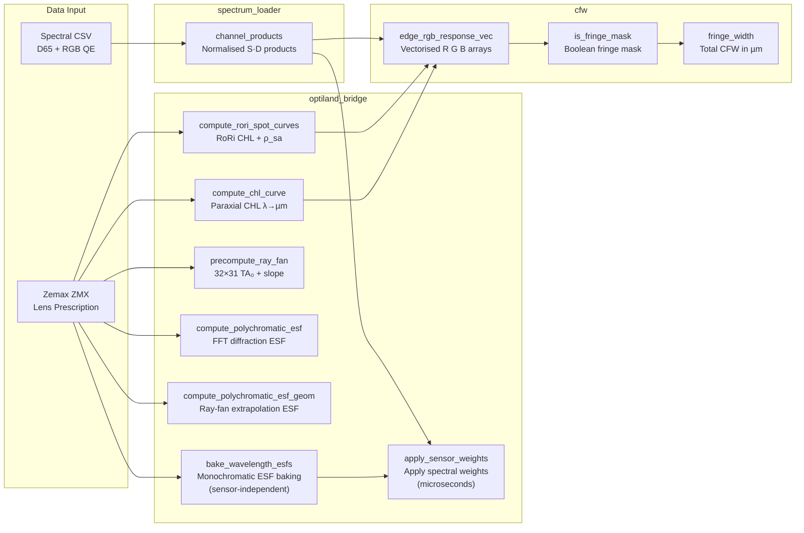
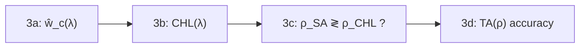

# ChromFringe Technical Research Report

> **Research objective:** Numerical modelling, prediction, and quantification of colour fringes caused by residual longitudinal chromatic aberration (CHL) and spherical aberration (SA) in photographic lenses.
>
> **Core metric:** Colour Fringe Width (CFW) — the width (µm) of the colour fringe at a given defocus.

---

## Table of Contents

- [[#1. Project Overview]]
- [[#2. Repository Structure]]
- [[#3. Module Dependencies]]
- [[#4. Data Flow and Signal Chain]]
- [[#5. Module Interface Reference]]
  - [[#5.1 chromf/__init__.py — Public API]]
  - [[#5.2 spectrum_loader.py — Spectral Data]]
  - [[#5.3 cfw.py — JIT Core Kernels]]
  - [[#5.4 optiland_bridge.py — Aberration Extraction & PSF]]
- [[#6. Mathematical and Physical Models]]
  - [[#6.1 Spectral Model — Sensor Response and Source Weighting]]
  - [[#6.2 Chromatic Aberration (CHL) Geometric Model]]
  - [[#6.3 RoRi Aperture-Weighted Method]]
  - [[#6.4 Residual Spherical Aberration (SA) Blur]]
  - [[#6.5 ESF Model: Uniform Circular Disc]]
  - [[#6.6 ESF Model: Gaussian PSF]]
  - [[#6.7 Geometric Optics Precomputed ESF (Ray Fan Method)]]
  - [[#6.8 FFT Fraunhofer Diffraction PSF]]
  - [[#6.9 Tone Mapping and Gamma Correction]]
  - [[#6.10 CFW Definition and Pixel Detection]]
- [[#7. Research Notebooks]]
  - [[#7.1 cfw_fftpsf_demo.ipynb — FFT Diffraction Baseline]]
  - [[#7.2 cfw_geom_demo.ipynb — Geometric/Analytic Models]]
    - [[#Step 3: Diagnostic Plots (4 Progressive Steps)]]
- [[#8. Performance Analysis]]
  - [[#8.1 Accuracy–Speed Comparison of Four Models]]
  - [[#8.2 Speed Comparison Across Methods]]
  - [[#8.3 Computational Resources]]
  - [[#8.4 Memory Usage]]
- [[#9. Experimental Data and Results]]
- [[#10. Data File Reference]]
- [[#Appendix A: Key Parameter Reference]]
- [[#Appendix B: Symbol Table]]

---

## 1. Project Overview

### 1.1 Physical Background

Achromatic lenses, after correcting the primary spectrum, still exhibit **secondary spectrum**: different wavelengths focus at slightly different axial positions. When the camera is focused on a particular image plane, each wavelength forms a blur circle of different radius, causing the R, G, and B channels to exhibit different ESF (Edge Spread Function) widths. At high-contrast edges, this difference produces visible colour fringes.

**Signal chain:**

$$\text{Scene (knife-edge)} \;\xrightarrow{D_{65}}\; \text{Illuminant} \;\xrightarrow{\mathrm{CHL}(\lambda),\,\mathrm{SA}(\lambda)}\; \text{Lens} \;\xrightarrow{S_c(\lambda)}\; \text{Sensor (RGB)} \;\xrightarrow{\gamma,\,\alpha}\; \text{Display}$$

### 1.2 Modelling Hierarchy

| Level | Method | Speed | Accuracy |
|-------|--------|-------|----------|
| 0 | FFT diffraction PSF (ground truth) | ~1 s/ESF | Includes diffraction effects |
| 1 | Ray-fan linear extrapolation (precomputed fan) | <1 ms/ESF | Geometrically exact, linear error O((z/f')²) |
| 2 | Analytic ESF models (Disc/Gauss) | <0.01 ms/ESF | Parametric approximation |

### 1.3 Test Lens

**Nikon AI Nikkor 85mm f/2S** (Zemax ZMX format)

- Focal length: 85 mm
- Maximum aperture: f/2 (experiments run at f/2, FNO ≈ 2.0)
- Elements: 6 lenses (12 refractive surfaces)
- Key output parameters:
  - SA spot radius $\rho_{sa}$: 12.2 – 19.0 µm (mean 17.4 µm)

---

## 2. Repository Structure

```
ChromFringe/
├── data/
│   ├── raw/                                ← Spectral CSV files
│   │   ├── daylight_d65.csv                ← CIE D65 standard illuminant
│   │   ├── sensor_nikond700_{red,green,blue}.csv  ← Nikon D700 sensor QE
│   │   ├── sensor_sonya900_{red,green,blue}.csv   ← Sony A900 sensor QE
│   │   └── defocus_chl_zf85.csv            ← Reference lens CHL curve
│   └── lens/
│       └── NikonAINikkor85mmf2S.zmx        ← Zemax lens prescription
├── examples/
│   ├── cfw_fftpsf_demo.ipynb               ← FFT diffraction PSF baseline notebook
│   └── cfw_geom_demo.ipynb                 ← Geometric/analytic PSF model notebook
├── src/chromf/
│   ├── __init__.py                         ← Public API exports (15 functions)
│   ├── cfw.py                              ← JIT-compiled CFW core kernels (disc/gauss)
│   ├── spectrum_loader.py                  ← Spectral data loading & normalisation
│   └── optiland_bridge.py                  ← Aberration extraction + ESF computation
├── pyproject.toml
├── environment.yml
├── requirements.txt
└── README.md
```

> **Sensor file naming convention:** `sensor_{model}_{color}.csv`, e.g. `sensor_nikond700_red.csv`. To add a new camera, place the corresponding CSV files and pass the `sensor_model` parameter.

---

## 3. Module Dependencies


### 3.1 Import Dependency Graph (Precise)

```
chromf/__init__.py
  ├── from chromf.cfw import fringe_width, edge_rgb_response_vec,
  │       is_fringe_mask, load_sensor_response
  │     └── cfw.py calls spectrum_loader.channel_products(sensor_model="sonya900") at module load
  │           └── spectrum_loader.py → pandas (CSV I/O), scipy (CubicSpline)
  ├── from chromf.spectrum_loader import channel_products
  └── from chromf.optiland_bridge import compute_chl_curve,
        compute_rori_spot_curves, precompute_ray_fan,
        compute_polychromatic_esf, compute_polychromatic_esf_geom,
        bake_wavelength_esfs, apply_sensor_weights
          ├── from chromf.spectrum_loader import channel_products
          └── lazy: from optiland.psf import FFTPSF (imported only when FFT functions are called)
```

---

## 4. Data Flow and Signal Chain

### 4.1 Complete Computation Pipeline



### 4.2 Experimental Workflows (Notebook Perspective)

**`cfw_fftpsf_demo.ipynb` (ground truth path, two-stage baking):**

```
Load lens → Spectral data →
Stage 1: Monochromatic ESF baking (29 z × 11 wavelengths, FFT diffraction, sensor-independent) →
Stage 2: Apply sensor spectral weights (re-run only when switching cameras, microseconds) →
Polychromatic ESF cache →
Tone mapping (variable parameters) →
CFW detection + channel-pair difference analysis
```

> The two-stage approach is **3× faster** than single-step baking: each wavelength's FFT runs only once, no longer repeated per channel.

**`cfw_geom_demo.ipynb` (geometric/analytic path):**

```
Load lens → Extract aberration curves (CHL / RoRi) → Precompute ray fans →
Interactive viewer (PSF model × CHL model × defocus) →
Static comparison experiments (5a: PSF model | 5b: SA effect | 5c: Geom Fast convergence) →
Per-defocus ESF diagnostic (Section 6, Geom Fast 16-node)
```

---

## 5. Module Interface Reference

### 5.1 `chromf/__init__.py` — Public API

`src/chromf/__init__.py` is the sole external-facing interface layer, exporting 12 functions:

#### CFW Core Functions (from `cfw.py`)

```python
from chromf import (
    fringe_width,            # Total colour fringe width in µm at a given defocus
    edge_rgb_response_vec,   # R, G, B ESF arrays at (x_arr, z) [vectorised]
    is_fringe_mask,          # Boolean mask of visible fringe pixels (all 3 conditions)
    load_sensor_response,    # Build R/G/B spectral-weight dict for a camera model
)
```

> **Multi-camera support:** All public CFW functions accept a `sensor_response` parameter. Use `load_sensor_response("sonya900")` or `load_sensor_response("nikond700")` to build the corresponding dict and pass it in to switch camera models. Default: Sony A900.

#### Spectral Data (from `spectrum_loader.py`)

```python
from chromf import channel_products   # Energy-normalised S·D products
# channel_products(sensor_model="sonya900")  ← specify camera model
```

#### Aberration Extraction & ESF (from `optiland_bridge.py`)

```python
from chromf import (
    compute_chl_curve,              # Paraxial CHL curve
    compute_rori_spot_curves,       # RoRi CHL + residual SA spot radius (ρ_SA)
    precompute_ray_fan,             # Pre-trace ray fan for fast ESF sweeps
    compute_polychromatic_esf,      # Diffraction ESF (ground truth)
    compute_polychromatic_esf_geom, # Geometric ESF via pre-traced ray fan
    bake_wavelength_esfs,           # Sensor-independent monochromatic ESF baking (FFT)
    apply_sensor_weights,           # Apply sensor spectral weights (microseconds)
)
```

---

### 5.2 `spectrum_loader.py` — Spectral Data Loading & Normalisation

**File path:** `src/chromf/spectrum_loader.py` (180 lines)

**Data directory resolution:**
```python
DATA_DIR = Path(__file__).resolve().parents[2] / "data" / "raw"
# parents[0]=chromf/, parents[1]=src/, parents[2]=project-root/
```

#### Internal Functions

| Function | Signature | Description |
|----------|-----------|-------------|
| `_csv(name)` | `(str) → ndarray` | Load CSV, return float64 `[λ, value]` array |
| `_load_defocus(channel)` | `(str) → ndarray` | Load defocus curve, default `"chl_zf85"` |
| `_load_daylight(src)` | `(str) → ndarray` | Load illuminant spectrum, default `"d65"` |
| `_load_sensor(ch, model)` | `(str, str) → ndarray` | Load sensor response, `ch ∈ {red, green, blue}`, `model` specifies camera |
| `_resample(xs, ys, new_x)` | `(ndarray, ndarray, ndarray) → ndarray` | Cubic spline interpolation + normalise to 0–100 |
| `_energy_norm(sensor, daylight)` | `(ndarray, ndarray) → float` | Compute energy normalisation coefficient k |

#### Public API

```python
def channel_products(
    daylight_src: str = "d65",
    channels: Sequence[str] = ("blue", "green", "red"),
    *,
    sensor_model: str = "sonya900",
    sensor_peak: float = 1.0,
) -> dict[str, np.ndarray]:
    """
    Returns: {channel_name: ndarray shape (N, 2)}
    Each column is [λ_nm, normalised S·D value], satisfying ∫ S·D dλ ≈ 1

    sensor_model: Camera model identifier, corresponding to data/raw/sensor_{model}_{ch}.csv
    """
```

**Wavelength grid:** Determined by the first sensor file (`blue`), 31 points, 400–700 nm, 10 nm step.

**Bundled camera models:** `"nikond700"` (Nikon D700), `"sonya900"` (Sony A900). To add a new camera, place `sensor_{model}_{red,green,blue}.csv` files in `data/raw/`.

---

### 5.3 `cfw.py` — JIT-Compiled Core Kernels

**File path:** `src/chromf/cfw.py` (379 lines)

#### Module-Level Constants

```python
DEFAULT_FNUMBER: float = 2.0        # Default f-number
EXPOSURE_SLOPE: float = 4.0         # Tone curve slope
DISPLAY_GAMMA: float = 1.8          # Display gamma
COLOR_DIFF_THRESHOLD: float = 0.15  # Fringe visibility threshold
EDGE_HALF_WINDOW_PX: int = 400      # Scan half-window (pixels)
ALLOWED_PSF_MODES = ("disc", "gauss")
DEFAULT_PSF_MODE = "gauss"
```

**Module-load precomputation (default Sony A900):**
```python
_prods = _channel_products(sensor_model="sonya900")
SENSOR_RESPONSE: dict[str, ndarray] = {
    "R": _prods["red"][:, 1],       # shape (31,)
    "G": _prods["green"][:, 1],
    "B": _prods["blue"][:, 1],
}
```

#### Sensor Selection Function

```python
def load_sensor_response(model: str = "sonya900") -> dict[str, np.ndarray]:
    """Build an R/G/B spectral-weight dict for the specified camera.
    Returns {"R": array(31,), "G": ..., "B": ...}, each array is energy-normalised S·D.
    CSV files data/raw/sensor_{model}_{red|green|blue}.csv must exist.
    """
```

> All public CFW functions accept an optional `sensor_response` parameter. When `None` (default), the module-level `SENSOR_RESPONSE` (Sony A900) is used; pass the return value of `load_sensor_response("nikond700")` to switch to Nikon D700.

#### JIT-Compiled Kernels (Numba `@njit(cache=True)`)

| Function | Lines | Description |
|----------|-------|-------------|
| `_exposure_curve(x, slope)` | 78–80 | `tanh` tone curve, mapped to [0,1] |
| `_disc_esf(x, rho)` | 84–98 | Uniform circular-disc ESF (analytic) |
| `_gauss_esf(x, rho)` | 96–100 | Gaussian PSF ESF (σ ≈ 0.5ρ) |
| `_edge_response_vec_jit(x_arr, z, ...)` | 103–135 | Vectorised edge-response kernel: processes an array of x values in one Numba call |

#### Public API

```python
def edge_rgb_response_vec(
    x_arr: np.ndarray,       # 1-D array of x positions (µm)
    z_um: float,             # Defocus (µm)
    *,
    exposure_slope: float | None = None,   # Default EXPOSURE_SLOPE=4.0
    gamma: float | None = None,            # Default DISPLAY_GAMMA=1.8
    chl_curve_um: np.ndarray,             # Shape (31,), CHL(λ) µm
    rho_sa_um: np.ndarray | None = None,  # Shape (31,), ρ_sa(λ) µm
    f_number: float = DEFAULT_FNUMBER,
    psf_mode: Literal["disc", "gauss"] = "gauss",
    sensor_response: dict[str, np.ndarray] | None = None,  # Default Sony A900
) -> tuple[np.ndarray, np.ndarray, np.ndarray]  # (R, G, B) ESF arrays
# Vectorised: dispatches to Numba only 3 times (once per channel)
# regardless of array length, eliminating Python-loop overhead
```

```python
def is_fringe_mask(
    r: np.ndarray, g: np.ndarray, b: np.ndarray,
    diff_threshold: float = 0.15,
    low_threshold: float = 0.15,
    high_threshold: float = 0.80,
) -> np.ndarray  # Boolean mask
# A pixel is fringed when ALL THREE conditions hold:
# 1. Every channel > low_threshold (excludes near-black)
# 2. At least one pair difference > diff_threshold (colour shift present)
# 3. At least one channel < high_threshold (excludes near-white/saturated)
```

```python
def fringe_width(
    z_um: float,
    *,
    xrange_val: int | None = None,   # Default EDGE_HALF_WINDOW_PX=400
    ...  # Same as edge_rgb_response_vec
) -> int  # Total CFW in µm (outer-boundary method)
# Scans x ∈ [-400, 400] µm, uses edge_rgb_response_vec + is_fringe_mask
# CFW = distance from first fringed pixel to last fringed pixel
```

---

### 5.4 `optiland_bridge.py` — Aberration Extraction & ESF Computation

**File path:** `src/chromf/optiland_bridge.py` (632 lines)

`optiland_bridge.py` is the bridge module between the **Optiland optical design library** and the **ChromFringe chromatic fringe analysis framework**. It extracts aberration data from optical system prescriptions (`Optic` objects imported from Zemax ZMX files) and outputs standardized chromatic aberration curves and edge spread functions (ESFs) for downstream computation of chromatic fringe width (CFW) in `cfw.py`.

#### Signal Flow

```
┌─────────────────────────────────────────────────────────────────┐
│                    Zemax ZMX → Optiland Optic                   │
└──────────────────────────┬──────────────────────────────────────┘
                           │
         ┌─────────────────┼─────────────────┐
         ▼                 ▼                 ▼
  compute_chl_curve   compute_rori_     precompute_ray_fan
   (Paraxial CHL)    spot_curves         (Geometric optics)
         │           (RoRi CHL+SA)           │
         ▼                 ▼                 ▼
     [λ, CHL_µm]    [λ, CHL_µm]    compute_polychromatic_
                     [λ, ρ_SA_µm]    esf_geom / bake_wavelength_esfs
         │                 │                 │
         └─────────┬───────┘                 │
                   ▼                         ▼
            cfw.fringe_width()         ESF(x) direct output
                   │
                   ▼
            CFW (chromatic fringe width, µm)
```

#### Shared Constants

```python
#: RoRi: 5-zone weighted average (energy-weighted best focus).
#: Pupil coords: 0, √¼, √½, √¾, 1  →  weights: 1, 12.8, 14.4, 12.8, 1 / 42
_RORI_PY      = (0.0, 0.5, 0.7071067811865476, 0.8660254037844387, 1.0)
_RORI_WEIGHTS = (1.0, 12.8, 14.4, 12.8, 1.0)
_RORI_SUM     = 42.0

_CHANNEL_MAP = {"R": "red", "G": "green", "B": "blue"}
```

#### Internal Helper Functions

| Function | Lines | Description |
|----------|-------|-------------|
| `_resolve_wl_grid(optic, wls, ref_wl)` | 20–36 | Resolve wavelength grid and reference wavelength |
| `_paraxial_bfl(paraxial, wl_nm, z_start)` | 39–52 | Paraxial marginal ray trace, compute back focal length |
| `_sk_real(optic, Py, wl_um)` | 110–123 | Meridional real-ray back-focal intercept SK(ρ) |
| `_optic_at_defocus(optic, z_defocus_um)` | 260–268 | Return deep copy of lens with shifted image plane |

#### Aberration Extraction Functions

```python
def compute_chl_curve(
    optic,
    wavelengths_nm: np.ndarray | None = None,
    ref_wavelength_nm: float | None = None,
) -> np.ndarray  # Shape (N, 2): [λ_nm, CHL_µm]
# Paraxial marginal ray trace, returns secondary spectrum curve
```

```python
def compute_rori_spot_curves(
    optic, wavelengths_nm=None, ref_wavelength_nm=None,
) -> tuple[np.ndarray, np.ndarray]
# Returns: (chl_curve [N,2], spot_curve [N,2])
# RoRi: 5-zone weighted average (energy-weighted best focus)
# spot_curve[:,1] = ρ_sa(λ), µm, i.e. RMS residual spot radius
```

#### Ray Tracing & ESF Functions

```python
def precompute_ray_fan(optic, num_rho: int = 32, sensor_model: str = "sonya900") -> dict:
    """
    Pre-trace 32×31 = 992 rays (at z=0)
    Returns dict containing:
        fno, rho_nodes (32,), W_gl (32,), wl_nm (31,)
        TA0 (32, 31) µm   — transverse aberration
        slope (32, 31)    — M/N direction cosine ratio
        "R", "G", "B"     — per-channel spectral weights g_norm (31,)
    """
```

```python
def compute_polychromatic_esf(
    optic, channel: str, z_defocus_um: float,
    x_um: np.ndarray,
    num_rays: int = 256,    # Pupil sampling count
    grid_size: int = 512,   # FFT grid size
    strategy: str = "chief_ray",  # Must use chief_ray to preserve defocus phase
    wl_stride: int = 1,     # Wavelength subsampling stride
    sensor_model: str = "sonya900",
) -> np.ndarray  # Shape == x_um.shape, values ∈ [0, 1]
# FFT diffraction PSF → ESF (ground truth, slow)
```

```python
def compute_polychromatic_esf_geom(
    ray_fan: dict,           # From precompute_ray_fan
    channel: str,
    z_defocus_um: float,
    x_um: np.ndarray,
    wl_stride: int = 1,
) -> np.ndarray  # Values ∈ [0, 1]
# Ray-fan linear extrapolation ESF, ~1000× faster than FFT
# No ray tracing performed; cost is a handful of vectorised numpy operations
```

#### Two-Stage Baking Functions

Splits FFT ESF computation into a **sensor-independent** monochromatic baking step and a **sensor-specific** weight application step, so switching camera models does not require re-running FFTs:

```python
def bake_wavelength_esfs(
    optic,
    z_defocus_um: float,
    x_um: np.ndarray,
    wl_nm_arr: np.ndarray,      # Wavelength array (nm)
    num_rays: int = 256,
    grid_size: int = 512,
    strategy: str = "chief_ray",
) -> np.ndarray  # Shape (len(wl_nm_arr), len(x_um)), values ∈ [0, 1]
# Independent FFT → ESF per wavelength, no sensor or illuminant weighting
```

```python
def apply_sensor_weights(
    mono_esfs: np.ndarray,      # From bake_wavelength_esfs
    wl_nm_arr: np.ndarray,
    channel: str,               # "R", "G", "B"
    sensor_model: str = "sonya900",
) -> np.ndarray  # Shape (n_x,), values ∈ [0, 1]
# Pure NumPy weighted sum, microsecond-level
```

> **Performance:** For the same optical system with 29 defocus steps × 3 channels × 2 cameras (174 ESFs), the two-stage approach requires only 29 × 11 = 319 FFTs + 174 NumPy weightings; the single-step approach would require 174 × 11 = 1914 FFTs. Speedup: **~6×** (single camera ~3×).

---

## 6. Mathematical and Physical Models

The central quantity in this project is the **polychromatic PSF** — the point spread function that a real colour channel actually "sees". Its construction requires three ingredients: a spectral model (source + sensor), a chromatic defocus model (CHL), and a monochromatic aberration model (SA). This section derives each ingredient and then assembles them into the full simulation chain.

### 6.1 Spectral Model — Sensor Response and Source Weighting

The colour response of an imaging system is jointly determined by three factors:

1. **Source spectral power distribution** $D(\lambda)$: the relative radiant power of the illumination at each wavelength. This project uses the CIE D65 standard daylight spectrum.
2. **Sensor quantum efficiency** $S_c(\lambda)$: the response efficiency of each Bayer R/G/B channel to photons at wavelength $\lambda$. Built-in data for Sony A900 and Nikon D700 are provided.
3. **Monochromatic PSF** $\text{PSF}_{\text{mono}}(r;\lambda,z)$: each wavelength focuses at a different axial position and carries a different spherical aberration profile, producing a wavelength-dependent blur kernel.

#### 6.1.1 Channel Spectral Weights

For channel $c \in \{R, G, B\}$, define the **spectral density** (energy-normalised sensor–source product):

$$
\hat{g}_c(\lambda) = k_c \cdot S_c(\lambda) \cdot D_{65}(\lambda)
$$

where the normalization constant $k_c$ satisfies:

$$
k_c = \frac{1}{\displaystyle\int S_c(\lambda) \cdot D_{65}(\lambda) \, d\lambda}
$$

so that $\int \hat{g}_c(\lambda)\,d\lambda = 1$. This ensures that a perfectly focused flat-spectrum edge produces unity response in every channel (ESF transitions from 0 to 1).

> [!info] Discretization
> In practice, wavelengths are sampled at 10 nm intervals over the 400–700 nm range (31 points), and integrals are replaced by the trapezoidal rule or discrete summation.

Implementation (`spectrum_loader.py`, `_energy_norm`):
```python
def _energy_norm(sensor, daylight):
    s, d = sensor[:, 1], daylight[:, 1]
    integral = float(np.trapezoid(s * d, sensor[:, 0]))
    return 1.0 / integral if integral else 0.0
```

#### 6.1.2 Polychromatic ESF Assembly

The polychromatic ESF for channel $c$ is the weighted superposition of monochromatic ESFs across all wavelengths:

$$
\boxed{\text{ESF}_c(x; z) = \sum_{j=1}^{N_\lambda} \hat{g}_c(\lambda_j) \cdot \text{ESF}_{\text{mono}}(x; \lambda_j, z)}
$$

Each wavelength's contribution is scaled by its spectral weight in that channel: the R channel primarily responds to 600–700 nm, the B channel to 400–500 nm, and the G channel is centred around 500–600 nm. In practice, `wl_stride=3` can down-sample from 31 to 11 wavelengths with negligible error.

**Analytic path** (`cfw.py`): the spectral loop computes monochromatic blur radii on the fly and accumulates the weighted ESF:

```python
for n in range(chl_curve.size):
    rho_chl = _fabs((z - chl_curve[n]) / denom)
    rho = _sqrt(rho_chl**2 + sa_curve[n]**2)
    weight = _disc_esf(x, rho)       # or _gauss_esf(x, rho)
    acc += sensor[n] * weight         # sensor[n] = normalised S·D weight
linear = acc / norm
```

**FFT path** (`optiland_bridge.py`): each wavelength's monochromatic ESF is computed via FFT-PSF (§6.8), mapped to physical coordinates, and interpolated onto a unified $x$ axis before weighted summation. See §6.8 for coordinate mapping and the two-stage baking optimization.

**Ray-fan path** (`optiland_bridge.py`): uses the precomputed ray fan (§6.7) with ring ESF + pupil integration per wavelength, then applies spectral weights identically.

The remaining subsections derive each component that enters the monochromatic ESF: chromatic defocus (§6.2–6.3), spherical aberration (§6.4), and the PSF/ESF kernel models (§6.5–6.8).

---

### 6.2 Chromatic Aberration (CHL) Geometric Model

#### 6.2.0 Physical Background

**Longitudinal Chromatic Aberration (LCA/CHL)** is the most fundamental aberration caused by dispersion: because the refractive index $n(\lambda)$ of glass varies with wavelength (shorter wavelengths have higher refractive indices in normal dispersion), light of different wavelengths experiences different refraction angles through a lens group, causing the focal points to separate along the optical axis.

For a positive lens, shorter wavelengths (blue light) focus closer, and longer wavelengths (red light) focus farther. The variation of focal length with wavelength $f'(\lambda)$ is called the **chromatic focal shift curve**.
#### 6.2.1 Paraxial Ray Tracing

Paraxial theory assumes that the angle between rays and the optical axis is extremely small ($\sin\theta \approx \theta$), linearizing Snell's law. For an optical system consisting of $K$ refracting surfaces, the recurrence relations for paraxial marginal ray tracing are:

$$n'_k u'_k = n_k u_k - y_k \phi_k$$

$$y_{k+1} = y_k + u'_k \cdot d_k$$

where:

| Symbol | Meaning |
|--------|---------|
| $y_k$ | Ray height at surface $k$ |
| $u_k$, $u'_k$ | Ray slope before/after refraction |
| $n_k$, $n'_k$ | Refractive index before/after surface $k$ |
| $\phi_k = (n'_k - n_k) / R_k$ | Optical power of surface $k$ |
| $R_k$ | Radius of curvature of surface $k$ |
| $d_k$ | Spacing from surface $k$ to surface $k+1$ |

The `_paraxial_bfl` function traces a unit-height, zero-slope ray ($y_0 = 1$, $u_0 = 0$) from $z_\text{start}$ (1 mm in front of the first refracting surface). After tracing, the back focal length is:

$$\text{BFL}(\lambda) = -\frac{y_\text{last}}{u_\text{last}} \quad (\text{mm})$$

#### 6.2.2 Paraxial CHL Definition

For a thin lens group, the paraxial back focal length $f_2'(\lambda)$ at wavelength $\lambda$ minus that at the reference wavelength $\lambda_\text{ref}$ defines the **longitudinal chromatic aberration** (CHL):

$$\mathrm{CHL}_\text{par}(\lambda) = \left[f_2'(\lambda) - f_2'(\lambda_\text{ref})\right] \times 10^3 \quad (\mu\mathrm{m})$$

> [!note] Sign Convention
> CHL > 0 indicates that the focal point for that wavelength is farther from the lens than the reference wavelength (shifted in the positive $z$ direction). For a positive lens with normal dispersion, blue light has CHL < 0 and red light has CHL > 0.

Implementation (`optiland_bridge.py` lines 84–86):
```python
f2_values = np.array([_paraxial_bfl(paraxial, wl, z_start) for wl in wls])
f2_ref = _paraxial_bfl(paraxial, ref_wl, z_start)
chl_um = (f2_values - f2_ref) * 1000.0  # mm → µm
```

#### 6.2.3 Paraxial CHL Limitations

Paraxial CHL reflects only first-order dispersion effects, assuming the focal position is the same across all pupil zones. In reality, spherical aberration also varies with wavelength (**spherochromatism**), causing different pupil zones to have different focal shifts. This is precisely the problem addressed by the RoRi model.

#### 6.2.4 CHL-Induced Blur Radius

In the geometric optics framework, when the image plane is at position $z$ (relative to the reference focal plane), light at wavelength $\lambda$ forms a blur circle of radius $\rho_\text{CHL}$:

$$\boxed{\rho_\text{CHL}(z,\lambda) = \frac{|z - \mathrm{CHL}(\lambda)|}{\sqrt{4F_{\#}^2 - 1}}}$$

**Derivation:** For a lens with f-number $F_{\#} = f/D$, the marginal ray converges to the focal point at half-angle $u$ satisfying the exact relation:

$$\sin u = \frac{D/2}{\sqrt{f^2 + (D/2)^2}} = \frac{1}{\sqrt{4F_{\#}^2 + 1}} \approx \frac{1}{2F_{\#}}$$

The approximation $\sin u \approx 1/(2F_{\#})$ holds well for $F_{\#} \gtrsim 1$ and is equivalent to the paraxial expression $u \approx \arctan(1/(2F_{\#}))$.

When the image plane is shifted by $\Delta z = z - \mathrm{CHL}(\lambda)$ from the wavelength's focal point, the marginal ray no longer converges to a point but instead intersects the observation plane at a radius:

$$\rho = |\Delta z| \cdot \tan u$$

Using $\sin u = 1/(2F_{\#})$ to express $\tan u$ exactly:

$$\tan u = \frac{\sin u}{\cos u} = \frac{\sin u}{\sqrt{1 - \sin^2 u}} = \frac{1/2F_{\#}}{\sqrt{1 - \dfrac{1}{4F_{\#}^2}}} = \frac{1/2F_{\#}}{\dfrac{\sqrt{4F_{\#}^2-1}}{2F_{\#}}} = \frac{1}{\sqrt{4F_{\#}^2-1}}$$

Substituting back:

$$\rho = |\Delta z| \cdot \frac{1}{\sqrt{4F_{\#}^2 - 1}} = \frac{|\Delta z|}{\sqrt{4F_{\#}^2 - 1}}$$

Implementation (`cfw.py` lines 116–119):
```python
denom = _sqrt(4.0 * f_number**2.0 - 1.0)
rho_chl = _fabs((z - chl_curve[n]) / denom)
```

---

### 6.3 RoRi Aperture-Weighted Method

#### 6.3.1 Motivation

Paraxial CHL ignores **spherochromatism** caused by spherical aberration: the magnitude of SA varies with wavelength, causing different aperture zones to have different effective focal lengths. The RoRi method estimates the "equivalent best-focus" by taking a weighted average of real-ray back-focal intercepts across multiple aperture zones.

#### 6.3.2 Pupil Zoning

The pupil is divided into 5 equal-area annular zones. If the normalized pupil radius is $r \in [0, 1]$, the equal-area zone boundaries are:

$$r_i = \sqrt{\frac{i}{4}}, \quad i = 0, 1, 2, 3, 4$$

The representative pupil coordinates are:

| Zone | $r$ | Value |
|------|-----|-------|
| Center | $0$ | $0$ |
| Ring 1 | $\sqrt{1/4}$ | $0.500$ |
| Ring 2 | $\sqrt{1/2}$ | $0.707$ |
| Ring 3 | $\sqrt{3/4}$ | $0.866$ |
| Edge | $1$ | $1.000$ |

> [!info] Equal-Area Principle
> The pupil area element is $dA = 2\pi r \, dr$, so energy is uniformly distributed according to $r^2$. The choice $r = \sqrt{i/4}$ ensures each annular zone intercepts the same luminous flux.

#### 6.3.3 The Integral Being Approximated

Both RoRi variants approximate the same physical quantity: the **aperture-area-weighted mean back-focal intercept**,

$$\mathrm{RoRi}(\lambda) = \int_0^1 \mathrm{SK}(r,\lambda)\cdot 2r\,dr$$

where the factor $2r$ is the area weight of a thin annulus of normalised radius $r$ (unit-normalised pupil area: $\int_0^1 2r\,dr = 1$).  The two variants differ only in the numerical quadrature rule used to evaluate this integral.

#### 6.3.4 Computing Focal Intercept SK(r)

For $\rho > 0$, the function `_sk_real` traces a tangential ray to the image plane, obtaining the ray's position and direction cosines at the image plane:

| Symbol | Definition | Meaning |
|--------|-----------|---------|
| $y$ | — | $y$-coordinate of the ray at the image plane (mm) |
| $M$ | $\cos\beta = \sin U$ | $y$-component of the direction cosine; $\beta$ is the angle between the ray and the $y$-axis; $U$ is the angle between the ray and the optical axis |
| $N$ | $\cos\gamma = \cos U$ | $z$-component (along the optical axis) of the direction cosine; $\gamma$ is the angle between the ray and the $z$-axis |

The ray is extrapolated from the image plane to its intersection with the optical axis ($y = 0$); the axial intercept is:

$$
SK(\rho, \lambda) = -\frac{y \cdot N}{M} \quad (\text{mm})
$$

> [!tip] Geometric Interpretation
> The slope of the ray at the image plane is $dy/dz = M/N$. Starting from $(y, 0)$, the $z$-displacement needed to reach $y = 0$ is $\Delta z = -y / (M/N) = -yN/M$. This is the longitudinal focal shift of that ray.

For $r = 0$ (the paraxial limit), the real-ray trace is degenerate; the back-focal intercept is obtained instead from the paraxial marginal-ray trace:

$$\mathrm{SK}(0,\lambda) = -\frac{y_\mathrm{par}}{u_\mathrm{par}}$$

where $y_\mathrm{par}$ and $u_\mathrm{par}$ are the final height and slope of the paraxial marginal ray.

Implementation (`optiland_bridge.py`):
```python
# Real ray (r > 0)
rays = optic.trace_generic(0.0, 0.0, 0.0, Py, wl_um)
y = float(rays.y.ravel()[-1])
M = float(rays.M.ravel()[-1])
N = float(rays.N.ravel()[-1])
return -y * N / M

# Paraxial limit (r = 0)
y, u = paraxial._trace_generic(1.0, 0.0, z_start, wl_um)
return float(-y.ravel()[-1] / u.ravel()[-1])
```

#### 6.3.5 RoRi: Equal-Area Trapezoidal Rule

**Quadrature construction.** Divide $[0,1]$ into four equal-area annuli by choosing breakpoints $r$ such that $r^2$ is uniformly spaced, i.e.\ $r^2 \in \{0, 0.25, 0.5, 0.75, 1\}$, giving nodes

$$r_i \in \left\{0,\;\sqrt{0.25},\;\sqrt{0.5},\;\sqrt{0.75},\;1\right\}$$

Under the substitution $u = r^2$, the integral becomes $\int_0^1 \mathrm{SK}(\sqrt{u},\lambda)\,du$, and the nodes are equally spaced in $u$-space.  Applying the composite trapezoidal rule on the four equal sub-intervals of length $\Delta u = 0.25$ yields the weights

$$w_i^{(1)} = \Delta u \cdot \{{\tfrac{1}{2}}, 1, 1, 1, {\tfrac{1}{2}}\} = 0.25 \cdot \{0.5, 1, 1, 1, 0.5\}$$

Rescaling to integer form (×56) and accounting for the area-weight factor $2r_i$ absorbed into the quadrature produces the published weights $\{1,\;12.8,\;14.4,\;12.8,\;1\}$ summing to 42:

$$
\begin{aligned}
\mathrm{RoRi}(\lambda) &= \frac{\displaystyle\sum_{i=0}^{4} w_i \cdot SK(\rho_i, \lambda)}{\displaystyle\sum_{i=0}^{4} w_i} \\
&= \frac{\mathrm{SK}(0) + 12.8\cdot\mathrm{SK}(\sqrt{0.25}) + 14.4\cdot\mathrm{SK}(\sqrt{0.5}) + 12.8\cdot\mathrm{SK}(\sqrt{0.75}) + \mathrm{SK}(1)}{42}
\end{aligned}
$$

**Predictive advantage.** Because the nodes span the full range $r \in [0,1]$, including the paraxial limit $r=0$ and the marginal ray $r=1$, RoRi explicitly captures the extreme focal positions of the lens.  The paraxial contribution anchors the CHL estimate to the secondary spectrum, while the marginal ray ensures the aperture edge is represented.  This broad coverage preserves the full chromatic spread of $\mathrm{SK}(r,\lambda)$, which benefits prediction of fringe visibility at low tone-curve exposures where even small channel differences cross the detection threshold.

Implementation (`optiland_bridge.py`, `compute_rori_spot_curves`):
```python
_RORI_PY      = (0.0, 0.5, 0.7071067811865476, 0.8660254037844387, 1.0)
_RORI_WEIGHTS = (1.0, 12.8, 14.4, 12.8, 1.0)
_RORI_SUM     = 42.0

sks = np.array([_paraxial_bfl(paraxial, wl_nm, z_start)]
               + [_sk_real(optic, py, wl_um) for py in _RORI_PY[1:]])
rori = float(np.dot(_RORI_WEIGHTS, sks) / _RORI_SUM)
```

#### 6.3.6 RoRi CHL Curve

For all variants, the CHL curve is computed by subtracting the reference-wavelength value:

$$\mathrm{CHL}_\mathrm{RoRi}(\lambda) = \left[\mathrm{RoRi}(\lambda) - \mathrm{RoRi}(\lambda_\mathrm{ref})\right] \times 10^3 \quad (\mu\mathrm{m})$$

---

### 6.4 Residual Spherical Aberration (SA) Blur

Spherical aberration causes different aperture zones to focus at different axial positions; even at the RoRi best-focus plane, residual blur remains.

#### 6.4.1 Lateral Blur Computation

At the RoRi focal plane, the lateral displacement of each ray at pupil height $r_i$ (small-angle approximation):

$$y_\text{spot}(r_i, \lambda) = \frac{[\mathrm{SK}(r_i, \lambda) - \mathrm{RoRi}(\lambda)] \cdot r_i}{\sqrt{4F_{\#}^2 - 1}} \times 10^3 \quad (\mu\mathrm{m})$$

#### 6.4.2 RMS Residual Spot

$$\boxed{\rho_\text{sa}(\lambda) = \sqrt{\frac{\sum_i w_i \cdot y_\text{spot}^2(r_i, \lambda)}{\sum_i w_i}}}$$

Implementation (`optiland_bridge.py`, `compute_rori_spot_curves`):
```python
y_spots = (sks - rori) * _py / _denom              # mm
rho_sa  = float(np.sqrt(np.dot(_w, y_spots**2) / _RORI_SUM))   # mm (RMS)
```

#### 6.4.3 Total Blur Radius (Quadrature Addition)

CHL blur and SA blur are combined via quadrature (area addition on the blur disc):

$$\boxed{\rho(z, \lambda) = \sqrt{\rho_\text{CHL}(z, \lambda)^2 + \rho_\text{SA}(\lambda)^2}}$$

Implementation (`cfw.py` line 120):
```python
rho = _sqrt(rho_chl**2 + sa_curve[n]**2)  # Quadrature addition
```

---

### 6.5 ESF Model: Uniform Circular Disc

#### 6.5.1 Physical Assumption

The PSF is a 2D disc uniformly distributed within radius $\rho$ (geometric blur circle), with intensity distribution:

$$\mathrm{PSF}_\text{geom}(\mathbf{r}) = \frac{1}{\pi\rho^2} \cdot \mathbf{1}[|\mathbf{r}| \leq \rho]$$

#### 6.5.2 ESF Integration

The ESF is the projection of the PSF along the $y$-direction followed by cumulative integration (equivalent to convolution of a half-plane with the PSF). For the uniform disc, the line spread function (LSF) is the chord length at each $x$:

$$\mathrm{LSF}(x) = \frac{2}{\pi\rho^2}\sqrt{\rho^2 - x^2}, \quad |x| \leq \rho$$

This is a **semicircular** (not uniform) 1D profile. Integrating gives the analytic ESF:

$$\mathrm{ESF}_\text{geom}(x, \rho) = \begin{cases} 0 & x \leq -\rho \\ \dfrac{1}{2} + \dfrac{1}{\pi}\!\left[\arcsin\dfrac{x}{\rho} + \dfrac{x}{\rho}\sqrt{1 - \dfrac{x^2}{\rho^2}}\right] & -\rho < x < \rho \\ 1 & x \geq \rho \end{cases}$$

**Derivation:** Substituting $t = \rho\sin\phi$:

$$\int_{-\rho}^{x}\!\frac{2}{\pi\rho^2}\sqrt{\rho^2-t^2}\,dt = \frac{2}{\pi}\int_{-\pi/2}^{\arcsin(x/\rho)}\cos^2\phi\,d\phi = \frac{1}{2} + \frac{1}{\pi}\!\left[\arcsin\frac{x}{\rho} + \frac{x}{\rho}\sqrt{1-\frac{x^2}{\rho^2}}\right]$$

Implementation (`cfw.py` lines 84–98):
```python
def _disc_esf(x: float, rho: float) -> float:
    if rho < 1e-6:
        return 1.0 if x >= 0.0 else 0.0
    if x >= rho:  return 1.0
    if x <= -rho: return 0.0
    t = x / rho
    return 0.5 + (asin(t) + t * sqrt(1.0 - t * t)) / pi
```

---

### 6.6 ESF Model: Gaussian PSF

#### 6.6.2 Physical Assumption

The PSF is a 2D circularly symmetric Gaussian distribution with standard deviation $\sigma \approx 0.5\rho$ (corresponding to the blur circle radius):

$$\mathrm{PSF}_\text{gauss}(\mathbf{r}) = \frac{1}{2\pi\sigma^2}\exp\!\left(-\frac{|\mathbf{r}|^2}{2\sigma^2}\right)$$

#### 6.6.3 ESF

The 1D ESF of a Gaussian PSF is the error function (CDF of the standard normal):

$$\boxed{\mathrm{ESF}_\text{gauss}(x, \rho) = \frac{1}{2}\left[1 + \mathrm{erf}\!\left(\frac{x}{\sqrt{2}\,\sigma}\right)\right], \quad \sigma = 0.5\rho}$$

Implementation (`cfw.py` lines 96–100):
```python
def _gauss_esf(x: float, rho: float) -> float:
    if rho < 1e-6:
        return 1.0 if x >= 0.0 else 0.0
    return 0.5 * (1.0 + _erf(x / (_sqrt(2.0) * 0.5 * rho)))
```

**Note:** The Gaussian model has soft tails compared to the uniform disc, providing a closer approximation to the real PSF (smooth approximation of diffraction edge ringing).

---

### 6.7 Geometric Optics Precomputed ESF (Ray Fan Method)

#### 6.7.1 Motivation

The FFT-PSF method (§6.8) requires rebuilding an `Optic` copy and tracing all rays at each defocus position $z$, taking ~1 s per ESF. For CFW curves that scan hundreds of $z$ values, this is too slow. The core idea: **ray trajectories are straight lines near the image plane** — trace once at $z=0$, then extrapolate to any $z$.

#### 6.7.2 Physical Picture — Knife-Edge Test of a Defocused Spot

The Edge Spread Function (ESF) measures the energy fraction transmitted past a knife edge as a function of the edge position $x$. Physically, a lens images a point source into a blur spot on the image plane (due to defocus, chromatic aberration, and spherical aberration). Placing a straight knife edge perpendicular to $x$ at position $x_0$ blocks all light with $x < x_0$. The ESF at $x_0$ is the fraction of the spot's total energy that falls on the bright side ($x \geq x_0$):

```
                        Knife edge at x₀
                             │
   ╭─────────────────────────┼─────────────────────────╮
   │           ╭─────────────┼─────────────╮           │
   │           │    Blur     │    spot     │           │
   │           ╰─────────────┼─────────────╯           │
   ╰─────────────────────────┼─────────────────────────╯
          Blocked (dark)     │     Transmitted (bright)
                             │
          ESF(x₀) = fraction of total energy on bright side
```

- $x_0 \ll -\rho$ (edge far left): all light passes → ESF = 1
- $x_0 \gg +\rho$ (edge far right): all light blocked → ESF = 0
- $x_0 = 0$ (edge at center): approximately half passes → ESF ≈ 0.5

The shape of the transition from 1 to 0 depends on the intensity distribution within the blur spot.

#### 6.7.3 Pupil Decomposition into Concentric Rings

The filled pupil ($r \in [0, 1]$) can be decomposed into infinitely thin concentric rings, each at a specific normalised pupil radius $r$. Due to the rotational symmetry of the lens, rays from a ring at pupil radius $r$ form a ring of radius $R(r)$ on the image plane (where $R$ depends on the aberrations). Different pupil radii produce rings of different image-plane radii because of spherical aberration:

```
    Pupil (entrance)              Image plane (at defocus z)

         r₃ r₂ r₁                      R₁  R₂    R₃
          │  │  │                        │   │     │
          ▼  ▼  ▼                        ▼   ▼     ▼
       ╭──────────╮               ╭────────────────────╮
       │ ╭──────╮ │               │  ╭──────────────╮  │
       │ │╭────╮│ │   ── Lens →   │  │  ╭────────╮ │  │
       │ │╰────╯│ │               │  │  ╰────────╯ │  │
       │ ╰──────╯ │               │  ╰──────────────╯  │
       ╰──────────╯               ╰────────────────────╯

    Each ring at pupil          Each ring maps to a different
    radius rₖ ...               image-plane radius Rₖ (due to SA)
```

The ESF of the full spot equals the area-weighted sum of individual ring ESFs. Since the pupil area element is $dA = r\,dr\,d\theta$, the contribution from each ring is proportional to $r$:

$$\text{ESF}(x) = \int_0^1 f\!\left(\frac{x}{R(r)}\right) \cdot 2r \, dr$$

where $f(x/R)$ is the knife-edge response of a single ring of radius $R$, derived in §6.7.6.

#### 6.7.4 Gauss-Legendre Quadrature — From Continuous Integral to Discrete Sum

The continuous pupil integral above cannot be evaluated analytically because $R(r)$ depends on the full aberration profile. We approximate it using **Gauss-Legendre (GL) quadrature**, which replaces the integral with a weighted sum over $K$ optimally chosen sample points:

$$\int_0^1 g(r) \, dr \;\approx\; \sum_{k=1}^{K} W_k \cdot g(r_k)$$

The GL nodes $\xi_k$ and weights $W_k$ are defined on the standard interval $[-1, 1]$ and mapped to $[0, 1]$:

$$r_k = \frac{\xi_k + 1}{2}$$

**Key property:** $K$ GL nodes can exactly integrate any polynomial of degree $\leq 2K - 1$. Since transverse aberration is dominated by primary spherical aberration ($\propto r^3$) with higher-order corrections ($r^5$, $r^7$), even $K = 16$ provides excellent accuracy; $K = 32$ is conservative.

Unlike the RoRi method (§6.3) which uses 5 fixed equal-area pupil zones with empirical weights to estimate the best focal plane, GL quadrature is a general-purpose numerical integration scheme with mathematically optimal node placement and weights. GL nodes are **infinitely thin sample points** (not finite-width annular zones); the weights $W_k$ encode the contribution of each point to the integral without assigning a physical width.

#### 6.7.5 Precomputation: Ray Fan

For each GL node $r_k$ and each wavelength $\lambda_j$ (31 wavelengths, 400–700 nm), a single tangential ray is traced to the nominal image plane ($z = 0$, defined by the Zemax prescription), recording two quantities:

- **Transverse Aberration (TA)** — the ray's $y$-offset from the chief ray at the image plane:

$$TA_0(r_k, \lambda_j) = y_{\text{image}} \times 1000 \quad (\mu\text{m})$$

- **Ray slope** — the ray's propagation direction at the image plane:

$$\text{slope}(r_k, \lambda_j) = \frac{M}{N}$$

where $M$ and $N$ are the $y$- and $z$-components of the direction cosine. This ratio is the ray's slope $dy/dz$ in the $yz$ plane. For degenerate cases ($|N| < 10^{-10}$), a geometric approximation is used: $\text{slope} = -r / \sqrt{4F_{\#}^2 - 1}$.

Implementation (`optiland_bridge.py`, `precompute_ray_fan`):
```python
xi, W_gl = np.polynomial.legendre.leggauss(num_rho)   # 32 nodes
rho_nodes = 0.5 * (xi + 1.0)                          # Map [−1,1] → [0,1]
# Trace at z=0 (nominal image plane defined by Zemax file)
rays  = optic.trace_generic(0.0, 0.0, 0.0, float(rho), wl / 1000.0)
y_mm  = float(rays.y.ravel()[-1])          # ray y-coordinate at nominal image plane
M     = float(rays.M.ravel()[-1])          # y-component of direction cosine
N_dir = float(rays.N.ravel()[-1])          # z-component of direction cosine
TA0_all[k, j]   = y_mm * 1000.0            # transverse aberration at nominal image plane (µm)
slope_all[k, j] = M / N_dir                # dy/dz slope
```

- Precomputation cost: trace $K \times 31$ rays (one-time, e.g. $32 \times 31 = 992$ rays), covering all wavelengths and all three channels (R/G/B).

#### 6.7.6 Linear Extrapolation to Arbitrary Defocus

After exiting the last lens surface, each ray travels in a straight line. Therefore, if the image plane is shifted by $z$ µm from the nominal position, the ray's transverse position changes linearly:

$$\boxed{R(r_k, \lambda_j;\, z) = \left|TA_0(r_k, \lambda_j) + \text{slope}(r_k, \lambda_j) \cdot z\right| \quad (\mu\text{m})}$$

The absolute value is taken because $R$ represents the radial distance from the optical axis. **No additional ray tracing is required** — changing $z$ is a single multiply-and-add operation.

**Error analysis:** The extrapolation assumes a straight-line trajectory beyond the last surface. The error is $O\!\left((z/f')^2\right)$, arising from the curvature of the actual wavefront. For an 85 mm lens with $z \leq 800\;\mu\text{m}$: $z/f' = 800/(85\times10^3) \approx 10^{-5}$, giving relative error $\approx 0.01\%$.

```python
R = np.abs(TA0 + slope * z_defocus_um)   # (K, N_wl_sub)
```

#### 6.7.8 Knife-Edge Response of a Single Ring

Each GL node $r_k$ at a given wavelength $\lambda_j$ and defocus $z$ produces a ring of radius $R = R(r_k, \lambda_j; z)$ on the image plane. Due to rotational symmetry, light is uniformly distributed along this ring. A knife edge at position $x$ transmits the fraction of the ring's circumference lying on the bright side ($x$-coordinate $\geq x_0$).

Parameterize the ring as $(R\cos\theta,\; R\sin\theta)$ for $\theta \in [0, 2\pi)$. The bright-side condition $R\cos\theta \geq x$ requires $|\theta| \leq \alpha$ where $\alpha = \arccos(x/R)$:

```
              θ = π/2
                ●
              ╱   ╲
            ╱   ↑   ╲               Bright arc: θ ∈ [−α, +α]
   θ = π  ●   +α    ● θ = 0        Arc length = 2α
            ╲   ↓   ╱               Fraction = 2α / 2π = α / π
              ╲   ╱
                ●
              θ = −π/2
```

The transmitted fraction is:

$$f = \frac{\alpha}{\pi} = \frac{\arccos(x/R)}{\pi}$$

Using the identity $\arccos(t) = \pi/2 - \arcsin(t)$:

$$f(x, R) = \frac{1}{2} - \frac{\arcsin(x/R)}{\pi}$$

This gives the fraction with $x$-coordinate $\geq x_0$ (light passing to the right of the edge). Flipping the sign convention so that positive $x$ corresponds to the bright side yields:

$$\boxed{f(x, R) = \frac{1}{\pi}\arcsin\!\left(\frac{x}{R}\right) + \frac{1}{2}, \quad |x| \leq R}$$

Boundary conditions: $f(-R) = 0$ (all blocked), $f(0) = 0.5$ (half transmitted), $f(+R) = 1$ (all transmitted).

> [!warning] Ring ESF vs. Filled-Disk ESF
> A **filled uniform disk** of radius $R$ has a different ESF that includes an additional $\frac{x}{R}\sqrt{1 - x^2/R^2}$ term (see §6.5.2). The code does **not** use the filled-disk formula here. Instead, it applies the ring formula to each GL node individually and recovers the correct filled-spot ESF by integrating over the pupil in §6.7.8. The two approaches are mathematically equivalent: integrating ring ESFs weighted by $r\,dr$ over $r \in [0,1]$ yields the filled-disk ESF when all rings share the same radius $R$; when they differ (due to spherical aberration), the ring decomposition correctly captures the non-uniform radial intensity profile.

```python
ratio = np.where(R_row > 1e-4, x_col / R_row, np.sign(x_col + 1e-15))
ratio = np.clip(ratio, -1.0, 1.0)
f_contrib = np.arcsin(ratio) / np.pi + 0.5   # (N, K)
```

#### 6.7.9 Pupil Integration to Assemble the Polychromatic ESF

Combining all GL nodes (pupil rings) and all wavelengths with their spectral weights:

$$\text{ESF}_c(x;\, z) = \sum_{j=1}^{N_\lambda} \hat{g}_c(\lambda_j) \sum_{k=1}^{K} W_k \cdot r_k \cdot f\!\left(\frac{x}{R(r_k, \lambda_j;\, z)}\right)$$

where:

| Symbol | Meaning |
|--------|---------|
| $\hat{g}_c(\lambda_j)$ | Normalised spectral weight for channel $c$ at wavelength $\lambda_j$ (§2) |
| $W_k$ | GL quadrature weight for node $k$ |
| $r_k$ | Normalised pupil radius (Jacobian factor from $dA = r\,dr\,d\theta$) |
| $R(r_k, \lambda_j; z)$ | Image-plane ring radius at defocus $z$ (§6.7.6) |
| $f(\cdot)$ | Ring knife-edge response (§6.7.8) |

The factor $r_k$ ensures that outer rings (which intercept more light due to their larger area) contribute proportionally more energy. This area weighting, combined with the ring ESF formula, correctly recovers the filled-spot response: the sum of $r_k$-weighted rings from $r = 0$ to $r = 1$ is equivalent to integrating over a filled pupil.

```python
esf_accum += g_sub[j] * np.sum(f_contrib * rho_row * W_row, axis=1)
```

**Accuracy:** 32-node GL quadrature gives ESF error < 0.1% for smooth aberration profiles. The notebook's §5c convergence test shows that even 16 nodes suffice for practical CFW accuracy.

---

### 6.8 FFT Fraunhofer Diffraction PSF

#### 6.8.1 Physical Principle

Under the Fraunhofer diffraction approximation, the PSF is the squared modulus of the Fourier transform of the exit pupil function:

$$\mathrm{PSF}(\mathbf{u}) = \left|\mathcal{F}\left\{P(\mathbf{r})\cdot e^{i2\pi W(\mathbf{r})/\lambda}\right\}\right|^2$$

where $P(\mathbf{r})$ is the pupil transmission function and $W(\mathbf{r})$ is the wavefront error (including CHL-induced defocus and spherical aberration).

Implemented by Optiland's `FFTPSF` class: computes OPD via real ray trace, constructs the complex pupil function, then applies FFT.

Implementation (`optiland_bridge.py`, `compute_polychromatic_esf`):
```python
from optiland.psf import FFTPSF

op = _optic_at_defocus(optic, z_defocus_um)       # deep copy with shifted image plane
fft_psf = FFTPSF(op, field=(0, 0), wavelength=wl_um_j,
                 num_rays=num_rays, grid_size=grid_size,
                 strategy=strategy)
```

#### 6.8.2 Wavelength-Corrected Pixel Pitch

FFT PSF pixel pitch is proportional to wavelength (Fraunhofer diffraction angular resolution):

$$\boxed{dx_j = \frac{\lambda_j \cdot F_{\#}}{Q}, \quad Q = \frac{\text{grid\_size}}{\text{num\_rays} - 1}}$$

where $Q$ is the oversampling factor. This means PSFs at different wavelengths have different pixel pitches in physical space and must be superimposed in physical coordinates (µm).

> [!warning] Wavelength-Dependent Pixel Scale
> PSFs at different wavelengths have different pixel scales $\Delta x_j$, because the diffraction pattern size is proportional to $\lambda$. Directly superimposing PSFs from different wavelengths in pixel space introduces coordinate confusion — each wavelength's PSF/ESF must first be mapped to a unified physical coordinate system.

#### 6.8.3 Oversampling Factor $Q$ and Nyquist Sampling

The pupil cutoff frequency is $f_{\text{cutoff}} = 1/(\lambda \cdot F_{\#})$. The Nyquist theorem requires a sampling rate $\geq 2 f_{\text{cutoff}}$, corresponding to a critical pixel pitch:

$$\Delta x_{\text{Nyquist}} = \frac{\lambda \cdot F_{\#}}{2}$$

The actual pixel pitch of the FFT PSF is $\Delta x_j = \lambda_j \cdot F_{\#} / Q$, so:

$$\frac{\Delta x_{\text{Nyquist}}}{\Delta x_{\text{actual}}} = \frac{Q}{2}$$

| $Q$ Value | Meaning |
|-----------|---------|
| $Q = 2$ | Exactly Nyquist sampling ($\Delta x = \lambda F_{\#}/2$), no aliasing but no margin |
| $Q = 4$ | 2× oversampling (twice Nyquist), smoother PSF |
| $Q \approx 1.57$ (Notebook) | Below Nyquist, slight aliasing, but negligible impact on the ESF cumulative integral |

> [!info] Notebook Sampling Parameters
> The parameters used in `cfw_fftpsf_demo.ipynb` are:
>
> | Parameter | Value | Description |
> |-----------|-------|-------------|
> | $N_{\text{rays}}$ | 512 | Pupil sample count (default 256) |
> | $N_{\text{grid}}$ | 800 | FFT grid size |
> | $Q$ | $800 / 511 \approx 1.57$ | Oversampling factor |
> | `wl_stride` | 3 | Sample every 3rd wavelength, 31 → 11 wavelengths (30 nm step), 3× speedup with negligible ESF error |
> | `strategy` | `"chief_ray"` | Wavefront reference strategy, anchored to the physical chief ray position to preserve chromatic defocus |
> | `x_um` | $[-300, +300]$, step 1 µm | Physical coordinate axis for ESF output (601 points) |
>
> The choice of $N_{\text{rays}} = 512$ is motivated by: the physical PSF half-span is $(N_{\text{rays}} - 1) \times \lambda_{\min} \times F_{\#} / 2$, which needs to cover the maximum geometric blur radius $z_{\max} / (2 F_{\#})$ (defocus range $|z| \leq 700\;\mu\text{m}$).
>
> The Notebook chooses $Q \approx 1.57$ instead of $Q = 2$ as a **field-of-view vs. memory trade-off**: with $N_{\text{grid}} = 800$ (~10 MiB per array), achieving $Q = 2$ would require $N_{\text{grid}} = 2 \times 511 = 1022$, increasing memory usage by ~60%. Although $Q < 2$ introduces slight aliasing (high-frequency energy folds into low frequencies), the ESF is the cumulative integral of the LSF — essentially a low-pass quantity — whose shape is primarily determined by low-frequency components and is insensitive to the high-frequency error introduced by aliasing, so the final ESF accuracy is sufficient.

Implementation (`optiland_bridge.py` lines 339–358):
```python
Q    = grid_size / (num_rays - 1)
dx_j = wl_um_j * fno / Q          # Wavelength-corrected pixel pitch (µm)
lsf  = fft_psf.psf.sum(axis=0)    # 2D PSF → 1D LSF
esf_j = np.cumsum(lsf / lsf.sum()) # LSF → ESF (cumulative sum)
x_j   = (np.arange(n) - n // 2) * dx_j  # Physical coordinates (µm)
esf_accum += g_norm[j] * np.interp(x_um, x_j, esf_j, ...)
```

#### 6.8.4 Wavefront Reference Strategy

The `strategy` parameter controls the choice of wavefront reference sphere:

- **`"chief_ray"`** (default): The reference sphere is centered on the actual arrival position of the chief ray at the image plane. When the image plane moves, the chief ray position changes, and the chromatic focal shift information is correctly preserved in the OPD. **This is the correct choice for computing chromatic fringes.**

- **`"best_fit_sphere"`**: The reference sphere is fitted to the actual wavefront on the exit pupil via least squares. This fits away the defocus term, making each wavelength appear nearly perfectly focused — all channel ESFs converge, the chromatic fringe disappears, and **CFW → 0**.

```python
fft_psf = FFTPSF(op, field=(0, 0), wavelength=wl_um_j,
                 num_rays=num_rays, grid_size=grid_size,
                 strategy="chief_ray")   # preserves chromatic defocus in OPD
```

#### 6.8.5 Defocus Implementation

Defocus is implemented by modifying the spacing before the last surface (the image plane):

$$t_{\text{last}} \leftarrow t_{\text{last}} + \frac{z_{\text{defocus}}}{1000} \quad (\text{mm})$$

Positive $z_{\text{defocus}}$ means the image plane moves away from the lens. This changes the defocus term in the wavefront (the $r^2$ term in the OPD), thereby altering the extent of PSF broadening.

Implementation (`optiland_bridge.py`, `_optic_at_defocus`):
```python
def _optic_at_defocus(optic, z_defocus_um: float):
    op = copy.deepcopy(optic)
    op.surface_group.surfaces[-1].thickness += z_defocus_um / 1000.0  # µm → mm
    return op
```

#### 6.8.6 ESF → LSF → ESF Conversion

$$\mathrm{LSF}(x) = \int_{-\infty}^{+\infty} \mathrm{PSF}(x, y)\,dy$$

$$\mathrm{ESF}(x) = \int_{-\infty}^{x} \mathrm{LSF}(t)\,dt \approx \mathrm{cumsum}(\mathrm{LSF})$$

`cumsum` is used instead of convolution because when the PSF is very narrow relative to the FFT grid, `fftconvolve` truncates at ~0.5.

```python
lsf  = fft_psf.psf.sum(axis=0)               # 2D PSF → 1D LSF (integrate along y)
lsf /= lsf.sum()                              # normalise to unit energy
esf_j = np.cumsum(lsf)                        # cumulative integral → ESF [0, 1]

n   = len(esf_j)
x_j = (np.arange(n) - n // 2) * dx_j          # pixel index → physical µm coordinates
esf_accum += g_norm[j] * np.interp(x_um, x_j, esf_j, left=0.0, right=1.0)
```

#### 6.8.7 Physical Coordinate Mapping

Because different wavelengths have different pixel pitches $\Delta x_j$ (§6.8.2), each monochromatic ESF lives on its own physical coordinate grid:

$$x_j[n] = \left(n - \frac{N_{\text{grid}}}{2}\right) \cdot \Delta x_j \quad (\mu\text{m})$$

All wavelengths' ESFs are interpolated onto a unified physical coordinate axis $x_{\mu m}$ and then weighted and superimposed (see §6.1.2):

$$\text{ESF}_c(x) = \sum_{j=1}^{N_\lambda} \hat{g}_c(\lambda_j) \cdot \text{interp}\!\left[\text{ESF}_j, x_j \to x\right]$$

Outside the interpolation range, the left side is extrapolated as 0 and the right side as 1 (physically corresponding to complete occlusion and complete transmission).

#### 6.8.8 Two-Stage Baking Optimization

When computing ESFs for multiple channels (R, G, B), calling `compute_polychromatic_esf` three times means each wavelength is FFT-traced three times. The optimized two-stage approach avoids this redundancy:

1. **`bake_wavelength_esfs`** (sensor-independent): Compute all wavelengths' monochromatic ESFs in one pass → output an $(N_\lambda, N_x)$ matrix. Re-run only when the optical system or defocus changes.
2. **`apply_sensor_weights`** (sensor-specific): For each channel, perform matrix multiplication with that channel's spectral weights $\hat{g}_c$:

$$\text{ESF}_c(x) = \hat{\mathbf{g}}_c^T \cdot \mathbf{E}(x)$$

This is a pure NumPy operation taking microseconds. Overall speedup: ~3× (single camera), ~6× (two cameras).

---

### 6.9 Tone Mapping and Gamma Correction

#### 6.9.1 Tone Mapping Curve

The linear ESF from §6.1–6.8 represents the raw optical signal. Before assessing fringe visibility, it must pass through a **tone mapping** stage that models the nonlinear response of the camera image processing pipeline and display. This project adopts the $\tanh$ tone curve from the Imatest image quality testing framework:

$$\boxed{T(I;\,F,\,I_{\max}) = \frac{\tanh\!\left(F \cdot I / I_{\max}\right)}{\tanh(F)} \cdot I_{\max}}$$

where $F$ is the exposure slope parameter and $I_{\max}$ is the maximum intensity. With $I_{\max} = 1$ (normalised ESF), this simplifies to:

$$T(x;\,\alpha) = \frac{\tanh(\alpha \cdot x)}{\tanh(\alpha)}$$

where $\alpha \equiv F$ is the exposure slope (`exposure_slope` in the code).

**Properties:**

| $\alpha$ | Behaviour |
|----------|-----------|
| $\alpha \to 0$ | $T(x) \to x$ (linear response, no contrast compression) |
| $\alpha = 4$ | Moderate contrast compression (project default) |
| $\alpha \to \infty$ | $T(x) \to$ step function (hard clip at $x > 0$) |

The curve satisfies $T(0) = 0$ and $T(1) = 1$ (the $\tanh(\alpha)$ denominator is the normalisation factor ensuring unit-in-unit-out). Near $x = 0$, the slope is $\alpha / \tanh(\alpha) > 1$, amplifying low-intensity differences — this is the mechanism by which higher exposure makes subtle colour fringes visible.

> [!info] Source
> The $\tanh$ tone curve originates from the **Imatest** optical image quality testing software, where it is used to simulate the nonlinear greyscale response from linear RAW capture to display output. In this project, it serves as a perceptual filter: the fringe is physically present in the linear ESF, but whether it is **visible** depends on how the tone curve maps small inter-channel differences into perceivable brightness differences.

#### 6.9.2 Gamma Correction

After tone mapping, a power-law gamma correction models the display transfer function (sRGB standard):

$$I_\text{display}(x) = T(x;\,\alpha)^\gamma$$

The default $\gamma = 1.8$ approximates the combined response of CRT/LCD displays.

#### 6.9.3 Complete Tone Pipeline

The full mapping from linear ESF to displayed intensity is:

$$\boxed{I_c(x, z) = \left[\frac{\tanh\!\left(\alpha \cdot \mathrm{ESF}_c(x, z)\right)}{\tanh(\alpha)}\right]^\gamma}$$

Implementation (`cfw.py` lines 78–80):
```python
def _exposure_curve(x, slope):
    return np.tanh(slope * x) / np.tanh(slope)
```

And (lines 129–130):
```python
linear = acc / norm
return _exposure_curve(linear, slope) ** gamma
```

---

### 6.10 CFW Definition and Pixel Detection

#### 6.10.1 Fringe Pixel Classification (`is_fringe_mask`)

A pixel at position $x$ is classified as a **visible fringe pixel** when **all three** conditions hold simultaneously:

1. **C1 (lower brightness threshold):** Every channel exceeds the low threshold: $\min(I_R, I_G, I_B) > \delta_\text{low}$
2. **C2 (inter-channel difference threshold):** At least one pairwise channel difference exceeds the threshold: $\max(|I_R - I_G|, |I_R - I_B|, |I_G - I_B|) > \delta$
3. **C3 (upper brightness threshold):** At least one channel is below the high threshold: $\min(I_R, I_G, I_B) < \delta_\text{high}$

Default thresholds in `cfw.py`: $\delta = 0.15$ (`COLOR_DIFF_THRESHOLD`), $\delta_\text{low} = 0.15$, $\delta_\text{high} = 0.80$.

Implementation (`cfw.py` lines 276–304, `is_fringe_mask`):
```python
cond1 = (r > low_threshold) & (g > low_threshold) & (b > low_threshold)
cond2 = (
    (np.abs(r - g) > diff_threshold)
    | (np.abs(r - b) > diff_threshold)
    | (np.abs(g - b) > diff_threshold)
)
cond3 = np.minimum(np.minimum(r, g), b) < high_threshold
return cond1 & cond2 & cond3
```

#### 6.10.2 Total CFW (Outer-Boundary Method)

The CFW is defined as the distance (µm) from the **first** fringed pixel to the **last** fringed pixel in the scan window $x \in [-400, 400]$ µm:

$$\boxed{\mathrm{CFW}(z) = x_\text{last} - x_\text{first} + 1 \quad (\mu\mathrm{m})}$$

where $x_\text{first}$ and $x_\text{last}$ are the outermost positions satisfying the fringe mask.  This outer-boundary definition is robust against threshold jitter that creates small internal gaps in the mask.

(Pixel pitch is 1 µm, so pixel count = µm width)

Implementation (`cfw.py` lines 334–378):
```python
def fringe_width(z_um, *, ...):
    xs = np.arange(-half, half + 1, dtype=np.float64)
    r, g, b = edge_rgb_response_vec(xs, z_um, ...)
    fringed = is_fringe_mask(r, g, b, diff_threshold=thr)
    return _cfw_from_mask(fringed)   # outer boundary: last − first + 1

def _cfw_from_mask(fringed):
    indices = np.flatnonzero(fringed)
    if indices.size == 0:
        return 0
    return int(indices[-1] - indices[0] + 1)
```

---

## 7. Research Notebooks

### 7.1 `cfw_fftpsf_demo.ipynb` — FFT Diffraction Baseline

**Purpose:** Compute polychromatic ESFs from first principles using FFT diffraction propagation, serving as the ground-truth reference for geometric models.

#### Workflow (6 Steps)

**Step 1: Load Lens**
```python
lens1 = fileio.load_zemax_file("data/lens/NikonAINikkor85mmf2S.zmx")
# Apply measured clear aperture constraints (RadialAperture) to each surface
```

**Step 2: Spectral Data & Tone Mapping**

Define tone function:
$$\text{tone}(x, e, \gamma) = \left(\frac{\tanh(e \cdot x)}{\tanh(e)}\right)^\gamma$$

Load sensor model (default: Sony A900).

**Step 3: Two-Stage PSF Baking (Most Time-Consuming Step)**

**Stage 3a — Monochromatic ESF Baking (Sensor-Independent):**

Parameters: `num_rays=512`, `grid_size=800`, `wl_stride=3`, `strategy="chief_ray"`

Calls `bake_wavelength_esfs()` for 29 z-values ($z \in [-700, +700]$, 50 µm step) × 11 wavelengths (400–700 nm, 30 nm step), caching results to `_esf_mono_cache`. This step only needs re-running when the **optical system changes**.

**Stage 3b — Apply Sensor Weights (Sensor-Specific):**

Calls `apply_sensor_weights()` for each z and channel, combining monochromatic ESFs into polychromatic ESFs using sensor spectral weights. This step re-runs when **switching camera models**, taking < 1 second.

```
[ 1/29]  z=  -700 µm  mean_wl_tr=263.0
...
[15/29]  z=    +0 µm  mean_wl_tr= 63.6
...
[29/29]  z=  +700 µm  mean_wl_tr=307.3
```

**Key observation:** At $z=0$ (nominal focal plane), the mean per-wavelength transition width (~64) is relatively narrow, indicating proximity to the best-focus region. The asymmetry between $z < 0$ and $z > 0$ transition widths reflects the sign of the secondary spectrum: the lens has longer focal length for red wavelengths.

**Step 4: ESF Transition Width Analysis**

ESF transition width is defined as the number of samples where 0.05 < ESF < 0.95, a purely optical quantity (independent of tone mapping). Each channel's minimum corresponds to its best-focus position; inter-channel separation directly quantifies CHL.

**Step 5: CFW & Channel-Pair Difference Analysis**

Compute CFW and per-pair maximum tone differences at multiple exposure values (1, 2, 4, 8, 16):

| Exposure | max CFW | Peak z |
|----------|---------|--------|
| 1 | (low) | — |
| 4 | (moderate) | ~−100 µm |
| 16 | (high but may decrease) | — |

**Non-monotonicity:** At very high exposure all channels saturate to a hard step, compressing the fringe region (channel differences approach 0).

**Step 6: Per-Defocus Diagnostic Grid**

Each row shows one z-value across three columns:

1. **Raw ESF** (pure optics)
2. **Tone-mapped ESF** (with exposure and gamma) + fringe boundary markers
3. **Pseudo-colour density map** (RGB ESFs rendered as colour strips)

---

### 7.2 `cfw_geom_demo.ipynb` — Geometric/Analytic Model Validation

**Purpose:** Use analytic PSF models (Disc/Gaussian) and geometric integration methods to predict CFW from RoRi aberration curves, comparing against the ray-fan ground truth.

#### Workflow

**Step 1: Load Lens** (same as FFT version)

**Step 2: Precompute Aberration Data**

```python
paraxial_curve = compute_chl_curve(lens1, wavelengths_nm=sensor_wl)
rori_curve, spot_curve = compute_rori_spot_curves(lens1, wavelengths_nm=sensor_wl)
ray_fan_5  = precompute_ray_fan(lens1, num_rho=5)   # coarse
ray_fan_16 = precompute_ray_fan(lens1, num_rho=16)  # medium
ray_fan_32 = precompute_ray_fan(lens1, num_rho=32)  # fine
```

Measured results:
```
RoRi spot rho_sa range: 12.2 – 19.0 µm (mean 17.4 µm)
```

**Step 3: Diagnostic Plots (4 Progressive Steps)**

Section 3 establishes the aberration characteristics of the test lens through four progressive diagnostic steps. Each step answers a specific question whose conclusion drives the next:



| Step | Question | Output |
|------|----------|--------|
| **3a** | What are the spectral weights? | $\hat{w}_c(\lambda)$ |
| **3b** | How much does focus shift with wavelength? | $\mathrm{CHL}(\lambda)$ curves |
| **3c** | Is SA significant compared to CHL? | Variance fraction per $\lambda$ |
| **3d** | How accurately must SA be represented? | RMS error of scalar / poly / ray fan |

**3a — Spectral Weights**

| Panel | Content |
|-------|---------|
| Left | Raw $S_c(\lambda)$ and $D_{65}(\lambda)$, normalised to global peak |
| Right | Energy-normalised $\hat{w}_c(\lambda) = k_c \cdot S_c(\lambda) \cdot D_{65}(\lambda)$ products entering all ESF integrations |

(Formulae: see §6.1.)

**Key observations (comparing Nikon D700 and Sony A900):**

- **D65 illuminant** (black, left panel): peaks near 460 nm and 590 nm with a dip at ~500 nm. This spectral shape modulates the sensor QE, suppressing blue-channel weight relative to what the sensor alone would suggest.
- **Sensor QE** (dashed, left panel): The R channel peaks at ~570–580 nm with the highest absolute QE (global max = 1.0 for Nikon D700). The B channel is broadest (400–510 nm) but with lower peak QE (~0.8). The G channel sits between the two (~490–590 nm). Sony A900 has similar band shapes but roughly half the peak QE of Nikon D700.
- **S·D products** (right panel): After multiplication by D65 and energy normalisation, the effective spectral weights $\hat{w}_c(\lambda)$ determine each channel's "spectral window":

| Channel | Effective band (>10% peak) | Peak $\lambda$ | Role in fringing |
|---------|---------------------------|----------------|------------------|
| B | 400–500 nm | ~460 nm | Samples the high-CHL blue wing; drives blue-side fringe |
| G | 490–590 nm | ~540 nm | Centred near CHL minimum; sharpest ESF at $z = 0$ |
| R | 540–680 nm | ~580 nm | Samples the red CHL wing; drives red-side fringe |

- **Channel overlap:** B and G overlap in the 490–510 nm region; G and R overlap in the 540–590 nm region. In these overlap bands, two channels respond to the same wavelengths with similar CHL, so their ESFs are similar — the visible fringe occurs where channels **do not** overlap (B-only: 400–480 nm, R-only: 600–680 nm).
- **Camera dependence:** The Nikon D700 R channel has a higher normalised peak (~0.021) than the Sony A900 (~0.018), meaning the D700 gives slightly more weight to long wavelengths. This can shift the R-channel ESF centroid and alter the R–B fringe balance. The two-stage baking architecture (§6.8.8) allows switching cameras without re-running FFTs.

**3b — CHL Curves (Paraxial vs RoRi)**

Single panel: two CHL curves (paraxial, RoRi) with 6th-order polynomial fits for visual smoothing. The gap between the two curves quantifies **spherochromatism** — the wavelength dependence of spherical aberration:

$$\Delta\mathrm{CHL}_{\mathrm{sphchrom}}(\lambda) = \mathrm{CHL}_{\mathrm{RoRi}}(\lambda) - \mathrm{CHL}_{\mathrm{par}}(\lambda)$$

(Formulae: see §6.2 and §6.3.)

**Key observations from the CHL plot:**

- **U-shaped curve:** Both curves show positive CHL at the spectral extremes (400–450 nm and 650–700 nm) and negative CHL in the mid-spectrum (~480–600 nm). The minimum near 500–530 nm corresponds to the achromatic design wavelength region where the lens is best corrected.
- **Secondary spectrum magnitude:** The total CHL range spans approximately $-90$ to $+230\;\mu\text{m}$ (paraxial) and $-80$ to $+310\;\mu\text{m}$ (RoRi). This $\sim 300\;\mu\text{m}$ focal spread across the visible spectrum is the fundamental driver of colour fringing.
- **Zero-crossing near 500 nm:** $\mathrm{CHL}(\lambda) = 0$ defines the wavelength that is in perfect focus at $z = 0$. Wavelengths shorter than 500 nm (blue) focus closer to the lens (CHL < 0), while wavelengths longer than ~580 nm (red) focus farther (CHL > 0) — this is the **normal dispersion** sign for a positive lens.
- **Spherochromatism gap:** The RoRi curve deviates from the paraxial curve most noticeably at short wavelengths (400–430 nm), where $\Delta\mathrm{CHL}_\mathrm{sphchrom} \approx +80\;\mu\text{m}$. This means that at full aperture, the real best-focus for violet light is shifted significantly farther from the lens than the paraxial prediction. At mid-spectrum the two curves nearly coincide, indicating that spherochromatism is small where SA itself is moderate.
- **Asymmetry:** The blue wing rises much more steeply than the red wing. This asymmetry means that at $z > 0$ (image plane behind focus), red and blue blur radii differ substantially, producing strong R–B fringing; at $z < 0$ (in front of focus), the fringe is weaker because the CHL spread is more compact.

**3c — Aberration Budget: SA vs CHL Blur Radius**

Before modelling SA, the notebook asks: **does it matter compared to CHL?** The relative importance is quantified by the **variance (energy) fraction**:

$$f_{\mathrm{SA}}(\lambda) = \frac{\rho_{\mathrm{SA}}^2}{\rho_{\mathrm{total}}^2}, \qquad f_{\mathrm{CHL}}(\lambda) = 1 - f_{\mathrm{SA}}(\lambda)$$

where $\rho_{\mathrm{total}} = \sqrt{\rho_{\mathrm{CHL}}^2 + \rho_{\mathrm{SA}}^2}$ (see §6.4).

- $f_{\mathrm{SA}} > 0.5$: spherical aberration dominates at this wavelength
- $f_{\mathrm{SA}} < 0.5$: chromatic defocus dominates

| Panel | Content |
|-------|---------|
| Left | $\rho_{\mathrm{CHL}}(\lambda)$, $\rho_{\mathrm{SA}}(\lambda)$, $\rho_{\mathrm{total}}(\lambda)$ at $z = 0$ |
| Right | Stacked bar chart of $f_{\mathrm{SA}}$ vs $f_{\mathrm{CHL}}$ per wavelength |

**Key observations from the aberration budget plot:**

- **$\rho_{\mathrm{SA}}$ is nearly flat:** The red curve ($\rho_{\mathrm{SA}} \approx 12$–$19\;\mu\text{m}$) varies only mildly across the spectrum. This is because spherical aberration is a geometric property of the lens shape and varies slowly with refractive index.
- **$\rho_{\mathrm{CHL}}$ has two peaks and a valley:** At $z = 0$, the CHL blur radius $\rho_{\mathrm{CHL}} = |\mathrm{CHL}(\lambda)| / \sqrt{4F_{\#}^2 - 1}$ mirrors the CHL curve shape. It peaks at ~80 µm (400 nm) and ~45 µm (700 nm), and drops to near zero around 470 nm and 590 nm (the CHL zero-crossings from §3b).
- **Three spectral regimes** (right panel, variance fraction):
  - *400–430 nm* (deep blue): CHL dominates (80–95%), because $\rho_{\mathrm{CHL}} \gg \rho_{\mathrm{SA}}$
  - *450–600 nm* (mid-spectrum): **SA dominates** (50–95%), because CHL is near its minimum while SA remains at ~15–19 µm. At the CHL zero-crossings (~470 nm, ~590 nm), SA accounts for nearly 100% of the total blur.
  - *650–700 nm* (red): CHL regains dominance (60–80%) as the secondary spectrum rises again
- **SA sets a blur floor:** Even at wavelengths where CHL = 0 (perfect chromatic focus), the total blur never drops below $\rho_{\mathrm{SA}} \approx 15\;\mu\text{m}$. This floor limits the sharpness of the ESF transition and affects the fringe boundary position.
- **Implication for modelling:** A pure-CHL model (without SA) would predict zero blur at the CHL zero-crossings and underestimate the total blur across most of the mid-spectrum. Including SA is essential for accurate CFW prediction at this aperture ($F_{\#} = 2$).

**3d — Per-Pupil SA Profile: Parameterisation Accuracy**

Section 3c established that SA is significant. Now: **how accurately must we represent it?** Three parameterisation levels are compared against the 32-node ray-fan ground truth:

| Model | Formula | Parameters per $\lambda$ | Error |
|-------|---------|:------------------------:|-------|
| Scalar $\rho_{\mathrm{SA}}$ | $\mathrm{TA}(r) \approx 2r^3 \cdot \rho_{\mathrm{SA}}$ | 1 | Highest |
| Polynomial | $\mathrm{TA}(r) \approx c_3(\lambda)\,r^3 + c_5(\lambda)\,r^5$ | 2 | Moderate |
| Ray fan | $\mathrm{TA}(r_k)$ exact at $K$ nodes | $K$ (32) | Zero (reference) |

The polynomial coefficients $c_3, c_5$ are fitted by least squares from the 5 RoRi SK data points (excluding $r = 0$):

$$\begin{pmatrix} r_1^3 & r_1^5 \\ \vdots & \vdots \\ r_4^3 & r_4^5 \end{pmatrix} \begin{pmatrix} c_3 \\ c_5 \end{pmatrix} = \begin{pmatrix} \mathrm{TA}_{\mathrm{SA}}(r_1) \\ \vdots \\ \mathrm{TA}_{\mathrm{SA}}(r_4) \end{pmatrix}$$

Quality metric — RMS error against the 32-node ray fan:

$$\varepsilon_{\mathrm{RMS}} = \sqrt{\frac{1}{K}\sum_{k=1}^{K} \bigl[\mathrm{TA}_{\mathrm{model}}(r_k) - \mathrm{TA}_{\mathrm{fan}}(r_k)\bigr]^2}$$

Five subplots (one per representative wavelength: 430, 480, 550, 600, 650 nm), each showing: black = ray fan ground truth (32 points), blue dashed = scalar $2r^3 \cdot \rho_{\mathrm{SA}}$ model, orange = polynomial $c_3 r^3 + c_5 r^5$ fit, red squares = 5 SK data points.

**Key observations from the SA profile plot:**

- **Ray fan (black) is non-monotonic:** At most wavelengths, $\mathrm{TA}(r)$ first increases (positive for small $r$), then reverses sign and grows strongly negative toward the pupil edge ($r \to 1$). This S-shaped profile indicates **overcorrected SA at large aperture** — the marginal rays cross the axis and land on the opposite side.
- **Scalar $\rho^3$ model (blue dashed) fails qualitatively:** The $2r^3 \cdot \rho_{\mathrm{SA}}$ model is a monotonic function that cannot capture the sign reversal. At 480 nm and 550 nm, the scalar model predicts +20 µm at $r = 0.5$ while the ray fan shows near zero — the error is not just quantitative but directional. This model is only appropriate when SA is small compared to CHL (spectral extremes).
- **Polynomial $c_3 r^3 + c_5 r^5$ (orange) captures the shape:** The two-term fit reproduces the sign reversal because $c_3$ and $c_5$ have opposite signs (e.g., $c_3 = +46.4$, $c_5 = -101.2$ at 650 nm). The 5 SK data points (red squares) constrain the fit well, and the orange curve tracks the ray fan closely up to $r \approx 0.8$.
- **Edge region ($r > 0.85$) deviates:** Even the polynomial underestimates the ray fan at the pupil edge, where higher-order terms ($r^7$, $r^9$) become significant. This is the regime where only the full ray fan provides accurate TA values.
- **Wavelength dependence:** At 430 nm the profile is mildly curved (primary SA dominates), while at 550–650 nm the S-curve is more pronounced (higher-order SA grows). This wavelength variation is the **spherochromatism** captured by §3b's CHL gap.
- **Implication for ESF modelling:** The analytic Disc/Gaussian models (§6.5–6.6) use only the scalar $\rho_{\mathrm{SA}}$ — they cannot represent the sign reversal and will overestimate blur at small pupil radii while underestimating it at the edge. The ray-fan method (§6.7) avoids this approximation entirely by using the actual TA profile at all 32 GL nodes.

**Step 4: Interactive Viewer**

Parameter controls:
- **Defocus z**: ±700 µm, 5 µm step
- **Gamma**: 1.0–3.0
- **Exposure**: 1–8
- **PSF model**: Disc / Gaussian / Geometric Fast (ray fan)
- **CHL curve**: RoRi / Paraxial
- **Include SA**: on/off

**Step 5: Static Comparison Experiments** (controlled variable design)

**5a — PSF Model Comparison (2×2 factorial: CHL × PSF)**

| Model | Characteristics |
|-------|----------------|
| Disc + Paraxial | Hard-cutoff linear transition |
| Gaussian + Paraxial | Soft tails, closer to diffraction |
| Disc + RoRi | With spherochromatism |
| Gaussian + RoRi | With spherochromatism |

**5b — SA Effect (Disc vs Gaussian with RoRi + SA)**

Tests how adding spherical aberration changes CFW predictions:

| Model | SA | Baseline (5a) |
|-------|-----|--------------|
| Disc + RoRi | on | C (no SA) |
| Gaussian + RoRi | on | D (no SA) |

**5c — Geometric Fast Convergence (GL node count)**

| Row | GL Nodes | Ray-Fan Bake Time |
|-----|----------|-------------------|
| 1 | 5 | ~3.4 s |
| 2 | 16 | ~10.5 s |
| 3 | 32 | ~20.7 s |

Tests how many Gauss-Legendre nodes are needed for ESF convergence.

**Section 6 — Per-Defocus ESF Diagnostic (Geom Fast 16-node)**

Detailed per-$z$ visualization mirroring the FFT notebook's diagnostic layout. Each row shows one defocus position ($z \in [-700, +700]$ µm, 50 µm step) with three columns:

1. **Raw ESF** — linear polychromatic edge response (pure geometric optics, 16 GL nodes)
2. **Tone-mapped ESF** — after applying exposure and gamma, with fringe boundary markers
3. **Pseudo-density fringe map** — RGB ESF rendered as a colour strip, with fringe boundaries

The ray-fan model serves as the reference standard for analytic models:

$$\mathrm{ESF}(x;\,z,\lambda) = \sum_k r_k W_k \left[\frac{1}{\pi}\arcsin\!\left(\mathrm{clip}\!\left(\frac{x}{R(r_k;\,z,\lambda)},\,-1,\,1\right)\right) + \frac{1}{2}\right]$$

---

## 8. Performance Analysis

### 8.1 Accuracy–Speed Comparison of Four Models

| Level | Method | Physical Model | Accuracy | Typical Timing | Function |
|:-----:|--------|---------------|----------|----------------|----------|
| 1 | Paraxial CHL | First-order optics, linearized Snell's law | First-order chromatic aberration only | ~1 ms | `compute_chl_curve` |
| 2 | RoRi CHL + SA | Real ray tracing + weighted focus | Includes spherochromatism | ~10 ms | `compute_rori_spot_curves` |
| 3 | FFT-PSF ESF | Wave optics, diffraction + full aberrations | Highest (diffraction-level) | ~1 s/ESF | `compute_polychromatic_esf` |
| 4 | Geometric precomputed ESF | Geometric optics, linear extrapolation | Geometric optics level | ~50 ms precompute, ~0.1 ms/ESF | `precompute_ray_fan` + `compute_polychromatic_esf_geom` |

> [!summary] Selection Guide
> - **Quick CHL curve estimation** → Level 1 (Paraxial)
> - **Spherical aberration information needed (e.g., PSF modeling)** → Level 2 (RoRi)
> - **Precise ground truth validation** → Level 3 (FFT-PSF)
> - **Scanning many defocus values for CFW curves** → Level 4 (Geometric precompute)

### 8.2 Speed Comparison Across Methods

| Method | Typical Speed | Relative to FFT | Use Case |
|--------|--------------|-----------------|----------|
| FFT diffraction PSF | ~1 s/ESF | 1× | Ground truth |
| Ray-fan extrapolation (`compute_polychromatic_esf_geom`) | <1 ms/ESF | ~1000× | z-sweeps, interactive |
| JIT analytic ESF (disc/gauss) | <0.01 ms/ESF | ~100000× | Parameter space exploration |

### 8.3 Computational Resources

**FFT baking (two-stage, 29 z × 11 wavelengths = 319 monochromatic ESFs):**
- Stage 1 storage: ~2 MB (11 × 801 × 29 × 8 bytes)
- Stage 2: microsecond-level weighted summation, no additional storage
- Total time: ~1–3 minutes (CPU-dependent), 3× faster than old single-step method

**Ray-fan precomputation:**
- Traces: 32 × 31 = 992 rays
- Storage: `TA0`(32,31) + `slope`(32,31) ≈ 16 KB

**JIT compilation (first call):**
- Numba compilation latency: ~10–30 s (subsequent calls are µs-level, using `cache=True`)

### 8.4 Memory Usage

| Data Structure | Size |
|---------------|------|
| Monochromatic ESF cache (29 z × 11 wl × 801 points) | ~2.0 MB |
| Polychromatic ESF cache (29 z × 3 ch × 801 points) | ~541 KB |
| Ray-fan dict (32×31 double arrays) | ~16 KB |
| Sensor response precomputation (3 × 31) | < 1 KB |

---

## 9. Experimental Data and Results

### 9.1 PSF Baking Output (`cfw_fftpsf_demo.ipynb`)

Baking grid: 29 z-points ($z \in [-700, +700]$ µm, 50 µm step) × 11 wavelengths (400–700 nm, 30 nm step).

| z (µm) | Mean wl transition |
|---------|-------------------|
| −700 | 263 |
| −400 | 153 |
| −100 | 64 |
| −50 | 61 |
| 0 | 64 |
| +50 | 71 |
| +100 | 83 |
| +400 | 192 |
| +700 | 307 |

**Interpretation:**
- Best-focus region is near $z \approx -50$ µm (narrowest mean transition = 61)
- Transition width increases roughly linearly with $|z|$ away from best focus
- Asymmetry between $z < 0$ and $z > 0$ reflects the secondary spectrum sign (longer R focal length)

### 9.2 Measured Aberration Curves

**Nikon AI Nikkor 85mm f/2S:**

| Quantity | Range | Description |
|----------|-------|-------------|
| $\rho_{sa}(\lambda)$ (RoRi) | 12.2 – 19.0 µm (mean 17.4 µm) | RMS residual SA blur at RoRi plane |
| FNO (measured) | 2.0 | Working f-number |
| Focal length | 85.0 mm | Measured |

### 9.3 CFW Comparison (Expected Patterns from Static Experiments)

- **Higher exposure** → larger CFW (low-contrast fringes become visible), but at very high exposure saturation causes CFW to decrease
- **RoRi vs. Paraxial**: In fast lenses with significant spherochromatism, RoRi predictions are closer to reality
- **Including SA**: $\rho_{sa}$ increases total blur, widening the CFW vs. z curve (larger fringe region)

---

## 10. Data File Reference

### 10.1 Spectral CSV Format

All CSV files are located in `data/raw/`, two-column format: `wavelength_nm, value`.

Sensor file naming convention: `sensor_{model}_{color}.csv` (e.g. `sensor_nikond700_red.csv`).

| File | Content | Wavelength Range |
|------|---------|-----------------|
| `daylight_d65.csv` | CIE D65 standard illuminant relative power | ~380–780 nm |
| `sensor_nikond700_red.csv` | Nikon D700 R channel quantum efficiency | 400–700 nm |
| `sensor_nikond700_green.csv` | Nikon D700 G channel quantum efficiency | 400–700 nm |
| `sensor_nikond700_blue.csv` | Nikon D700 B channel quantum efficiency | 400–700 nm |
| `sensor_sonya900_red.csv` | Sony A900 R channel quantum efficiency | 400–700 nm |
| `sensor_sonya900_green.csv` | Sony A900 G channel quantum efficiency | 400–700 nm |
| `sensor_sonya900_blue.csv` | Sony A900 B channel quantum efficiency | 400–700 nm |
| `defocus_chl_zf85.csv` | Reference lens CHL curve | 400–700 nm |

> **Extensibility:** To add a new camera, place `sensor_{model}_{red,green,blue}.csv` files in `data/raw/` and pass `sensor_model="{model}"` in API calls.

### 10.2 Lens File

`data/lens/NikonAINikkor85mmf2S.zmx`: Zemax format, containing:
- 13 lens elements (14 refractive surfaces)
- Per surface: radius of curvature, thickness, material (glass type)
- Known clear apertures: semi-diameter constraints for each of the 14 surfaces

Loaded via Optiland `fileio.load_zemax_file()`, returning an `Optic` object supporting both paraxial and real ray tracing.

---

## Appendix A: Key Parameter Reference

### A.1 Default Computation Parameters

| Parameter | Default Value | Description |
|-----------|--------------|-------------|
| `DEFAULT_FNUMBER` | 2.0 | Default f-number (can be overridden by measured lens data) |
| `EXPOSURE_SLOPE` | 4.0 | tanh tone curve slope |
| `DISPLAY_GAMMA` | 1.8 | Display gamma |
| `COLOR_DIFF_THRESHOLD` | 0.15 | Fringe detection threshold |
| `EDGE_HALF_WINDOW_PX` | 400 | Scan half-window (pixels) |
| `DEFAULT_PSF_MODE` | `"gauss"` | Default PSF model (allowed: `"disc"`, `"gauss"`) |
| `num_rho` | 32 | Gauss-Legendre pupil quadrature nodes |
| `wl_stride` | 1 | Wavelength subsampling stride (1 = all 31 wavelengths) |
| Default sensor (cfw.py) | Sony A900 | Module load: `sensor_model="sonya900"` |
| Default sensor (spectrum_loader) | Sony A900 | `channel_products()` default: `sensor_model="sonya900"` |

### A.2 Formula Quick Reference

| Formula | Expression |
|---------|-----------|
| CHL blur radius | $\rho_\text{CHL} = \|z - \text{CHL}(\lambda)\| / \sqrt{4F_{\#}^2-1}$ |
| Total blur (quadrature) | $\rho = \sqrt{\rho_\text{CHL}^2 + \rho_{sa}^2}$ |
| RoRi weighting | $\text{RoRi} = \sum w_i \cdot \text{SK}(r_i) / 42$ |
| SA blur (RMS) | $\rho_{sa} = \sqrt{\sum w_i y_\text{spot}^2 / \sum w_i}$ |
| Disc ESF | $\frac{1}{2} + \frac{1}{\pi}[\arcsin(x/\rho) + \frac{x}{\rho}\sqrt{1-x^2/\rho^2}]$, on $[-\rho, \rho]$ |
| Gaussian ESF | $\frac{1}{2}[1 + \text{erf}(x/(\sqrt{2}\cdot 0.5\rho))]$ |
| Ring ESF (geom) | $f(x,R) = \arcsin(x/R)/\pi + \tfrac{1}{2}$ |
| Geometric pupil-integral ESF | $\sum_k W_k \cdot r_k \cdot f(x/R(r_k))$, assembled from ring ESFs |
| Ray-fan extrapolation | $R(r;z,\lambda) = \|\text{TA}_0 + m\cdot z\|$ |
| FFT pixel pitch | $dx = \lambda \cdot F_{\#} / Q$, $Q = \text{grid\_size}/(\text{num\_rays}-1)$ |
| Spectral integration | $\text{ESF}_c(x,z) = \sum_j \hat{w}_j \cdot \text{ESF}_\text{mono}(x;\rho(z,\lambda_j))$ |
| Tone mapping | $I = (\tanh(\alpha \cdot \text{ESF}) / \tanh(\alpha))^\gamma$ |
| CFW definition (outer boundary) | $\text{CFW}(z) = x_\text{last} - x_\text{first} + 1$, where fringe mask = `is_fringe_mask(r,g,b)` |

---

---

## Appendix B: Symbol Table

| Symbol | Meaning | Unit |
|--------|---------|------|
| $\lambda$ | Wavelength | nm |
| $F_{\#}$ | F-number (focal ratio) | Dimensionless |
| $f'$ | Focal length | mm |
| $n(\lambda)$ | Refractive index | Dimensionless |
| $\text{CHL}(\lambda)$ | Longitudinal chromatic aberration | $\mu$m |
| $\text{BFL}(\lambda)$ | Back focal length | mm |
| $r$ | Normalized pupil coordinate | $[0, 1]$ |
| $\rho$ | Blur circle radius (CHL, SA, or total) | $\mu$m |
| $SK(r, \lambda)$ | Longitudinal focal intercept | mm |
| $TA_0(r, \lambda)$ | Transverse aberration | $\mu$m |
| $W(\xi, \eta)$ | Wavefront aberration (OPD) | $\lambda$ |
| $\text{PSF}(x, y)$ | Point spread function | Normalized intensity |
| $\text{LSF}(x)$ | Line spread function | Normalized intensity |
| $\text{ESF}(x)$ | Edge spread function | $[0, 1]$ |
| $\text{CFW}$ | Chromatic fringe width | $\mu$m / px |
| $S_c(\lambda)$ | Sensor quantum efficiency | Dimensionless |
| $D_{65}(\lambda)$ | D65 daylight spectrum | Relative power |
| $\hat{g}_c(\lambda)$ | Normalized spectral weight | $1/\text{nm}$ |
| $\rho_{SA}$ | Spherical aberration blur spot RMS radius | $\mu$m |
| $\alpha$ | Exposure slope | Dimensionless |
| $\gamma$ | Display gamma | Dimensionless |

---

*Report based on the ChromFringe codebase, updated: 2026-03-16.*
